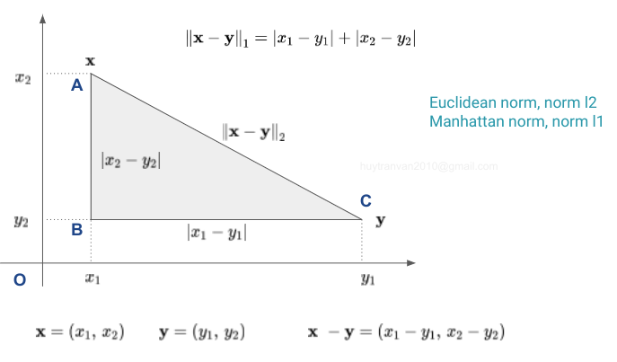

### Norm của vector

Cho vector $\mathbf{x}\in \mathbb{R}^{n}$. Làm sao để xác định được khoảng cách từ vector $\mathbf{x}$ đến vector $\mathbf{0}$. Tổng quát hơn, để xác  định khoảng cách giữa hai vector $\mathbf{y}$ và $\mathbf{z}$ chúng ta thường áp dụng một hàm số lên vector $\mathbf{x} = \mathbf{y} - \mathbf{z}$ . Đây chính là lúc khái niệm **norm** ra đời.

**Norm** của vector $\mathbf{x}$ được kí hiệu là $\lVert \mathbf{x} \rVert$ - nó chính là hàm số $f()$ ánh xạ một điểm $\mathbf{x}$ từ không gian $n$ chiều sang không số thực một chiều, $f(\mathbf{x}) = \lVert\mathbf{x} \rVert$.

Hàm số $f(\mathbf{x})$ hay $\lVert \mathbf{x} \rVert$ phải thỏa mãn 3 điều kiện sau mới được coi là norm:

- $\lVert \mathbf{x} \rVert \geq 0$, $\lVert \mathbf{x} \rVert = 0$ khi và chỉ khi $\mathbf{x} = \mathbf{0}$
- $\Vert  \alpha \mathbf{x} \Vert  = \lVert  {\alpha} \rVert \cdot \Vert  \mathbf{x} \Vert $, với $\alpha \in \mathbb{R}$
- Bất đẳng thức tam giác: $\lVert \mathbf{x} + \mathbf{y} \rVert \leq \lVert\mathbf{x} \rVert + \lVert \mathbf{y} \rVert$

Có rất nhiều loại norm khác nhau, hay dùng nhất là norm $L1$ và norm $L2$.

Với $p \geq 1$ bất kì, hàm số sau:

$$
||\mathbf{x}||_p = (|x_1|^p + |x_2|^p + \dots |x_n|^p)^{\frac{1}{p}}
$$

được gọi là norm p của vector $\mathbf{x}$ (nó thỏa mãn 3 điều kiện bên trên).

**Manhattan norm** ($p=1$): cho vector $\mathbf{x}\in \mathbb{R}^{n}$

$$ \lVert  \mathbf{x} \rVert_{1} = \sum_{i=1}^{n}\left| x_i \right| $$

**Euclidean norm** ($p =2$, khoảng cách Euclid): cho vector $\mathbf{x}\in \mathbb{R}^{n}$

$$ \Vert \mathbf{x} \Vert_{2} = \left (\sum_{i=1}^{n} \lvert  x_i \rvert^2  \right )^\frac{1}{2} $$

**Minkowski norm** ($p \geq 1$)): cho vector $\mathbf{x}\in \mathbb{R}^{n}$

$$ \Vert \mathbf{x} \Vert_p = \left (\sum_{i=1}^{n} \lvert  x_i \rvert^p  \right )^\frac{1}{p}, p \geq 1 $$

**Chebyshev norm** ($p \rightarrow \infty$): cho vector $\mathbf{x}\in \mathbb{R}^{n}$
$$ \lVert  \mathbf{x} \rVert_{\infty}=\underset{1\leq i\leq n}{\max} \lvert x_{i} \rvert $$

**Negative infinity norm:** cho vector $\mathbf{x}\in \mathbb{R}^{n}$

$$ \lVert \mathbf{x} \rVert_{-\infty}=\underset{1\leq i\leq n}{\min}\lvert  x_{i} \rvert $$

**Norm trong không gian của các hàm liên tục**

$C[a, b]$ là tập hợp các hàm liên tục $x(t)$ trên đoạn $[a, b]$. Đây là không gian vector tuyến tính (để dễ hiểu có thể coi hàm liên tục là một mảng có số chiều vô cùng lớn).
- Minkowski norm ($p \geq 1$):

$$\Vert x \Vert _p = (\int_{a}^{b}|x(t)|^p dt)^{1/p}$$

- Manhattan norm ($p = 1$):

$$\Vert x \Vert _1 = (\int_{a}^{b}|x(t)| dt)$$

- Chebyshev norm:

$$\Vert x \Vert _\infty = \underset{a \leq t \leq b}{\text{max}}|x(t)|$$

### Distance (dissimilarity)

Khoảng cách giữa hai vector $\mathbf{x}, \mathbf{y} \in \mathbb{R}^{n}$ có thể được xác định như sau:
$$ d(\mathbf{x} , \mathbf{y}) = \lVert \mathbf{x} - \mathbf{y} \rVert  ~~~ (1)$$

**Các tiên đề về khoảng cách:**

* Khoảng cách không âm, $d(\mathbf{x} , \mathbf{y}) \geq 0$, dấu $=$ xảy ra khi và chỉ khi $\mathbf{x} = \mathbf{y}$
* Khoảng cách có tính đối xứng: $d(\mathbf{x} , \mathbf{y}) = d(\mathbf{y} , \mathbf{x})$ 
* Bất đẳn thưc tam giác: $d(\mathbf{x} , \mathbf{y}) \leq d(\mathbf{x} , \mathbf{z}) + d(\mathbf{z} , \mathbf{y})$

Các norm khác nhau tạo ta khoảng cách giữa các vector khác nhau. Khoảng cách được xác định bởi norm là đồng nhất (homogeneous) và bất biến khi dịch chuyển (invariant under translation in $\mathbb{R}$): 

$$d(\alpha \mathbf{x}, \alpha \mathbf{y}) = \alpha d( \mathbf{x},\mathbf{y})$$

$$d(\mathbf{x} + \mathbf{a}, \mathbf{y} + \mathbf{a}) =d( \mathbf{x},\mathbf{y})$$

Có thể dễ dàng chứng minh được 2 công thức này từ định nghĩa (1).

Trên hình vẽ điểm A tương ứng với vector $\mathbf{x}$, điểm C tương ứng với vector $\mathbf{y}$. Việc đi từ điểm A đến điểm C mà các đường chỉ theo dạng ô bàn cờ thì chúng ta cần đi tới điểm B trước. Lúc này tổng quãng đường cần đi chính bằng norm L1 của $\mathbf{x} - \mathbf{y}$. Nếu có thể đi thắng luôn từ điểm A đến điểm C thì tổng quãng đường bằng norm L2 của $\mathbf{x} - \mathbf{y}$.

Trong xử lý ảnh có thể biểu diễn ảnh dưới dạng vector (được duỗi ra), sau đó chúng ta có thể đo lường độ tương đồng giữa các ảnh thông qua khoảng cách của các vector đó.

Có nhiều cách để chuyển đổi khoảng cách $d(\mathbf{x} , \mathbf{y})$ giữa 2 vector $\mathbf{x}, \mathbf{y}$ sang độ tương đồng (similarity) giữa 2 vector đó. Một trong những cách chuyển đó là Gaussian:

$$\text{sim}(\mathbf{x}, \mathbf{y}) = \text{exp}\left( \frac{-d^{2}(\mathbf{x},\mathbf{y})}{\sigma ^{2}} \right)$$

ở đây $\sigma$ là tham số tỉ lệ được chọn cho từng mục đích khác nhau, $0 \leq \text{sim}(\mathbf{x}, \mathbf{y}) \leq 1$.

### Norm của ma trận

Đối với ma trận $\mathbf{A} \in \mathbb{R}^{m \times n}$ ta có:

$$\lVert \mathbf{A} \rVert_p = \underset{\mathbf{x} \neq 0}\sup \frac{\lVert\mathbf{A} \mathbf{x}\rVert_p}{\lVert\mathbf{x}\rVert_p}$$

tương ứng với norm p của vetor $\mathbf{x}$ - số cột của ma trận $\mathbf{A}$ bằng với số chiều của vector $\mathbf{x}$. Lớp các norm của ma trận được định nghĩa dựa trên norm của vector được gọi là **induced norms**.

**Norm 1** của ma trận được xác định như sau: 
- Lấy trị tuyệt đối các phần tử của ma trận trên mỗi cột
- Tính tổng giá trị cho mỗi cột (sau khi lấy trị tuyệt đối cho từng phần tử)
- Lấy ra giá trị lớn nhất trong số các tổng đó. Đó chính là norm 1 của ma trận.

$$\lVert \mathbf{A} \rVert_1 = \underset{1 \leq j \leq n} \max \sum_{i=1}^m \lvert a_{ij}\rvert$$

**Norm 2** của ma trận $\mathbf{A}$ chính bằng căn bậc hai của giá trị riêng lớn nhất của ma trận $\mathbf{A}^T \mathbf{A}$.

$$
\lVert \mathbf{A} \rVert_2 = \sqrt{\lambda_{\max}(\mathbf{A}^T \mathbf{A})}
$$

trong đó $\lambda_{\max}(\mathbf{A}^T \mathbf{A})$ là trị riêng lớn nhất của ma trận $(\mathbf{A}^T \mathbf{A})$

Chúng ta sẽ đi chứng minh điều này. Như định nghĩa ở bên trên ta có:

$$\lVert \mathbf{A} \rVert_2 = \underset{\mathbf{x} \neq 0} \max \frac{\lVert\mathbf{A} \mathbf{x}\rVert_2}{\lVert\mathbf{x}\rVert_2}$$

Nhận thấy vế phải là bài toán tối ưu với biến là vector $\mathbf{x}$. Nếu $\mathbf{x}$ là nghiệm của bài toán tối ưu trên thì $k \mathbf{x}, k \neq 0$ cũng là cũng nghiệm. Do đó có thể giả sử mẫu số bằng 1. Lúc này bài toán tối ưu được viết lại dưới dạng:

$$
\lVert \mathbf{A} \rVert_2 = \underset{\lVert \mathbf{x}\rVert_2 = 1} \max \lVert\mathbf{A} \mathbf{x}\rVert_2
$$

Có thể viết lại như sau:

$$
\mathbf{x} =\underset{\mathbf{x}}\argmax \lVert \mathbf{A} \mathbf{x} \rVert^2_2 ~~~~\text{s.t.:} ~~~ \lVert \mathbf{x} \rVert^2_2 = 1 ~~~~~ (*)
$$

Bài toán (*) này có thể được giải bằng phương pháp nhân tử Langrange. Lagrangian của bài toán trên là:

$$
\mathcal{L}(\mathbf{x}, \lambda) = \lVert\mathbf{Ax}\rVert_2^2 + \lambda (1 - \lVert \mathbf{x}\rVert_2^2)
$$

Nghiệm của bài toán (*) thỏa mãn hệ phương trình:

$$
\left\{\begin{matrix}
\frac{\partial \mathcal{L}}{\partial \mathbf{x}} = 2\mathbf{A}^T\mathbf{Ax} - 2\lambda \mathbf{x} = \mathbf{0} \\ 
\frac{\partial \mathcal{L}}{\partial \lambda} = 1 - \lVert\mathbf{x}\rVert_2^2 = 0
\end{matrix}\right.
$$

Ta sẽ có:

$$
\mathbf{A}^T\mathbf{Ax} = \lambda\mathbf{x}
$$

Từ đây suy ra $\lambda$ là trị riêng của ma trận $\mathbf{A}^T \mathbf{A}$ và $\mathbf{x}$ là vector riêng tương ứng với trị riêng đó. Nhân vào bên cả hai vế của phương trình trên ta nhận được:

$$
\mathbf{x}^T \mathbf{A}^T\mathbf{Ax} = \lambda \mathbf{x}^T \mathbf{x} = \lambda
$$

Vế trái chính là $\lVert \mathbf{A}\mathbf{x} \rVert^2_2$ chính là hàm mục tiêu trong phương trình (*). Như vậy hàm mục tiêu lớn nhất khi $\lambda$ đạt giá trị lớn nhất hay $\lambda$ chính là trị riêng lớn nhất của ma trận $\mathbf{A}^T \mathbf{A}$.

Một chuẩn rất hay được dùng của ma trận $\mathbf{A} \in \mathbb{R}^{m \times n}$ là **chuẩn Frobenius** $\lVert \mathbf{A} \rVert_F$ là căn bậc hai tổng bình phương của tất cả các phần tử của ma trận đó.

$$
\lVert\mathbf{A}\rVert_F = \sqrt{\sum_{i = 1}^m \sum_{j = 1}^n a_{ij}^2} ~~~ (5)
$$

