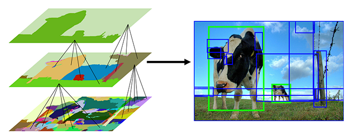
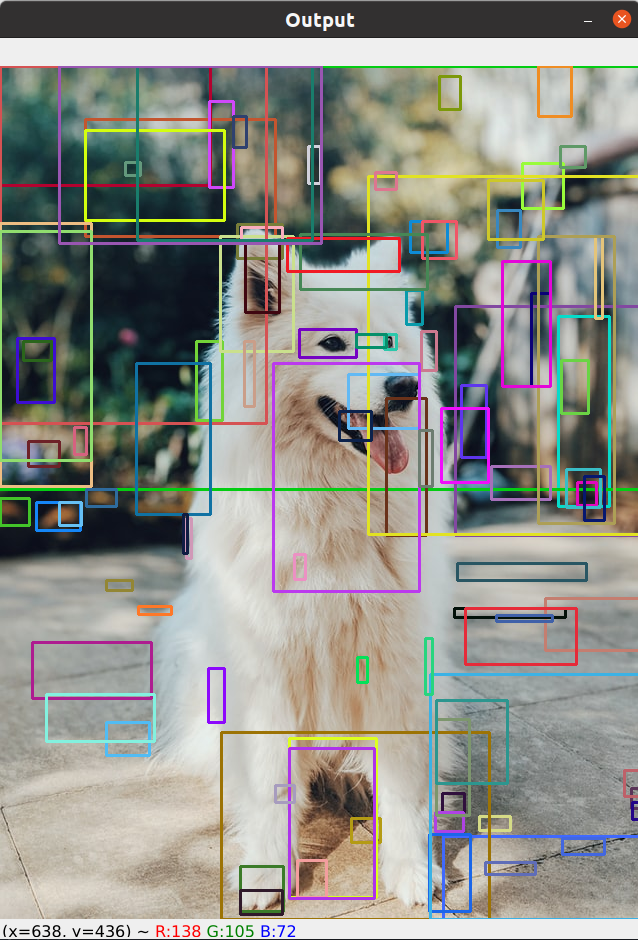

Selective search được sử dụng dựa trên image segmetation để đưa ra các region proposals (khoảng 2000 regions) có khả năng chứa object. Selective search có performance tốt hơn nhiều so với sử dụng image pyramid và sliding window.
Việc nghiên cứu Selective earch cũng giúp các nhà khoa học tạo ra một công cụ mạnh mẽ hơn sau này là Region Proposal Network. Trong bài này chúng ta sẽ đi thực hiện selective search để lấy ra các region proposals.

Selective search phân đoạn ảnh, chọn ra các region proposals dựa trên một số đặc điểm như:
- Color similarity
- Textuture similarity
- Size similarity
- Shape similarity
- Meta-similarity (kết hợp tuyến tính của những cái trên)

Trong bài trước nhận thấy việc khả năng ứng dụng image pyramid và sliding window phụ thuộc rất nhiều vào các thông số. Việc lựa chọn các thông số không tốt có thể dẫn tới kết quả không như mong muốn.

Selective search hoạt động bằng cách sử dụng [superpixel algorithm](https://www.pyimagesearch.com/tag/superpixel/). Ví dụ sử dụng superpixel algorithm được biểu diễn trong hình sau:


Selective search tìm cách hợp nhất các superpixels để tìm ra các vùng có khả năng chứa vật thể.



Thực hiện Selective seach bằng OpenCV

```python
import argparse
import random
import time
import cv2

ap = argparse.ArgumentParser()
ap.add_argument("-i", "--image", required=True, help="path to the input image")
ap.add_argument("-m", "--method", type=str, default="fast", choices=["fast", "quality"], help="selective search method")
args = vars(ap.parse_args())

# load ảnh
image = cv2.imread(args["image"])

# khởi tạo OpenCV's selective search implementation và set the input image
ss = cv2.ximgproc.segmentation.createSelectiveSearchSegmentation()
ss.setBaseImage(image)

# Lựa chọn internal mode of operation của Selective search
if args["method"] == "fast":
    print("[INFO] using *fast* selective search")
    ss.switchToSelectiveSearchFast()

# otherwise we are using the *slower* but *more accurate* version
else:
    print("[INFO] using *quality* selective search")
    ss.switchToSelectiveSearchQuality()

# chạy selective search trên image đầu vào
start = time.time()
rects = ss.process()    # để thực hiện Selective search, trả về list of rectangles
end = time.time()

# Xem selective search chạy mất bao lâu
print("[INFO] selective search took {:.4f} seconds".format(end - start))
print("[INFO] {} tổng số region proposals".format(len(rects)))

# Vẽ ra các region proposals cho từng nhớm, do có nhiều proposals regions nên chia ra
for i in range(0, len(rects), 100):
    # copy ảnh ban đầu để vẽ
    clone = image.copy()

    # duyệt qua các regions proposals trong nhóm
    for (x, y, w, h) in rects[i:i + 100]:
        color = [random.randint(0, 255) for j in range(0, 3)]   # tạo color ngẫu nhiên
        cv2.rectangle(clone, (x, y), (x + w, y + h), color, 2)

    cv2.imshow("Output", clone)

    if cv2.waitKey(0) & 0xFF == ord("q"):   # nhấn "q" thì thoát ra luôn, nhấm phím khác nó quay lên vòng lặp
        break

""" 
Một bức ảnh kích thước nhỏ, chạy chế độ 'fast' cần tới 7.5 seconds (i5-6300U, 8Gb Ram) để có thể trích xuất
các regions of proposals
"""
```
Cùng xem một số region proposals được tạo ra.



Do có khoảng 2000 regions proposals được tạo ra, biểu diễn cùng một lúc rất khó nhìn nên chỉ đưa ra một phần thôi.

## Tài liệu tham khảo
1. https://www.pyimagesearch.com/2020/06/29/opencv-selective-search-for-object-detection/

