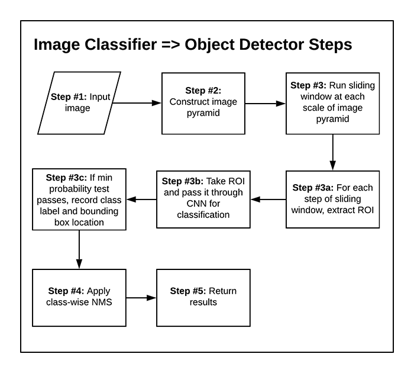

## Mở đầu
Trước khi xuất hiện object detector dựa trên Deep learning có một công cụ rất mạnh mẽ để phát hiện vật thể là `HOG + Linear SVM`.
3 thành phần quan trọng của HOG + Linear SVM sẽ được sử dụng để chuyển bất kì CNN image classifier thành object detetor:
1. Image pyramid: cho phép phát hiện vật thể với nhiều kích thước khác nhau
2. Sliding window: cho phép phát hiện vật thể ở nhiều vị trí khác nhau. Tại mỗi vị trí của sliding window sẽ thực hiện các công việc sau:
    - Trích xuất vùng quan tâm ROI (chính là vùng của sliding window đó)
    - Trích xuất đặc trưng rồi đưa vào các bộ phân loại (CNN, Linear SVM...)
    - Nhận được output predictions
3. Non-max suppression: loại bỏ các bounding boxes chồng chập (overlapping)

Các bước chính để chuyển mạng CNN phân loại ảnh thành object detector được thể hiện như hình sau:

## Kết luận:
- Bộ nhận diện vật thể dựa vào mạng CNN, image pyramid, sliding window khá chậm
- Kết quả phụ thuộc rất nhiều vào việc lựa chọn các thông số như stepSize, WindowSize, hay hệ số scale của image pyramid.
- Tách thành nhiều bước image pyramid, sliding window, mạng CNN nên kết quả của những công đoạn sau phụ thuộc nhiều vào các công đoạn trước

## Tài liệu tham khảo
1. https://www.pyimagesearch.com/2020/06/22/turning-any-cnn-image-classifier-into-an-object-detector-with-keras-tensorflow-and-opencv/