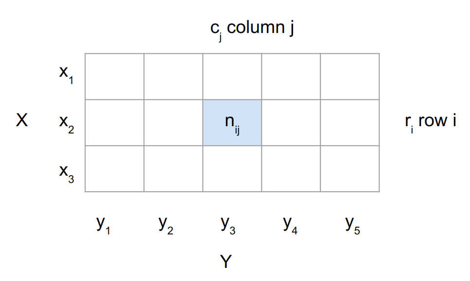

## Không gian xác suất, biến ngẫu nhiên

**Phép thử ngẫu nhiên** (hay phép thử) là một thí nghiệm hay quan sát mà kết quả của nó không thể dự báo trước được.

Ví dụ Mặt trời mọc hướng Đông và lặn ở hướng Tây. Đây là hiện tượng có tính quy luật, chắc chắn xảy ra do đó nó không phải phép thử ngẫu nhiên.

Gieo đồng xu cân đối đồng chất, gieo xúc xắc cần đối và đồng chất là các phép thử ngẫu nhiên.

**Không gian mẫu $\Omega$** (sample space): là tập hợp các kết quả có thể xảy ra của phép thử ngẫu nhiên.

Mỗi phần tử của không gian mẫu $\Omega$ cũng là kết quả của phép thử ngẫu nhiên được gọi là một phần tử mẫu.

Ví dụ phép thử ngẫu nhiên tung đồng xu đồng chất có không gian mẫu là $\Omega = \{H, T\}$

> Một phép thử có thể có nhiều không gian mẫu khác nhau tùy thuộc vào việc quan sát của chúng ta.

**Không gian biến cố $\mathcal{A}$** (event space) không gian các kết quả tiềm năng của phép thử. Không gian biến cố $\mathcal{A}$ chính là tập hợp các tập con của không gian mẫu. Nếu phân phối xác suất là rời rạc thì không gian biến cố là *power set* của không gian mẫu. Xem thêm khái niệm power set [tại đây](https://vi.wikipedia.org/wiki/T%E1%BA%ADp_l%C5%A9y_th%E1%BB%ABa).

Rõ ràng lúc này **biến cố** (event) là tập con của không gian mẫu $\Omega$. *Biến cố đơn* nếu nó chỉ chứa một kết quả, *biến cố kép* nếu nó chứa nhiều hơn một kết quả của phép thử.

Ví dụ phép thử ngẫu nhiên về việc di chuyển của 2 phương tiện giao thông tại ngã ba (xe rẽ trái hoặc phải). Ta có không gian mẫu:

$$\Omega = \left\{ \text{LR, LL, RL, RR} \right\}$$

Ta sẽ có 4 biến cố đơn và một số biến cố kép, ví dụ

$$A = \left\{ \text{LR, LL, RL} \right\} = \left\{ \text{biến cố có ít nhất một xe rẽ trái} \right\}$$

Ỏ đây ta đã biểu diễn biến cố bằng cách liệt kê và bằng lời.

**Xác suất** P: với mỗi biến cố A thuộc không gian biến cố $\mathcal{A}$ chúng ta liên hệ giá trị $P(A)$ đo lường xác suất hay mức độ tin tưởng rằng biến cố A sẽ xảy ra. Xác suất là giá trị nằm trong $[0, 1]$, ta có $P(\Omega) = 1$.

Cái khái niệm không gian mẫu $\Omega$, không gian biến cố $\mathcal{A}$ và xác suất P tạo thành **một không gian xác suất**.

Trong Machine Learning, chúng ta thường không đề cập trực tiếp đến không gian xác suất, thay vào đó hay đề cập đến *xác suất của các số lượng cần quan tâm* $\mathcal{T}$. Ánh xạ từ không gian mẫu $\Omega$ sang $\mathcal{T}$ được gọi là **random variable** (biến ngẫu nhiên).

Một người bắn vào bia cho đến khi trúng mục tiêu thì dừng. Số viên đạn cần bắn trúng coi là kết quả của phép thử này, không gian mẫu $\Omega = \left \{n, n \in N^* \right \}$. Ta đi lấy random variable bằng chính số viên đạn cần bắn (giống identity function). Do đó target space $\mathcal{T} = \left\{n, n \in N^*\right\}$. Có rất nhiều ví dụ chúng ta lấy random variable map kết quả phép thử đến chính nó. Ví dụ trong quan sát (phép thử) thời gian sống (h) của con chip điện tử. Nhận thấy ở đây random variable cũng lấy luôn là thời gian sống của con chip điện tử. Target space là $\mathcal{T} = \left\{ z, 0 \leq z < \infty \right\}$. Như đã đề cập ở trên chúng ta thường quan tâm đến xác suất của các giá trị trong target space $\mathcal{T}$ chứ không nói nhiều đến không gian xác suất ban đầu.

Ví dụ trường hợp tung 2 đồng xu đồng chất và đếm số lượng mặt head (sẽ tạo thành các số lượng quan tâm $\mathcal{T}$), lúc này random variable $X$ sẽ ánh xạ không gian mẫu đến 3 giá trị có thể. Cụ thể ta có:

$$\Omega = \left\{ \text{HH, HT, TH, TT} \right\}$$

Do chúng ta đang xác định số mặt head của phép thử thông qua random variable $X$ nên ta có: $X(\text{HH}) = 2$, $X(\text{HT}) = 1$, $X(\text{TH}) = 1$ và $X(\text{TT}) = 0$. Như vậy lúc này ta có $\mathcal{T} = \left\{ 0, 1, 2 \right\}$. Cho bất kì tập con $S \subseteq \mathcal{T}$ chúng ta liên hệ $P_X(S) \in [0, 1]$ cho một biến cố cụ thể tương ứng với random variable X.

> - Random variable là một ánh xạ, đơn giản hơn có thể coi nó là một hàm số. 
> - Sample space $\Omega$ thông qua random variable $X$ sẽ được target space $\mathcal{T}$. $S \subseteq \mathcal{T}$ nên xác suất của S chính là xác suất xảy ra biến cố tương ứng với S thông qua random variable $X$. 

Ví dụ phép thử lấy lần lượt 2 đồng xu (có bỏ lại) khỏi túi. Trong túi có các đồng xu vàng V và đồng xu bạc B. Không gian mẫu là $\Omega = \left\{ (V, V), (V, B), (B, V), (B, B)\right\}$. Giả sử xác suất lấy được đồng xu V là 0.3. Chúng ta quan tâm tổng số lần lấy được đồng xu vàng. Do đó đi định nghĩa random variable $X$ ánh xạ từ không gian mẫu $\Omega$ vào không gian đích $\mathcal{T}$, cái mà chỉ số lượng số lần lấy được đồng xu vàng V.

$$
\begin{matrix}
X((V, V)) = 2\\ 
X((V, B)) = 1\\ 
X((B, V)) = 1\\ 
X((B, B)) = 0
\end{matrix}
$$

Do đó không gian đích $\mathcal{T} = \left\{0, 1, 2 \right\}$. Nhận thấy việc lấy đồng xu có trả lại, do đó kết quả của hai lần rút là độc lập với nhau. Ta sẽ có:

$$
\begin{align*}
 P(X=2)&= P((V, V))\\ 
 &=P(V) \cdot P(V) \\ 
 &= 0.3 \cdot 0.3 = 0.09
\end{align*}
$$

$$
\begin{align*}
 P(X=1)&= P((V, B) \cup P(B, V)) \\ 
 &=P((V, B)) + P((B, V)) \\ 
 &= 0.3 \cdot (1 - 0.3) + (1 - 0.3) \cdot 0.3 = 0.42
\end{align*}
$$

$$
\begin{align*}
 P(X=0)&= P((B, B))\\ 
 &=P(B) \cdot P(B) \\ 
 &= (1 - 0.3) \cdot (1 - 0.3) = 0.49
\end{align*}
$$

Trong tính toán trên chúng ta đồng nhất nhất hai khái niệm xác suất đầu ra của random variable $X$ và xác suất các biến cố thuộc không gian biến cố $\mathcal{A}$ hay là tập con của không gian mẫu. Ví dụ $P(X=0) = P((B, B))$.

Ta có random variable $X: \Omega \rightarrow \mathcal{T}$ và tập con $S \subseteq \mathcal{T}$ (ví dụ một phần tử của $\mathcal{T}$). Lúc này $X^{-1}(S)$ là nghịch ảnh (pre-image) của $S$ bởi ánh xạ $X$ hay là tập hợp các phần tử thuộc không gian mẫu $\Omega$ sao cho ảnh của nó qua $X$ thuộc $S$. Ta có thể ghi như sau:

$$
X^{-1}(S) = \left\{ w \in \Omega: X(w) \in S \right\}
$$

Do vậy có thể hiểu việc chuyển đổi xác suất từ biến cố trong $\Omega$ qua xác suất của random variable $X$ liên hệ với xác suất nghịch ảnh của $S$. Với $S \subseteq \mathcal{T}$ ta có:

$$
P_X(S) = P(X \in S) = P(X^{-1}(S)) = P \left( \left\{ w \in \Omega: X(w) \in S \right\} \right)
$$

Từ đây có thể thấy phân bố xác suất của random variable $X$ được xác định thông qua xác suất của biến cố và chính random variable $X$ này ánh xạ không gian mẫu vào không gian đích $\mathcal{T}$.

> - Thông thường đối với continuous random variable thì chúng ta chỉ xem xet $\mathcal{T} = \mathbb{R}$ hoặc $\mathcal{T} = \mathbb{R}^D$
> - Nhiều kí hiệu sau này có sử dụng subscript $X$ để ám chỉ random variable sử dụng.

## Phân bố xác suất rời rạc, liên tục

Phụ thuộc vào target space là rời rạc hay liên tục chúng ta sẽ có phân bố của random variable $X$ là rời rạc hay liên tục. Lúc này ta cũng gọi random variable $X$ là rời rạc hoặc liên tục.

> Với phân bố rời rạc, khi tính xác suất chúng ta sử dụng tổng, với phân bố liên tục chúng ta sử dụng tích phân với hàm mật độ xác suất

Khi target space là rời rạc, lúc này chúng ta có thể chỉ rõ xác suất mà random variable $X$ nhận một giá trị cụ thể nào đó $x \in \mathcal{T}$, kí hiệu là $P(X = x)$. Biểu diễn $P(X = x)$ cho discrete random variable $X$ được gọi là *hàm khối xác suất (probability mass function pmf)*. Như ví dụ ở trên ta quan tâm đến số lần lấy được đồng vàng trong 2 lần rút coin có trả lại $\mathcal{T} = \left\{ 0, 1, 2 \right\}$, random variable $X$.

Nếu target space $\mathcal{T}$ là liên tục, một cách tự nhiên là xét xác suất random variable $X$ rơi vào một đoạn nào đó $P(a \leq X \leq b)$ với $a < b$. Theo quy ước, gọi xác suất random variable $X$ nhỏ hơn giá trị $x$ nào đó là $P(X \leq x)$. Biểu diễn $P(X \leq x)$ cho biến ngẫu nhiên liên tục được gọi là *hàm phân phối tích lũy (cumulative distribution function)*. Với biến ngẫu nhiên liên tục ta quan tâm đến xác suất $X$ nằm trong khoảng nào đó, từ đây có khái niệm *hàm mật độ xác suất (probability density distribution pdf)* $p(x)$. Chúng ta sẽ quay lại khái niệm này trong bài về xác suất của biến ngẫu nhiên liên tục.

> - Đối với continuous random variable (biến ngẫu nhiên liên tục) thì coi $P(X = x) = 0$.
> - Sử dụng *univariate distribution* để ám chỉ distribution của single random variable
> - Sử dụng *multivariaye distribution* để ám chỉ distribution của nhiều hơn một random variable. Lúc này có thể sử dụng vector of random variable $\mathbf{x}$.

## Xác suất rời rạc

**Chú ý**: Để không nhầm lẫn, đối với biến ngẫu nhiên liên tục hàm mật độ xác suất, đối với biến ngẫu nhiên rời rạc hàm khối xác suất ta đều ghi là $p$. Trong một số trường hợp trong bài này tôi vẫn sử dụng $P$ cho hàm khối xác suất đối với biến ngẫu nhiên rời rạc. 

Xem $X$ là random variable chỉ việc học sinh đến từ các tỉnh $x_1, x_2, x_3$ (coi học sinh trong trường đến từ 3 tỉnh này). $Y$ là random varibale chỉ điểm môn Hóa của một học sinh trong trường trên thang điểm mới $y_1, y_2, y_3, y_4, y_5$.

Lúc này ta có **joint probability** của 2 random variables như sau:

$$
P(X = x_i, Y=y_i) = \frac{n_{ij}}{N}
$$

với $n_{ij}$ là tổng số học sinh đến từ tỉnh $x_i$ và có điểm môn Hóa $y_i$ khi khảo sát và $N$ là tổng số học sinh trong trường. **Joint probability** chính là xác suất của giao hai sự kiện $P(X = x_i, Y=y_i) = P(X=x_i \cap Y=y_i)$, ghi gọn lại thành $p(x, y)$. Lúc này ta có:

$$\sum_{x, y} p(x, y) = 1$$

Nếu cả hai biến ngẫu nhiên là liên tục hay liên tục một ngẫu nhiên ta có:

$$\int p(x, y) dxdy = 1$$

$$ \sum_{x}\int p(x, y) dy = \int \left(\sum_{x}p(x, y)\right) dy = 1$$

Coi $r_i = \sum_{j=1}^5 n_{ij}$ là tổng các giá trị trên hàng $i$,  $c_j = \sum_{i=1}^3 n_{ij}$ là tổng các giá trị trên cột $j$

**Marginal probability** (xác suất biên) cho một random variable có thể được xác định như sau:

$$
P\left( X = x_i\right) = \frac{r_i}{N} = \frac{\sum_{j=1}^5 n_{ij}}{N} = \sum_{j=1}^5 P(X=x_i, Y=y_j) = \sum_y p(x, y)
$$

Lấy tổng một hàng chia chia tổng của cả bảng. Ở đây ghi gọn là $P\left( X = x_i\right) = p(x)$. Ta có:

$$p(x) = \sum_y p(x, y)$$

$$
P\left( Y = y_j\right) = \frac{c_j}{N} = \frac{\sum_{i=1}^3 n_{ij}}{N} = \sum_{i=1}^3 P(X=x_i, Y=y_j) = \sum_x p(x, y)
$$

Lấy tổng một cột chia cho tổng của cả bảng. Ở đây ghi gọn là $P\left( Y = y_j\right) = p(y)$. Ta có:

$$p(y) = \sum_x p(x, y)$$

**Conditional probability** - xác suất có điều kiện, chúng ta quan tâm xác suất random varibale $Y$ nhận giá trị $y$ khi đã biết random variable $X$ nhận giá trị $x$. Ta có $P(Y=y \| X=x) = p(y \| x)$.

Như hình trên ta thấy:

$$P(Y=y_j | X=x_i) = \frac{n_{ij}}{r_i}$$

$$P(X=x_i | Y=y_j) = \frac{n_{ij}}{c_j}$$

Dễ nhận thấy 

$$p(y|x) = P(Y=y_j | X=x_i) = \frac{n_{ij}}{r_i} = \frac{n_{ij}}{N} / \frac{r_i}{N} = \frac{P(X=x_i, Y=y_j)}{P(X=x_i)} = \frac{p(x, y)}{p(x)}$$

Viết gọn lại ta có:

$$
p(y|x) = \frac{p(x, y)}{p(x)}
$$

Tương tự như vậy có thể chứng minh được:

$$
p(x|y) = \frac{p(x, y)}{p(y)}
$$

Nếu có nhiều các biến ngẫu nhiên ta có:

$$
\begin{align*}
  p(x, y, z, w) &= p(x, y, z | w) p(w) \\ 
  &= p(x, y | z, w)p(z, w)\\
  &= p(x, y | z, w) p(z | w) p(w)\\
  &= p(x | y, z, w)p(y | z, w) p(z | w) p(w)
\end{align*}
$$

## Xác suất liên tục

Khi target space là liên tục chúng ta có biến ngẫu nhiên liên tục. Ta đi định nghĩa hàm mật độ xác suất - probability density function.

**Định nghĩa:** Hàm $p: \mathbb{R}^D \rightarrow \mathbb{R}$ được gọi là hàm mật độ xác suất - probability density function (pdf) nếu:
1. $\forall \mathbf{x} \in \mathbb{R}^D$: $f(\mathbf{x}) \geq 0$
2. $\int_{\mathbb{R}^D} p(\mathbf{x}) d\mathbf{x}=1$

Đối với trường hợp univariate distribution chúng ta có liên hệ của xác suất random variable nhận giá trị trong một đoạn nào:

$$
P(a \leq X \leq b) = \int_a^b p(x)dx
$$

Dễ nhận thấy $P(X=x) = 0$ như đã trình bày ở phần trước.

**Định nghĩa**: Hàm phân phối tích lũy - cumulative distribution function (cdf) của multivariate real-valued random variable $X$ với state $\mathbf{x} \in \mathbb{R}^D$ là:

$$
F_X(\mathbf{x}) = P(X_1 \leq x_1, X_2 \leq x_2, \dots, X_D \leq x_D)
$$

ở đây $X = [X_1, X_2, \dots, X_D]^T$, $\mathbf{x} = [x_1, x_2, \dots, x_D]^T$, vế phải là xác suất tương ứng với các random variable $X_i$ nhận giá trị nhỏ hơn hoặc bằng $x_i$.

Cdf có thể được biểu diễn thông qua pdf như sau:

$$
F_X(\mathbf{x}) = 
\int_{-\infty}^{x_1} \dots \int_{-\infty}^{x_D} f(z_1,\dots,z_D) dz_1 \dots dz_D
$$

## Quy tắc Bayes

Trong Machine learning và Bayestian statistics, chúng ta quan tâm đến xác định xác suất của random varibales $y$ khi đã quan sát trước được một số random variables $x$. Giả sử chúng ta có một số hiểu biết trước về random variable chưa quan sát $x$ thông qua $p(y)$ và mối quan hệ $p(x \|y)$ giữa $x$ và $y$. Nếu chúng ta quan sát được $x$, có thể dựa vào quy tắc Bayes để xác định $p(y|x)$ như sau:

$$
\underset{\text{posterior}}{\underbrace{p(y|x)}} = \frac{\overset{\text{likelihood}}{\overbrace{p(x|y)}} \overset{\text{prior}}{\overbrace{p(y)}}} {\underset{\text{evidence}}{\underbrace{p(x)}}} = \frac{p(x,y)}{p(x)}
$$

Quy tắc Bayes này có thể được suy ra từ phần conditional probability ở phần trước. 

$p(y)$ là *prior probability* - xác suất tiên nghiệm, cái thể hiện sự hiểu biết chủ quan của chúng ta về variable $y$. Chúng ta có thể chọn bất kỳ prior nào mà thấy hợp lý, tuy nhiên cần chú ý prior là khác 0. Ví dụ tung xúc xắc có thể dự đoán được xác suất cho mỗi mặt là $\frac{1}{6}$.

$p(y \|x)$ là *posterior probability* - xác suất hậu nghiệm. Như đã nói đây là xác suất có điều kiện, được suy ra khi đã biết random variable $x$.

Trong một số trường hợp việc xác định trực tiếp $p(x)$ khó khăn thì chúng ta sẽ dựa trên xác suất đồng thời của 2 random variables $p(x, y)$ như sau:

$$p(y|x) = \frac{p(x|y) p(y)}{p(x)} = \frac{p(x|y) p(y)}{\sum_y p(x, y)}$$ 

Đây cũng chính là định lý Bayes mở rộng.

## Independence

Nếu biết giá trị của một biến ngẫu nhiên $x$ không mang lại thông tin về việc suy ra giá trị của biến ngẫu nhiên $y$ (và ngược lại), thì ta nói rằng hai biến ngẫu nhiên là độc lập (independence). Chẳng hạn, chiều cao của một học sinh và điểm thi môn Toán của học sinh đó có thể coi là hai biến ngẫu nhiên độc lập.

Khi hai biến ngẫu nhiên $x$ và $y$ độc lập với nhau thì:

$$p(x|y) = p(x) ~~~~~~ p(y|x) = p(y)$$

Thay vào công thức của conditional probability ta có:

$$p(x, y) = p(x|y)p(y) = p(x)p(y)$$

## Kỳ vọng

Kỳ vọng (expected value) là giá trị hưu ích để miêu tả tính chất của phân phối.

- Với $x$ là biến ngẫu nhiên rời rạc:

$$\mathbb{E}(x) = \sum_{i=1}^n x_i p(x_i)$$

với $p(x_i)$ là xác suất random variable $x$ nhận giá trị $x_i$. Khi khả năng xảy ra của các $x_i$ như nhau $\frac{1}{n}$ thì ta có:

$$\mathbb{E}(x) = \bar{x} = \frac{\sum_{i=1}^n x_i}{n}$$

- Với $x$ là biến ngẫu nhiên liên tục thì:

$$\mathbb{E}(x) = \int xp(x)dx$$

**Tổng quát** hơn ta có: Kỳ vọng của hàm số $g: \mathbb{R} \rightarrow \mathbb{R}$ của biến ngẫu nhiên liên tục $X \sim p(x)$:

$$\mathbb{E}_X[g(x)] = \int_{\mathcal{X}} g(x)p(x)dx$$

Cho biến ngẫu nhiên rời rạc thì:

$$\mathbb{E}_X[g(x)] = \sum_{x \in \mathcal{X}} g(x)p(x)$$

$\mathcal{X}$ là target space hay các giá trị có thể của random variable $X$.

> $X \sim p(x)$ ám chỉ random variable $X$ tuân theo phân phối $p(x)$.
> $g(x)$ chính là hàm số nhận vào các giá trị của random variable $X$. Ví dụ biến ngẫu nhiên là sô điểm của Hóa cuối kì của một học sinh. $g(x) = x + 10$ là số điểm Hóa cuối kì của học sinh cộng với 10.

Đối với multivariate random variables $X$ - coi như vector của các univariate random varibale $X = [X_1, X_2, \dots, X_D]^T$. Ta có thể định nghĩa kỳ vọng của hàm $g(\mathbf{x})$ như sau:

$$
\mathbb{E}_X[g(x)] = 
\begin{bmatrix}
\mathbb{E}_{X_1}[g(x_1)]\\
\mathbb{E}_{X_2}[g(x_2)]\\
\vdots\\
\mathbb{E}_{X_D}[g(x_D)]
\end{bmatrix} \in \mathbb{R}^D
$$

**Tính chất của kỳ vọng**:

- $\mathbb{E}(\alpha) = \alpha$
- $\mathbb{E}(\alpha x) = \alpha \mathbb{E}(x)$
- $\mathbb{E}(x+y) = \mathbb{E}(x) + \mathbb{E}(y)$
- $\mathbb{E}(xy) = \mathbb{E}(x)\mathbb{E}(y)$ nếu $x$ và $y$ độc lập với nhau

Các tính chất này có thể dễ dàng chứng minh dựa trên định nghĩa của kỳ vọng, các bạn có thể thử.

## Covariance 

**Định nghĩa**: Covariance giữa *univariate random variables* $X$, $Y \in \mathbb{R}$ được xác định theo công thức sau:

$$
\text{Cov}_{X, Y}[x, y] = \mathbb{E}_{X, Y}\left[(x - \mathbb{E}_X[x]) (y - \mathbb{E}_Y[y]) \right]
$$

>Khi random variable liên hệ với expected value hoặc covariance theo argument của nó thì thường chúng ta loại bỏ subscript (ví dụ $\mathbb{E}_X[x]$ chuyển thành $\mathbb{E} [x]$).

$$
\begin{align*}
 \text{Cov}[x, y]&= \mathbb{E}\left[(x - \mathbb{E}[x]) (y - \mathbb{E}[y]) \right]\\ 
 &= \mathbb{E}[xy] - \mathbb{E}[x] \mathbb{E}[y] - \mathbb{E}[y] \mathbb{E}[x] + \mathbb{E}[x]\mathbb{E}[y]\\ 
 &= \mathbb{E}[xy] - \mathbb{E}[x]\mathbb{E}[y]
\end{align*}
$$

Covariance của random variable với chính nó $\text{Cov}[x,x]$ được gọi là *variance* và được kí hiệu $\mathbb{V}_X[x]$. Căn bậc hai của variance được gọi là *standard deviation* $\sigma(x)$.

Có thể tổng quát hóa cho trường hợp multivariate random variables.

**Định nghĩa**: Cho hai multivariate random variables $X$, $Y$ với states $\mathbf{x} \in \mathbb{R}^D$ và $\mathbf{y} \in \mathbb{R}^E$, covariance giữa $X$ và $Y$ được xác định như sau:

$$
\text{Cov}[\mathbf{x}, \mathbf{y}] = \mathbb{E}[\mathbf{x}\mathbf{y}^T] - \mathbb{E}[\mathbf{x}] \mathbb{E}[\mathbf{y}]^T = \text{Cov}[\mathbf{y}, \mathbf{x}]^T \in \mathbb{R}^{D \times E}
$$

**Định nghĩa**: Variance của random variable $X$ với states $\mathbf{x} \in \mathbb{R}^D$ và mean vector ${\mu} \in \mathbb{R}^D$ được xác định như sau:

$$
\mathbb{V}_X[\mathbf{x}] = \text{Cov}_X[\mathbf{x}, \mathbf{x}] = \mathbb{E}_X[(\mathbf{x} - \mu)(\mathbf{x} - \mu)^T] = \mathbb{E}_X[\mathbf{x}\mathbf{x}^T] - \mathbb{E}_X[\mathbf{x}] \mathbb{E}_X[\mathbf{x}]^T = 
\begin{bmatrix}
\text{Cov}[x_1, x_1]& \text{Cov}[x_1, x_2]& \dots& \text{Cov}[x_1, x_D]\\
\text{Cov}[x_2, x_1]& \text{Cov}[x_2, x_2]& \dots& \text{Cov}[x_2, x_D]\\
\vdots& \vdots& \ddots& \vdots\\
\text{Cov}[x_D, x_1]& \text{Cov}[x_D, x_2]& \dots& \text{Cov}[x_D, x_D]\\
\end{bmatrix}
$$

Đây là ma trận $D \times D$ và được gọi là *covariance matrix* của multivariate random variable $X$. Đây là ma trận đối xứng và nửa xác định dương, nó giúp chúng ta xác định sự mở rộng của data. Xem thêm về covariance matrix [ở đây](https://huytranvan2010.github.io/Covariance-matrix/).

### Biểu diễn variance cho univariate random variable

$$
\mathbb{V}_X[x] = \mathbb{E}_X[(x - \mu)^2]
$$

Biến đổi một chút ta sẽ nhận được:

$$
\mathbb{V}_X[x] = \mathbb{E}_X[x^2] - \left( \mathbb{E}_X[x] \right)^2
$$

## Correlation - hệ số tương quan

**Định nghĩa**: Correlation giữa hai biến ngẫu nhiên $X$, $Y$ được xác định bởi:

$$
\text{corr}[x, y] = \frac{\text{Cov}[x, y]}{\mathbb{V}[x] \mathbb{V}[y]} \in [-1, 1]
$$

Hệ số tương quan đánh giá mối quan hệ đồng biến hay nghịch biến giữa 2 đại lượng ngẫu nhiên. Tuy nhiên khác với hiệp phương sai, hệ số tương quan cho biết thêm mối quan hệ tương quan tuyến tính giữa 2 biến là mạnh hay yếu.

Hệ số tương quan giao động trong khoảng [-1, 1]. Tại 2 giá trị đầu mút -1 và 1, hai biến hoàn toàn tương quan tuyến tính. Tức ta có thể biểu diễn $y= ax + b$ . Trường hợp hệ số tương quan bằng 0, hai đại lượng là độc lập tuyến tính.

## Thực nghiệm

Trong thực tế chúng ta không làm việc mới quần thể (population) mà chỉ làm việc với một số lượng data giới hạn (mẫu hay sample). Lúc này chúng ta có khái niệm trung bình mẫu (sample mean hoặc emprirical mean) và empirical covariance.

Cho random variable $X$ với states $\mathbf{x} \in \mathbb{R}^D$ ta có sample mean:

$$
\bar{\mathbf{x}} = \frac{1}{n} \sum_{i=1}^n \mathbf{x}_i
$$

Tương tự có empirical covariance:

$$
\Sigma = \frac{1}{n-1} \sum_{i=1}^n (\mathbf{x}_i - \bar{\mathbf{x}}) (\mathbf{x}_i - \bar{\mathbf{x}})^T
$$

> Sử dụng $n-1$ cho empirical covariance. Khi làm việc với population mới sử dụng $n$.

Với univariate random variable, ta có variance:

$$
\sigma^2_x = \frac{1}{n-1} \sum_{i=1}^n (x_i - \bar{x})^2
$$

## Kết luận

Như vậy chúng ta đã làm quen với một số khái niệm cơ bản của xác suất. Trong phần sau chúng ta sẽ tìm hiểu về một số phân phối xác suất hay gặp.

## Tài liệu tham khảm
1. Mathematics for machine learning