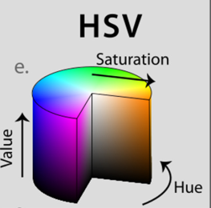
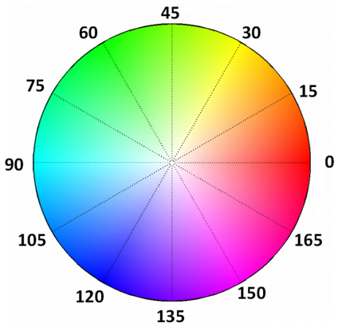

Trong bài này chúng ta cùng tìm hiểu về object tracking dựa trên màu săc của đối tượng. Ý tưởng chung là dựa vào color detection (color của vật để detect vị trí của vật) từ đó có thể track theo vật khi nó di chuyển. Việc xác định color boundaries (ranh giới màu) khi xác định vật thể nhiều khi rất khó do ảnh ảnh của điều kiện ánh sáng (light condition), tuy nhiên đôi khi với ngưỡng màu (color threshold) nào đó có thể giúp ta dễ dàng tracking vật thể.

**Một số nhiệm vụ (pepline) cần thực hiện để phát hiện vật thể và theo dõi chúng:**
* Tạo mask cho ảnh bằng cách so sánh từng pixel của ảnh với target color value (màu của vật thể quan tâm). Nếu pixels nằm trong khoảng màu quan tâm sẽ chuyển thành **white**, nằm ngoài sẽ chuyển thành **black**.
* Tìm tâm của vật thể và vẽ đường đi chuyển của tâm
* Ngoài lề chút (bài toán thêm): thay thế vật thể theo dõi bằng vật thể khác. Giả sử hình dạng vật thể không đổi trong các frame, sự thay đổi diện tích của taget color tỉ lệ với bình phương khoảng cách đến camera. Khi đó chúng ta có thể thay đổi kích thước của vật thay thế cho phù hợp.

##### 1. Chọn màu quan tâm, ngưỡng (threshold) để tạo mask
* Nên chuyển ảnh về không gian màu **HSV** hay **L* a *b** khi xác định các khoảng màu (color range) cho dễ. **RGB** không thích hợp để thực hiện color segmentation. 
* Không gian màu **HSV** chứa 3 giá trị HUE, SATURATION và VALUE lần lượt nằm trong các khoảng 0-179, 0-255, 0-255. HUE đại diện cho màu, SATURATION thể hiện lượng màu tương ứng được pha với màu trắng, VALUE thể hiện lượng màu tương ứng được pha với màu đen.

* HUE là *duy nhất* cho phân phối màu xác định của vật thể, tuy nhiên SATURATION và VALUE có thể thay đổi theo điều kiện ánh sáng môi trường. Hình bên dưới phần nào giúp chúng ta chọn giá trị HUE thích hợp cho từng trường hợp.

* Việc chọn ngưỡng màu cần đảm bảo: không quá hẹp (có thể không bao được hết vật thể), không quá rộng (nhiều noise)
- Xem thêm về HSV và cách lấy khoảng màu của object, có thể sử dụng file `range-detector.py` để chọn khoảng màu đến khi nào tách được vật thể khỏi background (có màu trắng)

##### 2. Loại bỏ noise
* Ảnh ban đầu đã được loại bỏ noise thường dùng GaussianBlur. Tuy nhiên ở đây ám chỉ sau khi tạo mask cho ảnh có nhiều đốm trắng nằm đâu đó do cùng màu với vật thể quan tâm. Để loại bỏ chúng có thể thực hiện bằng **mophorlogical opening**. Đơn giản nhất là áp dụng **erosion** theo sau bởi **dilation**.
* Nhiều khi ở giữa vật thể quan tâm lại có các đốm đen, để loại bỏ thì làm ngược lại, áp dụng **mophorlogical closing**. Đơn giản là áp dụng **dilation** theo sau bởi **erosion**.
* Xác định tâm (centroid) của vật thể. Để xác định tâm của vật thể chúng ta sẽ đi tìm **contour** sau đó tính moments. Điều này đã quá quen thuộc mình xin phép không nhắc lại nữa. Sau đó vẽ gì đó ở tâm để có thể track vật thể.

Dưới đây là phần implementation. Các bạn có thể xem chi tiết mình comment tại [Github_huytranvan2010](https://github.com/huytranvan2010/Object-Tracking-by-Color)
```python
import imutils
import argparse
import cv2

ap = argparse.ArgumentParser()
ap.add_argument("-v", "--video", help="Path to the (optional) video file")
args = vars(ap.parse_args())

# Tùy thuộc vào bài toán mà chọn cho phù hợp
colorRanges = [
    ((29, 86, 6), (64, 255, 255), "green"),
    ((57, 68, 0), (151, 255, 255), "blue")
]

if not args.get("video", False):    
    camera = cv2.VideoCapture(0)
else:
    camera = cv2.VideoCapture(args["video"])

while True:  
    ret, frame = camera.read()
    if args.get("video") and not ret:   
        break
    frame = imutils.resize(frame, width=600)
    blurred = cv2.GaussianBlur(frame, (11, 11), 0)      
    hsv = cv2.cvtColor(blurred, cv2.COLOR_BGR2HSV) 

    for (lower, upper, colorName) in colorRanges:
        mask = cv2.inRange(hsv, lower, upper) 
        mask = cv2.erode(mask, None, iterations=2)  
        mask = cv2.dilate(mask, None, iterations=2)
        ctns = cv2.findContours(mask.copy(), cv2.RETR_EXTERNAL, cv2.CHAIN_APPROX_SIMPLE)
        ctns = imutils.grab_contours(ctns)

        if len(ctns) > 0:
            c = max(ctns, key=cv2.contourArea)    
            ((x, y), radius) = cv2.minEnclosingCircle(c)
            M = cv2.moments(c)
            (cX, cY) = int(M["m10"] / M["m00"]), int(M["m01"] / M["m00"])
            if radius > 10:
                cv2.circle(frame, (int(x), int(y)), int(radius), (0, 255, 0), 2)
                cv2.putText(frame, colorName, (cX, cY), cv2.FONT_HERSHEY_SIMPLEX, 1, (0, 255, 0), 2)

    cv2.imshow("Frame", frame)
    if cv2.waitKey(1) & 0xFF == ord("q"):
        break 

camera.release()
cv2.destroyAllWindows()
```
##### Tài liệu tham khảo
1. https://www.opencv-srf.com/2010/09/object-detection-using-color-seperation.html 
2. https://opencv-python-tutroals.readthedocs.io/en/latest/py_tutorials/py_imgproc/py_morphological_ops/py_morphological_ops.html
3. https://github.com/jrosebr1/imutils/blob/master/bin/range-detector
4. https://developer.nvidia.com/gpugems/gpugems3/part-iv-image-effects/chapter-26-object-detection-color-using-gpu-real-time-video
5. https://www.pyimagesearch.com/2015/09/14/ball-tracking-with-opencv/ 

