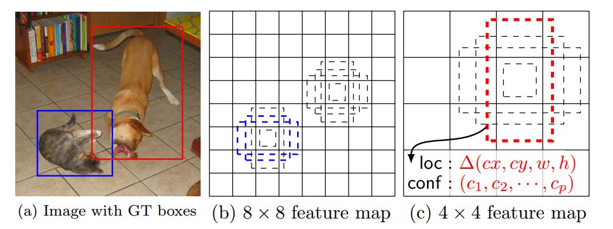
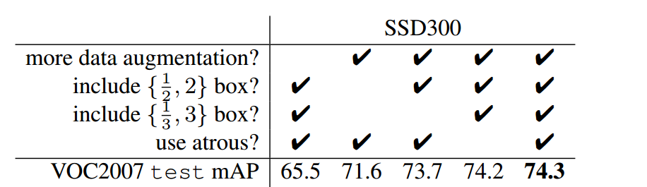

Chúng ta đã tìm hiểu về một số mô hình phát hiện vật thể như họ R-CNN hay YOLO. Trong bài này chúng ta tìm hiểu thêm một mô hình phát hiện vật thể mới có tên là SSD (Single-shot detector). SSD là mô hình one-stage tương tự như YOLO.

Nói sơ qua, SSD đi dự đoán từ nhiều feature maps với độ phân giải khác nhau để xử lý object nhiều kích thước và hình dạng. SSD ban đầu được train trên Framework Caffe.

SSD300 đạt được 74.3% mAP với 59 FPS trên VOC2017, SSD500 đạt được 76.9% mAP với 22 FPS vượt trội hơn hẳn so với [Faster R-CNN (73.2% mAP với 7 FPS)](https://towardsdatascience.com/review-faster-r-cnn-object-detection-f5685cb30202) và [YOLOv1 (63.4% mAP với 45 FPS)](https://towardsdatascience.com/yolov1-you-only-look-once-object-detection-e1f3ffec8a89). Hiện này YOLO đã có đến phiên bản thứ 5 cải thiện hơn rất nhiều, chúng ta sẽ không bàn ở đây. Chúng ta sẽ đi sâu hơn vào các thành phần chính tạo nên model SSD.

# 1. Multibox Detector

Phần này mình sẽ trình bày khái quát quá trình làm việc của SSD. Phần kiến trúc bên dưới sẽ đi chi tiết hơn.



*SSD: Multiple bounding boxes for localization (loc) and confidence (cof)*

Trong quá trình training SSD chỉ cần ảnh đầu vào và các ground-truth boxes cho mỗi object. 

- Sau khi đi qua một số lớp Convolution để trích xuất đặc trưng, chúng ta nhận được được một số feature maps. Ví dụ ở trên chúng ta nhận được feature maps với kích thước `8x8` hoặc `4x4` (chưa tính channels). Convolutional layer 3x3 được áp dụng lên các feature maps này để đưa ra dự đoán.
- Ứng với mỗi vị trí trên feature map chúng ta có **k default boxes**. k default boxes này có kích thước và tỉ lệ khác nhau. Việc chọn số lượng default boxes này dựa trên các objects trong bộ dataset, có thể dùng K-Means để phân cụm các ground-truth boxes để có lựa chọn phù hợp.
- Ứng với mỗi default box chúng ta sẽ xác định confidence score cho tất cả classes $(c_{1}, c_{2},...,c_{n})$ và **4 offsets** cho tọa độ của center, weight và height.

**Chú ý**: Chỗ này hơi khác với YOLO, YOLO dự đoán objectness confidence của box - có object hay không, và tiếp theo dự đoán class scores.
- Cuối cùng chúng ta sẽ có $ m\times n\times k\times (c+4) $ outputs tương ứng với feature map có kích thước $m \times n$ (không tính channels)


Hình trên biểu diễn quá trình prediction của SSD.

# 2. SSD Network architecture


*SSD(top) and YOLO(bottom)*


*Kiến trúc VGG-16*

**Chú ý**: input size trên hình trên là `(224, 224, 3)`, tuy nhiên trong SSD nếu input size là `(300, 300, 3)` có thể thay đổi và kiểm tra kiến trúc trong Kera như sau:
```python
base_model = keras.applications.VGG16(include_top=False, input_shape=(300, 300, 3))
base_model.summary()
```
SSD dựa trên feed-forward convolutional network cái tạo ra số lượng cố định các bounding boxes và scores cho sự xuất hiện của object class trong những boxes này.

Kiến trúc của SSD model bao gồm 3 thành phần chính:
- **Base network** để trích xuất feature map. SSD được xây dựng dựa trên base model VVG-16 có loại bỏ các lớp fully connected layers. Các base model khác được sử dụng như ResNet... có thể cho kết quả tốt hơn.
- **Multi-scale feature layers**: series convolution filters được thêm vào sau base network, bắt đầu từ `CONV6` như hình bên dưới. Những layers này sẽ giảm kích thước để cho phép dự đoán objects với nhiều scales khác nhau và giảm kích thước đầu vào ở các Conv layer tiếp theo.
- **Non-maximum suppression** - NMS được dùng để loại bỏ overlapping boxes.


**Chú ý**: 
- Phần nét đứt thể hiện toàn bộ 5 block VGG16 - base network (không tính FC layers). Phần hình hộp trong đó thể hiện layer `Conv4_3`, ở đây nó được vẽ như bình thường do nó được sử dụng để dự đoán bounding boxes, `Conv4_3` layer này có kích thước `38x38x512` cho inpt image có kích thước `300x300x3`.
- Đầu ra của base network sẽ được áp dụng tích chập để nhận được `Conv6`

Như hình trên có thể thấy các layers `Conv4_3`, `Conv7`, `Conv8_2`, `Conv9_2`, `Conv10_2`, `Conv11_2` được đưa vào dự đoán và thực hiện NMS.

Network thực hiện tổng cộng 8732 detections cho mỗi class, sau đó đưa chúng vào NMS layer để giảm xuống còn 1 detection cho 1 object.

Để có thể phát hiện chính xác hơn, nhiều layers khác nhau của feature map đã được cho đi qua Conv layer `3x3` (như trên hình còn gọi là classifier) để có thể phát hiện vật thể có kích thước khác nhau.
- `Conv4_3` có kích thước `38x38x512` được áp lên 3x3 Conv layer để phát hiện vật thể trên feature map. Đầu ra từ `Conv4_3` để dự đoán là `38x38x4x(C+4)`. Do chúng ta có `38x838` vị trí trên feature map (không tính đến số channels), mỗi vị trí định nghĩa  `4` default boxes, mỗi box lại cần dự đoán confidence scores cho $C$ classes và 4 offsets của nó so với ground truth box. Giả sử chúng ta có 20 object classes cộng với background khi đó số outputs khi áp dụng tích chập lên `Conv4_3` là `38x38x4x(21+4) = 144400`. Nếu chỉ tính số lượng bounding boxes chúng ta có `38x38x4=5776`. Chú ý ngoài áp Conv layer để nhận diện vật thể chúng ta còn áp dụng một số Conv layer thích hợp để nhận được các feature maps tiếp theo. Điều này cũng tương tự đối với các lớp kế tiếp.
- Tương tự như vậy chúng ta có:
    - `Conv7`: `19x19x6=2166` boxes (6 boxes cho mỗi vị trí)
    - `Conv8_2`: `10x10x6=600` boxes (6 boxes cho mỗi vị trí)
    - `Conv9_2`: `5x5x6=150` boxes (6 boxes cho mỗi vị trí)
    - `Conv10_2`: `3x3x4=36` boxes (4 boxes cho mỗi vị trí)
    - `Conv11_2`: `1x1x4=4` boxes (4 boxes cho mỗi vị trí)

**Chú ý**: số lượng bounding boxes ở mỗi vị trí cho các layers có thể khác nhau. Tổng cộng lại chúng ta có `5776 + 2166 + 600 + 150 + 36 + 4 = 8732` bounding boxes. Ở phiên bản **YOLOv1** có `7x7` vị trí (cells) với 2 bounding boxes cho mỗi vị trí, như vậy **YOLOv1** có tổng cộng 98 bounding boxes. Chính vì điều này nên SSD có tốc độ chậm hơn so với YOLOv1. Nên nhớ output của mỗi bounding box sẽ có dạng:

$$ y^{T} = [\underbrace{cx, cy, w, h}_{\text{bounding box}}, \underbrace{c_1, c_2,..., c_C}_{\text{scores of C classes}}] $$

# 3. Training
## 3.1. Loss function
**Matching strategy:** Trong suốt quá trinh training chúng ta cần xác định default boxes khớp với ground-truth box. Đối với mỗi ground-truth box chúng ta chọn các default boxes có IoU lớn hơn **0.5** (coi là positive examples). Điều này làm đơn giản vấn đề, nó cho phép model có thể dự đoán được nhiều boxes có score cao mà overlap với nhau thay vì chỉ lấy duy nhất một box có overlap lớn nhất.

$x_{ij}^p = \{1, 0 \}$ thể hiện sự khớp của **default box $i$ với ground-truth box $j$** của nhãn thứ $p$. $\sum_{i}x_{ij}^p \geq 1$ do trong quá trình mapping chúng ta có thể có nhiều default bounding box $i$ được map vào cùng 1 ground truth box $j$ với cùng 1 nhãn $p$ như đã nói ở trên.

Loss function bao gồm 2 thành phần: localization loss $ L_{loc} $ và confidence loss $ L_{conf} $ (bài toán image classification chỉ có $L_{conf}$ thôi):

$$ L(x, c, l, g) = \frac{1}{N}[L_{conf}(x, c) + \alpha L_{loc}(x, l, g)] \tag{1} $$

trong đó $ N $ là số lượng các default boxes được khớp với ground truth boxes. Nếu $ N=0 $ chúng ta set loss bằng 0. $\alpha$ là trọng số thể hiện đóng góp của các losses.

### 3.1.1. Localization loss

$$ L_{loc}(x, l ,g) = \sum_{i \in Pos}^{N}\sum_{m \in \{cx, cy, w, h\}} x^{k}_{ij} \space L_1^\text{smooth}(l_i^m - \hat{g}_j^m) $$

**Localization loss** là một hàm Smooth L1 đo lường sai số giữa các transformation parameters của predicted box ($ l $) và ground truth box ($ g $). **Nên nhớ transformation parameters của predicted box và ground truth box đều so với default boxes**. Vì khi dự đoán có transformation parameters của predicted boxes và vị trí của default boxes ta mới xác định được vị trí tuyệt đối của predicted boxes trên image.

Localization loss chỉ xét cho các positive matching example ($i \in Pos$) giữa predicted box và ground-truth box. **$ d $ là kí kiệu cho default bounding box**.

$$t_{x} = \frac{g_j^{cx}-d_{i}^{cx}}{d_{i}^{w}} $$

$$t_{y}= \frac{g_j^{cy}-d_{i}^{cy}}{d_{i}^{h}}  $$

$$t_{w} =log\frac{g_j^{w}}{d_i^{w}} $$

$$t_{h} =log\frac{g_j^{h}}{d_i^{h}} $$

$ t_{x}, t_{y}, t_w, t_h $ nhận giá trị trong khoảng $ (-\infty, +\infty) $ và dùng làm labels để tinh chỉnh vị trí của predicted boxes vì không phải default box nào cũng khớp chính xác với ground truth box. $ t_{x}, t_{y} $ càng lớn thì khoảng cách giữa tâm của **ground-truth $ g $ và default box $ d $** càng lớn. $t_w, t_h $ càng lớn thì chênh lệch giữa chiều dài và chiều rộng của ground-truth box và default box càng lớn. $ (t_x, t_y, t_w, t_h) $ là bộ tham số chuẩn hóa kích thước của ground-truth box $g$ theo kích thước của default box $d$. 

Tương tự như vậy chúng ta có thể xác định được bộ tham số thể hiện mối liên hệ giữa **predicted box $l$ và default box $d$** bằng cách thay $g$ bằng $l$ trong các phương trình trên. Khi đó khoảng cách giữa predicted box và ground truth box sẽ càng gần, mô hình dự đoán càng chính xác.

Nhắc lại một chút về hàm smooth $L_1^{smooth}$:

$$ L_1^\text{smooth}(x) = \begin{cases}
    0.5 x^2             & \text{if } \vert x \vert < 1\\
    \vert x \vert - 0.5 & \text{otherwise}
\end{cases} $$

Trường hợp $\textbf{x}$ là một vector thì thay $\lvert x \rvert$ ở vế phải bằng giá trị norm chuẩn bậc 1 của $\textbf{x}$ kí hiệu là $\Vert x \Vert$.

Trong phương trình của hàm localization loss thì các hằng số mà ta đã biết chính là $g$. Biến cần tìm giá trị tối ưu chính là $l$. Sau khi tìm ra được nghiệm tối ưu của $l$ ta sẽ tính ra predicted box nhờ phép chuyển đổi từ default box tương ứng. Xem thêm về transformation parameters đã được ghi rất rõ tại đây [tại đây](https://huytranvan2010.github.io/R-CNN-Understanding/).

Xin nhắc lại một lần nữa việc sử dụng transformation parameters này hiệu quả hơn so với việc dùng kích thước tuyệt đối, do lúc này chúng ta cần có cơ chế xử lý để tránh các gía trị nằm ngoài phạm vi cho phép và đánh giá không đúng về độ lệch giữa predicted box và ground truth box.

### 3.1.2. Confidence loss

$$ L_{conf}(x, c) = -\sum_{i \in Pos} x_{ij}^{p} \text{log}(\hat{c}_{i}^p) - \sum_{i \in Neg}\text{log}(\hat{c}_{i}^0) $$

$ L_{conf} $ chính là softmax loss trên toàn bộ confidences của các classes ($c$).  
* Đối với mỗi **positive match prediction**, chúng ta phạt loss function theo confidence score của các nhãn tương ứng. Do positive match prediction nên vùng dự đoán có vật thể chính xác là chứa vật thể. Do đó việc dự đoán nhãn cũng tương tự như bài toán image classification với softmax loss $ -\sum_{i \in Pos} x _ {ij}^p \text{log}\hat{c} _ {i}^p$. Nhớ lại $x _ {ij}^p = \{1, 0\}$ thể hiện matching default box $i$ với ground-truth box $j$ cho nhãn $p$, còn $\hat{c}_i^{p}$ chính là xác suất xuất hiện nhãn $p$ trong default box $i$. Điều này cũng tương tự như bài toán classification với nhiều nhãn với loss là $-\sum _ {i}^{}y^i \ast log(\hat{y}^i)$
* Đối với mỗi một **negative match prediction**, chúng ta phạt loss function theo confidence score của nhãn ‘0’ là nhãn đại diện cho background không chứa vật thể. Do không chứa vật thể nên chỉ có duy nhất background 0, xác suất xảy ra background $ x_{ij}^0 = 1$, do đó loss là $ -\sum_{i \in Neg}\text{log}(\hat{c}_{i}^0) $.

Ở đây 

$$\hat{c}_{i}^p = \frac{\exp({c}_{i}^p)}{\sum_{p}^{}\exp({c}_{i}^p)}$$


## 3.2. Lựa chọn kích cỡ (scale) và hệ số tỉ lệ (aspect ratio) cho box mặc định

Để xử lý các objects có kích thước khác nhau, một số phương pháp trước đó đã được dùng, tuy nhiên trong SSD tác giả sử dụng feature maps từ nhiều layers khác nhau trong cùng networl để đạt được mục đích tương tự và vẫn có chia sẻ parameters.

Feature maps pử các levels khác nhau trong network có **receptive field size** khác nhau. Tác giả đã thiết kế default boxes một cách hợp lý để feature maps cụ thể đáp ứng được kích thước cụ thể của các objects.

**Scale:** độ phóng đại so với ảnh gốc. Nếu ảnh gốc có kích thước $(w, h)$, sau khi scale ảnh mới sẽ có kích thước là $(ws, hs)$. $s\in \left [ 0,1 \right ]$ là hệ số scale. 

**Aspect ratio:** hệ số tỉ lệ hay tỉ lệ cạnh $\frac{w}{h}$ xác định hình dạng tương đối của khung hình chứa vật thể, người thường có aspect ratio < 1, ô tô có aspect ratio> 1.

Giả sử chúng ta có $m$ feature maps để dự đoán. Scale của default boxes cho mỗi feature map được xác định như sau như sau:

$$ s_k = s_{min} + \frac{s_{max} - s_{min}}{m-1}(k-1), k \in [1,m] $$

Trong đó $k$ là số thứ tự layer dùng để dự đoán do đó nó nằm từ 1 đến $m$, $s_{min} = 0.2$, $s_{max} = 0.9$.

* $k=1$ - tương đương với layer `Conv4_3` và $s_{1} = s_{min} = 0.2$. Điều này nghĩa là sao? Tại `Conv4_3` layer sẽ phát hiện object với scale nhỏ (bản thân `Conv4_3` layer là layer đầu tiên để dự đoán, có kích thước lớn nhất, chia làm nhiều cell nhất, do đó nó có khả năng phát hiện các vật thể nhỏ).
* $k=m$ - tương đương với layer `Conv11_2` và $s_{m} = s_{max} = 0.9$. Điều này nghĩa là sao? Tại `Conv11_2` layer sẽ phát hiện object với scale lớn (bản thân `Conv11_2` layer là layer cuối cùng để dự đoán, có kích thước nhỏ nhất, chia làm ít cell nhất, do đó nó có khả năng phát hiện các vật thể lớn).
Giả sử chúng ta có $m$ feature maps để dự đoán, chúng ta sẽ tính $s_{k}$ cho $k-th$ feature map.

Đối với layer có 6 dự đoán, chúng ta đặt các tỉ lệ (aspect ratios) khác nhau cho 5 default boxes và biểu diễn là $a_{r}\in \{1, 2, 3, \frac{1}{2}, \frac{1}{3}\}$. Sau đó chúng ta có thể tính được **height và width cho mỗi default box** theo công thức sau:

$$ w_{k}^a = s_{k} * \sqrt{a_r} $$

$$ h_{k}^a = \frac{s_k} {\sqrt{a_r}}$$

Đối với trường hợp aspect ratio $ a_{r} = 1$ ta sẽ thêm một default box có scale $s_k' = \sqrt{s_ks_{k+1}}$ và từ đó xác định được width và height tương ứng để tạo thành 6 default boxes cho mỗi vị trí của feature map.

Center của mỗi default box là $\left(x_l^i, y_l^i \right) = \left( \frac{i + 0.5}{\left|f_k \right|}, \frac{j + 0.5}{|f_k|}\right)$, trong đó $\left| f_k \right|$ chính là kích thước (width hay height) của $k-th$ square feature map, $i, j \in \left[ 0, \left| f_k \right| \right]$. 

Trên thực tế có thể thiết kế các default boxes để khớp với dataset cụ thể. Bằng cách kết hợp các dự đoán cho tất cả default boxes với các scale và aspect ratios từ tất cả các vị trí trên feature maps, chúng ta có nhiều predictions với các object size và shape khác nhau.

**Chú ý**: Riêng đối với `Conv4_3`, `Conv10_2` và `Conv11_2` chúng ta chỉ sử dụng 4 default boxes cho mỗi vị trí của feature map. Ở đây đã bỏ qua 2 aspect ratios là $1/3$ và $3$.

## 3.3. Hard negative mining

Sau quá trình matching (khớp default boxes và groud-truth box) có rất nhiều default boxes là negative. Điều này dẫn đến imbalance giữa positive và negative training exmaples. Thay vì sử dụng tất cả negative examples, chúng ta sắp xếp chúng dựa vào **highest confidence loss** (ít có khả năng chứa vật thể nhất) cho mỗi default box và lấy những cái đầu tiên sao cho tỉ lệ giữa negatives và positives tối đa là `3:1` (tránh mất cân bằng quá).
Điều có thể thể làm tăng quá trình tối ưu và ổn định hơn khi training.

## 3.4. Data augmentation

Để model có thể xử lý được objects nhiều kích thước và hình dạng, mỗi training image được chọn ngẫu nhiên từ các lựa chọn sau:
- Sử dụng ảnh gốc
- Lấy một patch với minimum jaccard IoU với các vật thể: 0.1, 0.3, 0.5, 0.7, 0.9
- Lấy ngẫu nhiên một patch

Kích thước của mỗi patch là `[0.1, 1]` so với kích thước ảnh gốc và có aspect ratio nằm giữa 0.2 và 2.

Data augmentation trong SSD thực sự quan trọng. Fast và Faster R-CNN sử dụng original image và horizontal flip để train. SSD tương tự như YOLO sử dụng data augmentation một cách triệt để hơn. Điều này giúp cải thiện 8.8% mAP trên bộ dữ liệu VOC2007. Bảng bên dưới thể hiện ảnh hưởng của một số thành phần lên performance của model.



# 4. Inferences using SSD

SSD sẽ tạo ra rất nhiều predicted boxes khác nhau do đó cần thực hiện non-maximum suppression (NMS) trong quá trình inference. SSD sử dụng các default boxes với tỉ lệ, hình dạng khác nhau trên các layers. SSD loại bỏ các predictions có confidence score nhỏ hớn 0.01. Sau đó cũng áp dụng NMS với IoU threshold 0.45 cho mỗi class và giữ lại top 200 detections cho mỗi ảnh. SSD512 với input image có kích thước `512x512` vượt trội so với Faster R-CNN trên PASCAL VOC và COCC trong khi nhanh hơn 3 lần.

# 5. Kết luận

Trên đây chúng ta đã tìm hiểu chung về mô hình SSD và cách thức chúng hoạt động. Ý tưởng chính của SSD là sử dụng nhiều feature maps có kích thước khác nhau để đưa ra dự đoán. Điều này giúp model có khả năng đối phó tốt với objects nhiều kích thước và hình dạng khác nhau. SSD có độ chính xác cao và tốc độ tương đối nhanh có thể chạy real time được. Phần code của SSD các bạn có thể tham khảo thêm [tại đây](https://github.com/pierluigiferrari/ssd_keras).

# Tài liệu tham khảo
1. https://arxiv.org/abs/1512.02325
2. https://towardsdatascience.com/review-ssd-single-shot-detector-object-detection-851a94607d11
3. https://towardsdatascience.com/understanding-ssd-multibox-real-time-object-detection-in-deep-learning-495ef744fab
4. https://jonathan-hui.medium.com/ssd-object-detection-single-shot-multibox-detector-for-real-time-processing-9bd8deac0e06
5. https://medium.com/featurepreneur/object-detection-using-single-shot-multibox-detection-ssd-and-opencvs-deep-neural-network-dnn-d983e9d52652
6. https://github.com/weiliu89/caffe/tree/ssd#models
7. https://github.com/pierluigiferrari/ssd_keras
8. https://lilianweng.github.io/lil-log/2017/12/31/object-recognition-for-dummies-part-3.html 
9. https://lilianweng.github.io/lil-log/2018/12/27/object-detection-part-4.html#ssd-single-shot-multibox-detector
10. Deep Learning for Vision Systems
11. https://manalelaidouni.github.io/Single%20shot%20object%20detection.html

