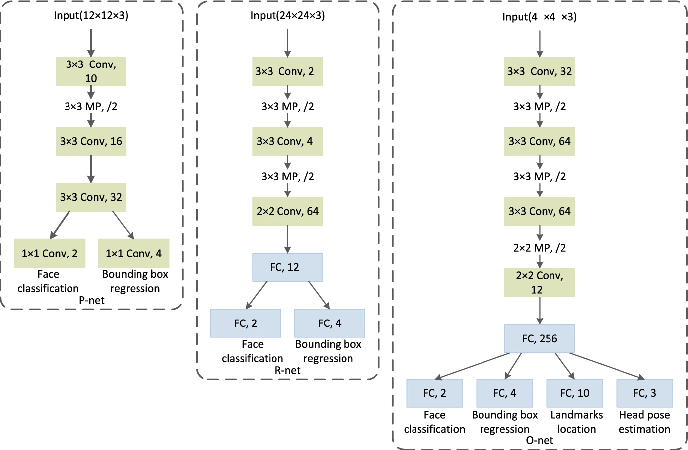
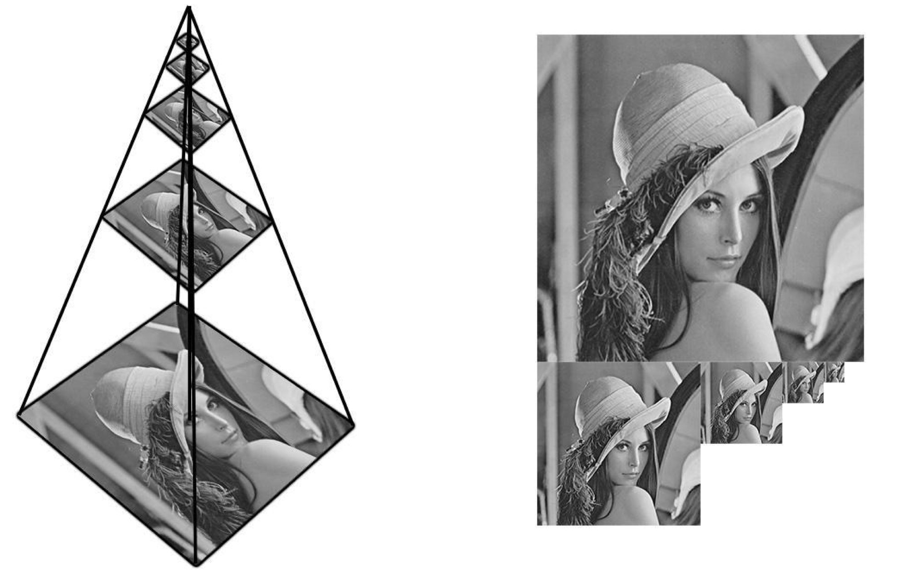
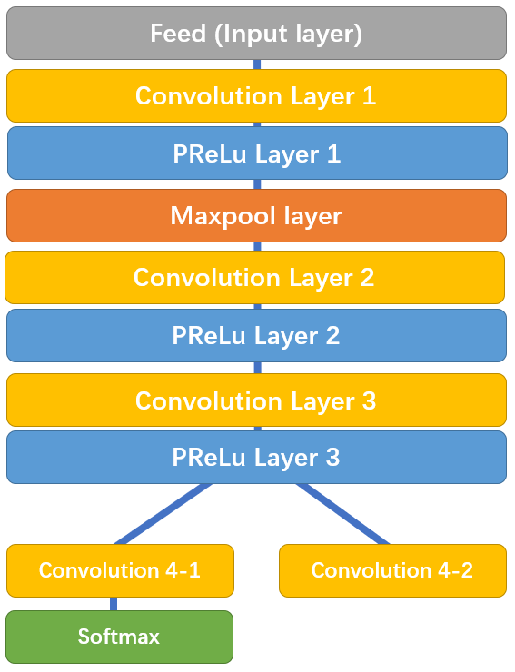
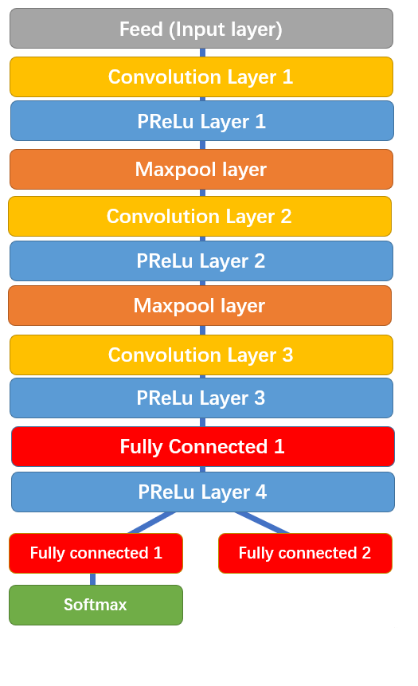
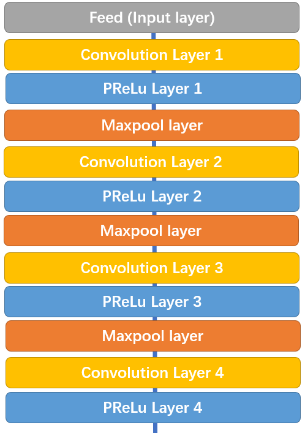
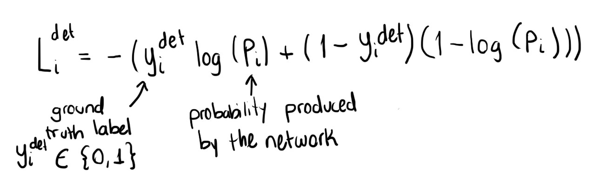
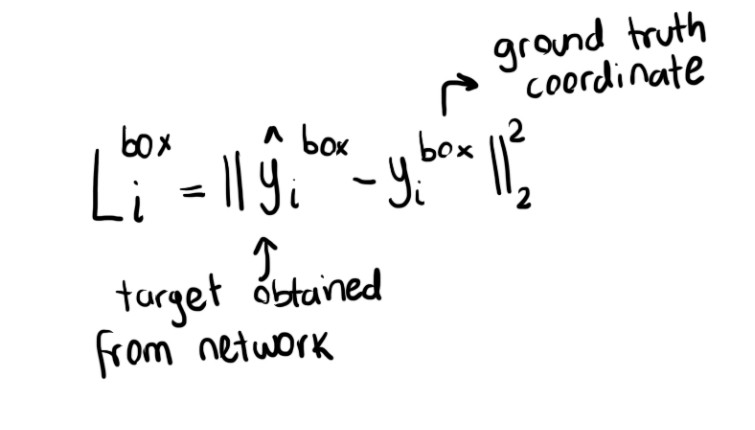
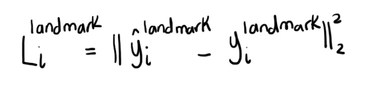

Như chúng ta đã tìm hiểu ở một số bài trước MTCNN bao gồm 3 mạng NN hay có thể gọi là 3 stages. Trong bước đầu tiên sử dụng mạng CNN nông (shallow) để nhanh chóng tạo ra các bounding boxes tiềm năng. Bước 2 tinh chỉnh lại bounding boxes nhận được từ bước 1 bằng mạng CNN phức tạp hơn. Bước cuối cùng sử dụng mạng CNN phức tạp hơn nữa để tinh chỉnh kết quả và đưa ra các facial landmarks.

*Kiến trúc MTCNN (NN thứ 3 đầu vào là 48x48x3)* 

## 3 bước trong CNN
Đầu tiên ảnh được rescale để nhận được **image pyramid** giúp mô hình có thể phát hiện khuôn mặt với các kích thước khác nhau.

*Ảnh được rescale với nhiều tỉ lệ khác nhau* 

### Bước 1: The proposal network (P-Net)
Ở bước đầu tiên sẽ sử dụng mạng FCN (fully convolutional network). Mạng FCN khác mạng CNN ở chỗ mạng FCN không sử dụng lớp **Dense layer**. **P-Net** được sử dụng để có được các windows tiềm năng và bounding box regression vectors của chúng (tọa độ).

**Bounding box regression** là kỹ thuật để dự đoán vị trí của bounding box khi chúng ta cần phát hiện đối tượng (ở đây là khuôn mặt). Sau khi có được tọa độ của bounding boxes một vài tinh chỉnh được thực hiện để loại bỏ một số bounding boxes overlap với nhau (xem trong code sẽ có). Đầu ra của bước này là tất cả bounding boxes sau khi đã thực hiện sàng lọc.

*Chi tiết kiến trúc P-Net*

Ở đây có dùng **PRelu layer** (nói đơn giản giá trị không âm thì giữ nguyên, giá trị âm sẽ được nhân với hệ số $ \alpha $, hệ số này được học trong quá trình training), mọi người có thể xem chi tiết tại đây https://keras.io/api/layers/activation_layers/prelu/

Chú ý sau **PReLu layer 3** tách thành 2 nhánh, nhánh 4-2 dùng để dự đoán tọa độ của bounding box, nhánh 4-1 dùng để dự đoán xác suất xuất hiện khuôn mặt trong bounding box.

### Bước 2: The Refine Network (R-Net)
Tất cả bounding boxes từ **P-Net** được đưa vào **R-Net**. Chú ý rằng **R-Net** là mạng CNN chứ không phải FCN. **R-Net** giảm số lượng bounding boxes xuống, tinh chỉnh lại tọa độ, có áp dụng Non-max suppression.

Ở đây cũng có 2 nhánh để dự đoán xuất hiện khuôn mặt hay không và tọa độ của bounding boxes. 

**Chú ý**: có một số phiên bản modified ví dụ ở **R-Net** có xác định facial landmarks, khi nói chúng ta sẽ đề cập đến một kiến trúc cụ thể.

### Bước 2: The Output Network (O-Net)
Đầu ra của **R-Net** được sử dụng làm đầu vào của **O-Net**. Trong **O-Net** có đưa ra vị trí của facial landmarks (2 mắt, mũi, 2 vị trí của miệng). Như hình trên có thể thấy gần cuối chúng ta có 3 nhánh: xác suất xuất hiện khuôn mặt, tọa độ bounding box, tọa độ của facial landmarks (mỗi vị trí có tọa độ x và y, cái này ảnh hưởng đến số lượng units trong layer).

**Chú ý**: Như hình bên trên model được modified lại, **O-Net** có dự đoán cả *head pose*. 

## 3 nhiệm cụ của MTCNN
### 1. Face classification
Đây là binary classification nên dùng loss function như sau:

### 2. Bounding box regression

Đây là bài toán regression. Đối với mỗi window (bounding box) offset (độ lệch) giữa bounding box và ground truth bounding box được tính. Eucledian loss được áp dụng cho trường hợp này.

Chú ý ở đây mỗi bounding box có 4 thành phần nhé.

### 3. Facial landmark localization
Xác định vị trí của facial landmarks. Đây cũng là bài toán regression.

Có 5 landmraks: left eye, right eye, nose, left mounth corner, right mounth corners.

## Kết luận
Trên đây chúng ta đã cùng tìm hiểu về kiến trúc của MTCNN. Tóm lại MTCNN gồm 3 thành phần chính: **P-Net, R-Net và O-Net**.
MTCNN ngoài việc được sử dụng để phát hiện khuôn mặt có thể được dùng để detect các object khác như biển số, xe...

## Tài liệu tham khảo
1. https://towardsdatascience.com/face-detection-neural-network-structure-257b8f6f85d1
2. https://medium.com/@iselagradilla94/multi-task-cascaded-convolutional-networks-mtcnn-for-face-detection-and-facial-landmark-alignment-7c21e8007923#:~:text=Multi-task%20Cascaded,eyes%2C%20nose%2C%20and%20mouth.
3. https://github.com/baomingwang/MTCNN-Tensorflow 

