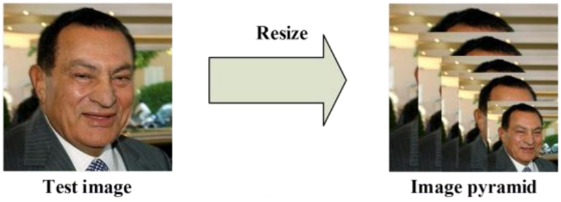
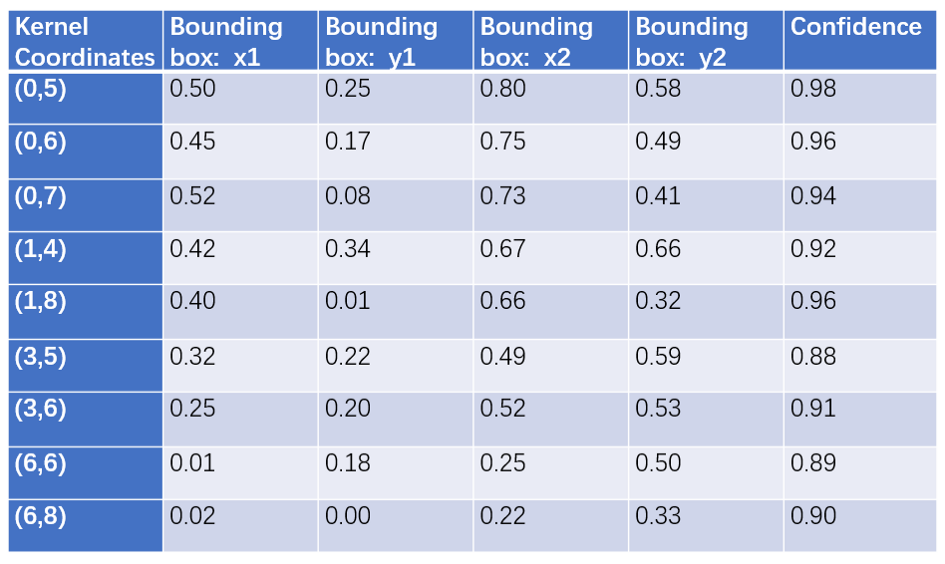
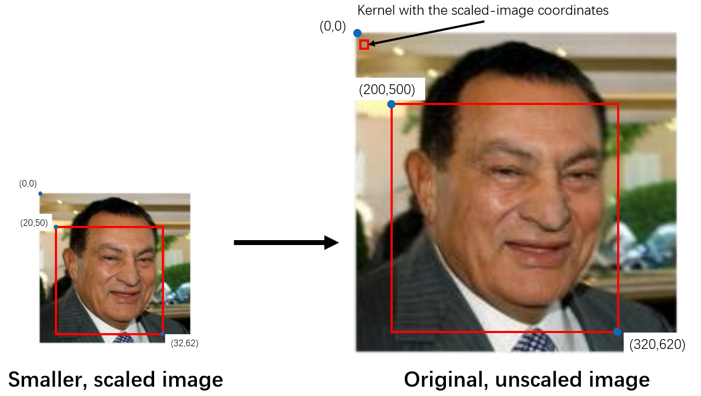
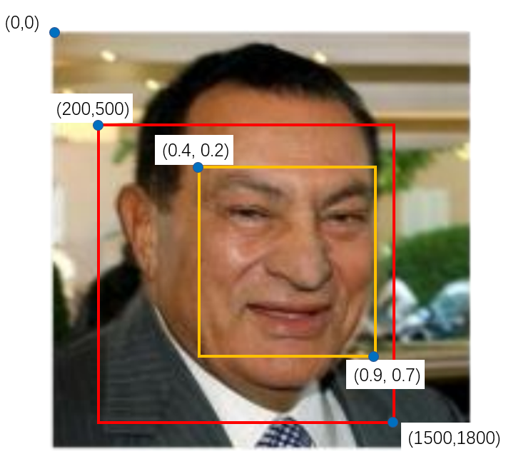
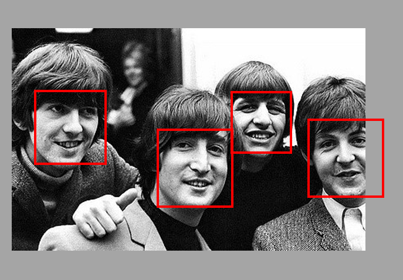

Face detection có thể thực hiện bằng nhiều cách ví dụ Haarcascade bên OpenCV hay sử dụng mạng NN. Trong bài này chúng ta sẽ đề cập đến MTCNN - Multi task cascaded convolutional network. MTCNN bao gồm 2 mạng CNN (P-Net, R-Net và O-Net), MTCNN vượt trội về hiệu suất phát hiện khuôn mặt mà vẫn đảm bảo tốc độ real-time. 

Hình trên thể hiện kiến trúc của mạng MTCNN. Chúng ta cùng đi vào các bước trong MTCNN.
## Bước 1
Ảnh đầu vào được sử dụng để tạo **image pyramid** (các ảnh với nhiều kích thước khác nhau). Mục đích của chúng ta là có thể phát hiện được khuôn mặt với nhiều kích thước khác nhau.

Đối với mỗi ảnh trong **image pyramid** chúng ta cho kernel có kích thước `12x12` trượt qua với `stride = 2` (khuôn mặt thường lớn hơn 2 pixels nên hiếm khi bỏ sót). Kernel này chỉ lấy một phần của ảnh thôi chứ không thực hiện o bất kỳ operation nào ở đây. Kernel bắt đầu từ góc trên bên trái phần của ảnh có tọa độ 2 góc là (0, 0) và (12, 12). Sau khi dịch phải hoặc xuống dưới sẽ có 2 tọa độ là (0+2a, 0+2b), (12+2a, 12+2b). Mỗi phần của bức ảnh được đưa qua mạng **P-Net**, đầu ra của mạng là tọa độ bounding box nếu phát hiện ra có khuôn mặt. 
Ví dụ đầu ra mạng P-Net

Một số bounding boxes có confidence thấp hơn ngưỡng nào đó sẽ bị loại bỏ.
Do kernel `12x12` cố định kích thước nên đối với ảnh có kích thước lớn trong **image pyramid** chúng ta có thể phát hiện được những khuôn mặt nhỏ hơn. Tương tự như vậy nó cũng giúp chúng ta phát hiện các khuôn mặt lớn hơn trong những ảnh có kích thước nhỏ trong **image pyramid**.

Đối với các bounding box tìm được trong các ảnh của **image pyramid** chúng ta cần rescale chúng về kích thước của ảnh gốc (dễ dàng thực hiện được thông qua scale factor).
Sau khi đã rescale về kích thước ảnh gốc lại có nhiều bounding box overlap với nhau. **Non-maximum supression (NMS)** sẽ giúp chúng ta giảm số lượng bounding boxes bị chồng chập.
Kích thước của bounding box cũng được chuyển về so với kích thước ảnh gốc (không phải kích thước tương đối nữa).

Cuối cùng bounding box sẽ được reshape lại thành hình vuông.

Xem thêm tại [link sau.](https://youtu.be/w4tigQn-7Jw)

## Bước 2

Đôi khi ảnh chỉ chứa một phần của khuôn mặt. Ví dụ trong ảnh trên chỉ chụp được một phần khuôn mặt của người bên phải. Trong trường hợp này bounding box chỉ là một phần bên trái (trong bức ảnh). Để giải quyết vấn đề này chúng ta sẽ thêm những `pixels=0` còn thiếu bên phải vào. Quá trình này gọi là **padding**.

Sau khi thực hiện xong padding bounding boxes, ta sẽ resize bounding boxes (được rescale lại rồi) về kích thước `24x24`, sau đó **normalize** các pixels về đoạn `[-1, 1]` bằng cách trừ tất cả các pixels cho 127.5 rồi chia cho 127.5.

Bây giờ chúng ta có rất nhiều array 24x24, chúng ta sẽ cho vào mạng **R-Net**. Đầu ra của mạng **R-Net** cũng tương tự như mạng **P-Net**. Nó bao gồm tọa độ của các **bounding boxes mới, chính xác hơn** cũng như confidence của các bounding boxes đó.

Một lần nữa cũng phải loại bỏ các bounding boxes có confidence thấp và sử dụng **NMS** để loại bỏ các bounding boxes chồng chập. Tọa độ của các bounding boxes mới này dựa trên tọa độ của bounding boxes từ **P-Net**, do đó chúng ta cần chuyển về tọa độ thực so với ảnh gốc ban đầu.

## Bước 3
Tương tự như phần trên cần thực hiện padding các bounding boxes (nếu cần) và resize lại về kích thước `48x48`. Sau đó các bounding boxes mới này được đưa vào mạng **O-Net**.

Đầu ra của mạng **O-Net** hơi khác so với **P-Net và R-Net**. **O-Net** cho 3 outputs:
* Tọa độ của bounding boxes mới
* Tọa độ của 5 facial landmarks
* Confidence level của mỗi box

Một lần nữa cũng phải loại bỏ các boxes có confidence thấp, cần chuẩn hóa về tọa độ so với ảnh ban đầu. Áp dụng **NMS**. Cuối cùng đối với mỗi khuôn mặt chúng ta chỉ nên có một bounding box tương ứng thôi.

## Kết quả cuối cùng
Ở bước cuối cùng chúng ta sẽ đóng gói để nhận được dictionary với các **keys** là: `box, confidence, keypoints`. `Box` chứa tọa độ của bounding boxes, `confidence` chứa confidence level của mỗi box, `keypoint` chứa các tọa độ của facial landmarks (eye, nose, endpoints of the mounth).

## Một số lưu ý
MTCNN đáp áp dụng nhiều kỹ thuật để có hiệu quả cao mà vẫn đảm bảo được tốc độ tính toán. Dùng `stride=2` giúp giảm số lượng tính toán chỉ còn gần 1/4 so với ban đầu. Mô hình cũng không xác định ngay các facical landmarks cho tới bước cuối cùng ở **O-Net** giúp mô hình nhanh hơn.

Độ chính xác cao nhờ sử dụng một số mạng NN, mạng NN sau có thể tinh chỉnh kết quả của mạng NN trước đó. Model này cũng áp dụng **image pyramid** để có thể phát hiện được khuôn mặt với nhiều kích thước khác nhau.

Mô hình có hiệu quả cao này có thể dùng để phát hiện các đối tượng khác. Hãy thử xem sao?

Xem thêm thông tin **implementation** các mạng [tại đây](https://github.com/ipazc/mtcnn).

## Tài liệu tham khảo
1. https://towardsdatascience.com/how-does-a-face-detection-program-work-using-neural-networks-17896df8e6ff
2. http://arxiv.org/abs/1604.02878
3. https://github.com/ipazc/mtcnn

