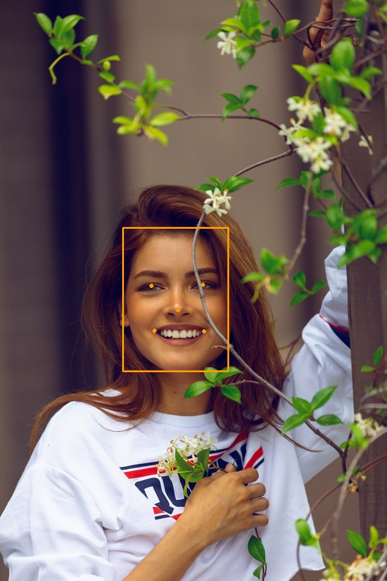

Trong bài này chúng ta cùng thực hiện face detection với pre-trained model MTCNN. MTCNN trả về cho chúng ta bounding box của khuôn mặt và vị trí của các keypoints. 

Đầu tiên sẽ đi cài đặt thư viện
```python
pip install mtcnn
```
Sau đó đi import các thư viện cần thiết, load ảnh, khai báo model và detect khuôn mặt. 

```python
model = MTCNN()
```
Bên trong này có thể thay thế một số tham số mặc định như:
- `min_face_size=20`: kích thước nhỏ nhất cho box để detect face
- `scale_factor=0.079`: hệ số scale cho input image 

```python
import cv2
import mtcnn 

# face detection
img = cv2.imread('image_1.jpg')
# chuyển từ BGR -> RGB
img_rgb = cv2.cvtColor(img, cv2.COLOR_BGR2RGB)
detector = mtcnn.MTCNN()   # đang để mọi thứ mặc định
faces = detector.detect_faces(img_rgb)
```

Sau khi phát hiện khuôn mặt detector sẽ trả về list of JSON objetcs. Mỗi JSON object chứa 3 keys: `box`, `confidence` và `keypoints`:
- Bounding box ở dạng `[x, y, width, height]` dưới key `box`
- Confidence -  probability cho bounding box chứa khuôn mặt
- Keypoints là JSON object với keys `left_eye`, `right_eye`, `nose`, `mouth_left`, `mouth_right`. Mỗi keypoint được xác định vị trí `(x, y)`.

Sau khi phát hiện vị trí các khuôn mặt và keypoints, ta có thể vẽ chúng lên ảnh để xem kết quả như thế nào.

```python
# vẽ keypoints và bounding boxes
def draw(image, face):
    x, y, width, height = face['box']
    cv2.rectangle(image, (x, y), (x+width, y+height), (0, 155, 255), 2)

    for key, value in face['keypoints'].items():
        cv2.circle(image, value, 2, (0, 155, 255), 2)
```



Sau này đối với các bài toán face recognition chúng ta cần cắt các khuôn mặt, lưu lại để tính embeddings. Việc cắt các khuôn mặt và hiển thị được thực hiện như sau:

```python
def draw_faces(face):
    x, y, width, height = face['box']
    data = img[y:y+height, x:x+width]
    cv2.imshow("face", data)
    cv2.waitKey(0)
```
Đối với nhận diện khuôn mặt cũng làm tương tự, chúng ta cần lấy các frame và detect khuôn mặt trên đó thôi. Các bạn tham khảo thêm source code [tại đây](https://github.com/huytranvan2010/Face-detection-MTCNN).

## Tài liệu tham khảo
1. https://github.com/ipazc/mtcnn
2. https://machinelearningmastery.com/how-to-perform-face-detection-with-classical-and-deep-learning-methods-in-python-with-keras/
3. https://github.com/huytranvan2010/Face-detection-MTCNN


