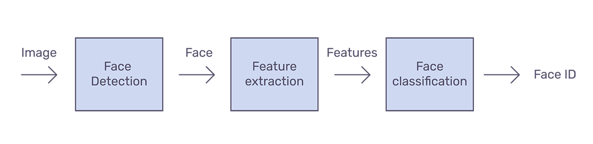
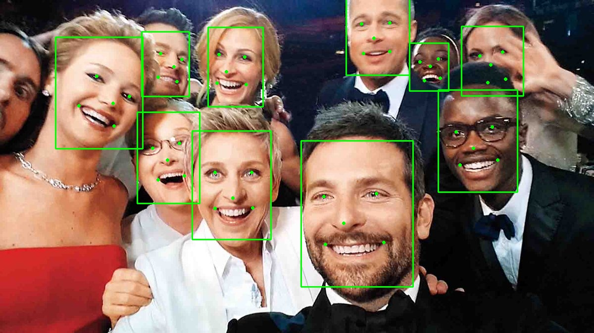
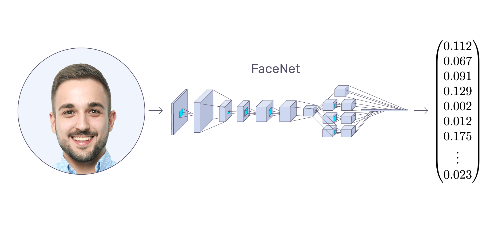

Trong bài viết trước chúng ta đã tìm hiểu về mô hình FaceNet (dùng triplet loss function). Trong bài này chúng ta sẽ đi sâu vào xây dựng hệ thống nhận diện khuôn mặt. 

Quá trình nhận diện khuôn mặt có thể được chia thành nhiều bước như hình bên dưới.

1. **Face detection**: phát hiện một hay nhiều khuôn mặt trong ảnh. Việc này có thể thực hiện bằng nhiều cách ví dụ như **HaarCascade** hay dùng **Deep Learning** để phát hiện khuôn mặt.
2. **Feature extraction**: Trích xuất các đặc trưng quan trọng nahats từ ảnh chứa khuôn mặt (vùng ảnh chứa khuôn mặt được thực hiện sau bước 1). Có thể dùng FaceNet để trích xuất đặc trưng (128 dimensions).
3. **Face classification**: phân loại khuôn mặt dựa trên đặc trưng đã được trích xuất. Việc này có thể thực hiện bằng cách sử dụng **SVM** hay **Softmax**

Đây là pepline chung cho nhận diện khuôn mặt. Bài này sẽ tập trung vào sử dụng **MTCNN** để phát hiện khuôn mặt, **FaceNet** để trích xuất đặc trưng và **Softmax** để phân loại khuôn mặt.

## MTCNN
MTCNN (Multi-task cascaded convolutional neural networks) - mạng NN nhằm phát hiện khuôn mặt và các facical landmarks (vị trí của mắt, mũi, miệng..) trong ảnh. MTCNN được công bố năm 2016 bởi Zhang et al.

MTCNN là một trong những công cụ phổ biến và chính xác nhất để phát hiện khuôn mặt hiện nay. MTCNN gồm 3 mạng NN kết nối với nhau theo kiểu tầng. 

## FaceNet
FaceNet là mạng NN dùng để trích xuất đặc trưng từ ảnh mặt người (là mạng NN trong Siamese Network, Siamese Network bao gồm 2 mạng FaceNet giống hệt nhau). FaceNet được công bố năm 2015 bởi tác giả Schroff et al.

Như bài trước đã nói rất kĩ, đầu vào của FaceNet là ảnh khuôn mặt, đầu ra là là vector có chiều 128 thể hiện đặc trưng của khuôn mặt (còn gọn là encoding hay embedding). Gọi là **embedding** vì những thông tin quan trọng được **embedded** vào vector. Việc mapping dữ liệu có số chiều lớn (như ảnh chẳng hạn) xuống biểu diễn có số chiều nhỏ (embedding) là vấn đề rất hay thấy hiện nay. Xem thêm về [embedding tại đây.](https://developers.google.com/machine-learning/crash-course/embeddings/video-lecture)

Nên nhớ FaceNet (chính xác Siamese Net - 2 mạng NN) đã được train dựa trên các bộ 3 ảnh (triplels). Vì vậy chúng ta có parameters sắn rồi nên mới có thể xác định được embedding.

<video src="../images/mtcnn/3.mp4" controls> </video>

Các giá trị trong embedding là gì? Kích thước của mắt, mũi, khoảng cách giữa 2 mắt... Các giá trị này rất quan trong, nhưng thực tế chúng ta không biết rõ ý nghĩa của chúng là gì. `Có thể tìm hiểu được không?`

## Softmax
Sau khi có vector embedding có thể thực hiện classification thông qua việc tính toán khoảng cách giữa khuôn mặt mới và các khuôn mặt có trong database. Ngay cả không lưu ảnh raw mà chỉ lưu mỗi vector embedding, việc này cũng yêu cầu tính toán nhiều (phương pháp **kNN**). Thay vào đó chúng ta quyết định sử dụng **Softmax classifier**. Ngoài ra cũng có thể sử dụng **SVM, Random Forest...** để phân loại.

## Tài liệu tham khảo
1. https://arsfutura.com/magazine/face-recognition-with-facenet-and-mtcnn/

