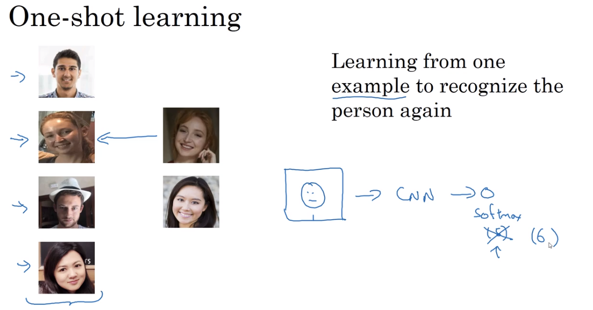
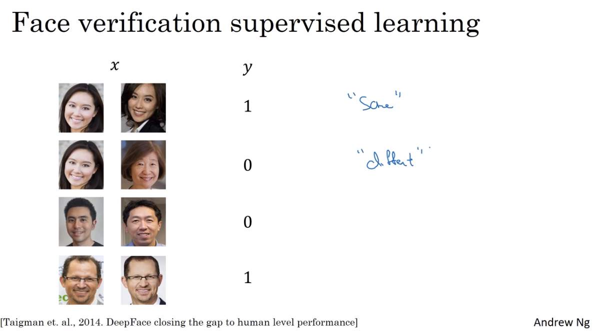

Trong bài này chúng ta sẽ đi tìm hiểu về bài toán nhận diện khuôn mặt. Hiện nay việc nhận diện khuôn mặt được ứng dụng khá nhiều trong việc chấm công, theo dõi đối tượng... Đầu tiên chúng ta cần phân biệt khái niệm `face recognition` và `face verification`:
## Face verification
Khi chúng ta có ID, có hình ảnh của người đó, nhập ID vào hệ thống rồi kiểm tra xem ảnh đó có phải là của người có mã ID kia không. Ở đây chỉ phải so sánh ảnh `1:1`.

Trước hệ thống xác thực khuôn mặt đã có xác thực vân tay và mống mắt (chính xác hơn do ít thay đổi), khuôn mặt có thể thay đổi theo thời gian, make hay ánh sáng... Tuy nhiên hiện nay hệ thống xác thực bằng khuôn mặt cũng được ứng dụng rộng rãi. 

Trên một số dòng điện thoại chúng ta có thể mở khóa bằng khuôn mặt, đây là một ứng dụng của xác thực khuôn mặt.
## Face recognition
Có hình ảnh của người, hệ thống cần kiểm tra trong kho dữ liệu (có `K` người) xem ảnh này có trùng với ai trong cơ sở dữ liệu hay không, nếu trùng đó là ai (đưa ra ID chẳng hạn). Bài toán này phức tạp hơn hệ thống xác thực khuôn mặt. Ở đây phải so sánh ảnh `1:K`. Chính vì điều này độ chính xác của `face recognition` thường thấp hơn `face verification`.

Nhận diện khuôn mặt có thể được ứng dụng trong việc chấm công, giám sát công dân...

# Một số thuật toán nhận điện khuôn mặt
## 1. One-shot learning
Đây là thuật toán học giám sát mà mỗi người chỉ cần một. Việc học được thực hiện từ 1 bức ảnh (đối với 1 người) để nhận diện lại người đó. 

Đầu vào là ảnh của một người, đưa qua mạng CNN để dự đoán người đó là ai, output là softmax layer. Do bản thân có ít ảnh nên để model hoạt động tốt cũng rất khó. Ngoài ra thuật toán này có một nhược điểm khi có thêm người mới (ví dụ công ty bổ sung người) chúng ta phải train lại model vì đầu ra output của chúng ta tăng thêm 1. Việc này gây tốn thời gian và không tốt cho những công ty có số người luôn biến động.



## 2. Learning a similarity function
Nhìn vào tên chúng ta có thể đoán được thuật toán này làm gì, thuật toán này sẽ xác định khoảng cách giữa 2 bức ảnh (qua norm `l1` hoặc norm `l2`), nếu 2 bức ảnh của 1 người sẽ cho khoảng cách nhỏ nhất, nếu thuộc 2 người khoảng cách sẽ lớn hơn. Ở đây chúng ta có thể sử dụng ngưỡng `threshld` để phân biệt là cùng một người hay khác nhau (việc chọn ngưỡng này có thể quyết định kết quả của bài toán). 
```
d(img1, img2) = degree of difference between images 
```

Thuật toán này giải quyết nhược điểm của `one-shot learning` vì thuật toán này không giới hạn số lượng người, không cần huấn luyện lại model.

Điều quan trọng là làm sao chúng ta biểu diễn ảnh lên không gian n chiều một cách hợp lý để sau đó có thể sử dụng khoảng cách để dự đoán nhãn. **Siamese network** sẽ giúp chúng ta giải quyết vấn đề này.

Trong khóa học của Andrew Ng. đã nói rất rõ điều này.


# Siamese Network
Kiến trúc mạng mà khi chúng ta đưa 2 ảnh đầu vào và mô hình dự đoán có cùng một người hay không được gọi là `Siamese Network`.


Kiến trúc Siamese network dữ trên base model dạng CNN đã được loại bỏ output layer, lúc này ảnh sẽ được encoding thành vector embedding. Đầu vào của Siamese Network là 2 ảnh bất kì  $ x^{(1)} $,  $ x^{(2)} $ , output của Siamese Network là 2 vector tương ứng biểu diễn 2 ảnh đầu vào $ f(x^{(1)}) $,  $ f(x^{(2)}) $ hay còn được gọi là **encoding của ảnh** . Sau đó 2 vector này sẽ được sử dụng để tính **similarity function** (so sánh sự khác biệt giữa chúng).

$$ d(x^{(1)}, x^{(2)}) = ||f(x^{(1)})-f(x^{(2)})||_2^{2} $$

Có thể xem thêm chi tiết tại [bài báo này](https://www.cs.toronto.edu/~ranzato/publications/taigman_cvpr14.pdf).

Làm sao để train Siamese Network? Siamese Network bao gồm 2 mạng NN **chia sẻ với nhau parameters**.


Nhiệm vụ của chúng ta là học được các parameters của NN. Để học được điều này chúng ta dựa trên `similarity function`, nếu 2 ảnh cùng một người thì đạt giá trị nhỏ, nếu 2 ảnh 2 người khác nhau thì giá trị lớn. Mục đích chính là tạo ra được `good encoding` của ảnh.

Để train model chúng ta cần định nghĩa loss function, ở đây sẽ dùng **triplet loss function**.

# Triplet loss function 
[Bài báo gốc](https://arxiv.org/abs/1503.03832)
Một cách để học được các parameters mạng NN là áp dụng gradient descent lên **triplet loss function**.
Để áp dụng triplet loss mỗi lần chúng ta cần 3 bức ảnh trong đó có một bức ảnh gọi là `anchor` (bức ảnh được cố định). Hai ảnh còn lại một ảnh là `negative` và một ảnh là `positive` (cùng người). Đây là lý do loss function có tên là **triplet** - xem 3 bức ảnh cùng lúc.

Kí hiệu ảnh anchor, positive, negative lần lượt là **A, P, N.**


Triplet loss function lấy 3 bức ảnh làm input (A, P, N), chúng ta hy vọng:

$$ d(\mathbf{A}, \mathbf{P}) \leq d(\mathbf{A}, \mathbf{N}) $$

có thể viết lại như sau:

$$ d(\mathbf{A}, \mathbf{P}) - d(\mathbf{A}, \mathbf{N}) \leq 0 $$

Tuy nhiên điều này rất dễ xảy ra ví dụ như encoding $ f(img) = \vec{0} $ hoặc các vector encoding identical. Để tránh mạng NN học được nghiệm tầm thường ta thêm hệ số  $ \alpha $ không âm để tăng khoảng cách giữa vế trái và phải lớn hơ. $\alpha$ gọi là margin.

$$ d(\mathbf{A}, \mathbf{P}) - d(\mathbf{A}, \mathbf{N}) + \alpha \leq 0$$

hay là

$$ \Vert f(\mathbf{A})-f(\mathbf{P}) \Vert_2^{2} - \Vert f(\mathbf{A})-f(\mathbf{N}) \Vert_2^{2} + \alpha \leq 0 ~~~~ (1)$$

## Loss function
Triplet loss function được định nghĩa khi có 3 ảnh $\mathbf{A}$, $\mathbf{N}$, $\mathbf{P}$:

$$ L(\mathbf{A, P, N}) = \Vert f(\mathbf{A})-f(\mathbf{P}) \Vert_2^{2} - \Vert f(\mathbf{A})-f(\mathbf{N}) \Vert_2^{2}+ \alpha $$ 

Trong đó `n` là số lượng bộ ba hình ảnh đưa vào huấn luyện model.
Mục tiêu của chúng ta là giảm thiểu các trường hợp model nhận diện Negative thành Positive. Ta sẽ điều chỉnh loss function một chút:

$$ L(\mathbf{A, P, N}) = \max(\Vert f(\mathbf{A})-f(\mathbf{P})\Vert_2^{2} - \Vert f(\mathbf{A})-f(\mathbf{N}) \Vert_2^{2}+ \alpha, 0) $$ 

Mục đích đưa `max` vào đây:
* Miễn là thành phần thứ nhất <=0 (**đạt được mục đích**) hay điều kiện (1) thỏa mãn, vừa phân loại đúng vừa đảm bảo khoảng cách thì loss function = 0
* Nếu thành phần thứ nhất > 0 (điều kiện (1) không thỏa mãn) khi đó max > 0, nghĩa là chúng ta có **positive loss**, cố gắng min loss function - làm cho thành phần thứ nhất <= 0 (không quan tâm âm bao nhiêu)

Bên trên là triplet loss cho 3 ảnh, đối với bộ các 3 ảnh chúng ta sẽ có triplet loss function:

$$ J = \sum_{i=1}^{m}L(\mathbf{A^{(i)}, P^{(i)}, N^{(i)}}) $$ 

hay 

$$ J = \sum_{i=1}^{m}\max(\Vert f(\mathbf{A}^{(i)})-f(\mathbf{P}^{(i)})\Vert_2^{2} - \Vert f(\mathbf{A}^{(i)})-f(\mathbf{N}^{(i)})\Vert_2^{2}+ \alpha, 0) $$

Ví dụ chúng ta có training set: 10k pictures của 1k persons, ** có nghĩa rằng 1 người sẽ có nhiều ảnh trong đó**. Điều này cũng dễ hiểu vì khi train chúng ta cần các cặp $\mathbf{A}$, $\mathbf{P}$. Nếu 1 người chỉ có 1 ảnh chúng ta không thể train được model.

## Lựa chọn triplets (bộ ba ảnh đầu vào) để tạo training set huấn luyện model
Trong quá trình training nếu các ảnh $\mathbf{A}$, $\mathbf{P}$, $\mathbf{N}$ được chọn ngẫu nhiên thì điều kiện

$$ d(\mathbf{A}, \mathbf{P}) + \alpha \leq d(\mathbf{A}, \mathbf{N}) $$

rất dễ dàng được thỏa mãn vì nếu 2 ảnh được chọn ngẫu nhiên khả năng $\mathbf{A}$, $\mathbf{N}$ khác nhau là rất lớn. Hầu hết các trường hợp đều thỏa mãn điều kiện trên và giá trị loss function được set về 0. Do đó việc học những bức ảnh `Negative` quá khác biệt so với `Anchor` không có nhiều ý nghĩa (gần như chẳng cần học nhiều vẫn thỏa mãn, điều này không tốt).

Để model có thể phân biệt tốt độ giống khác nhau giữa các hình ảnh, triplets được chọn để training cần phải `hard`. Chúng ta cần có bộ 3 ảnh (triplets) sao cho $ d(\mathbf{A}, \mathbf{P}) \approx  d(\mathbf{A}, \mathbf{N}) $, điều này tương đương với việc làm cho  $ d(\mathbf{A}, \mathbf{N}) $ có giá trị nhỏ nhất và $ d(\mathbf{A}, \mathbf{P}) $ có giá trị lớn nhất. Có như vậy Gradient descent mới có cái để làm việc, algorithm sẽ hiệu quả hơn.Với mỗi Anchor $ \mathbf{A} $ cần chọn:
* **Hard positive**: $ \mathbf{P} $ - positive có khoảng cách xa nhất với Anchor tương ứng với nghiệm: 

$$ \text{argmax}_{\mathbf{P}^{(i)}}(d(\mathbf{A}^{(i)}, \mathbf{P}^{(i)})) $$

* **Hard negative**: $ \mathbf{N} $ - negative có khoảng cách gần nhất với Anchor tương ứng với nghiệm: 

$$ \text{argmin}_{\mathbf{N}^{(j)}}(d(\mathbf{A}^{(j)}, \mathbf{N}^{(j)})) $$

Ở đây $ i, j $ là nhãn của người trong ảnh.

Việc tính toán các trường hợp Hard Positive và Hard Negative có thể được thực hiện offline và lưu vào checkpoint hoặc có thể tính toán online trên mỗi mini-batch.

Việc lựa chọn image triplet sẽ quyết định đến chất lượng của mô hình Facenet.

Mục tiêu của loss function là tối thiểu khoảng cách giữa 2 ảnh khi chúng là A, N và tối đa khoảng cách giữa 2 ảnh khi chúng là A, P (đặt ra trường hợp khó nhất để mô hình học). Do đó cần lựa chọn 3 ảnh sao cho:
* Ảnh Anchor A và positive P khác nhau nhất để khoảng cách `d(A,P)` lớn. Điều này giống với việc chọn ảnh một người lúc nhỏ và lớn.Nếu mô hình vẫn nhận biết được thì nó thông minh.
* Ảnh Anchor A và negative N giống nhau nhất để khoảng cách d(A, N) nhỏ. Điều này tương tự việc thuật toán phân biệt được ảnh của hai anh em sinh đôi vậy.

Khi đã chọn được triplets chúng ta có thể bắt đầu quá trình training.


# Face verification and Binary classification
Thông qua triplet loss chúng ta có thể học được các parameters của ConvNet giúp giải quyết bà toán face recognition. Ngoài ra face recognition có thể được coi là bài toán **binary classification**.


Thông qua Siamese Network sẽ nhận được 2 vector encoding của 2 ảnh. Sau đó chúng đưa vào layer để dự đoán output - xác suất (training set nếu cùng 1 người thì label = 1, hai người khác nhau thì label = 0, bài toán phân loại Logistic regression).

$$ \widehat{y} = \sigma(\sum_{k=1}^{128} w_{k} \left| f(x^{(i)})_{k}-f(x^{(j)})_{k} \right| + b) $$


Ngoài ra cũng có một số biến thể khác như;

$$ \widehat{y} = \sigma(\sum_{k=1}^{128} w_{k} \frac{(f(x^{(i)})_k - f(x^{(j)})_k)^{2}}{f(x^{(i)})_k + f(x^{(j)})_k} + b) $$

cái này còn được gọi là **chi square form hay chi square similarity**.

Tất nhiên đối với cách này chúng ta phải thay đổi cách gãn nhãn như đề cập bên trên. 



**Tip (good practice for the deployment):**
* Khi deploy hệ thống nhận diện khuôn mặt thay vì lưu tất cả ảnh ở dạng raw chúng ta có thể **tính trước vector encoding** (ví dụ ở đây vector with 128 dimensions dùng được cho cả `triplet loss` và `binary classification`) và lưu lại. Khi đó có thể tiết kiệm được rất nhiều bộ nhớ.
* Khi có một người mới đến chỉ cần chụp ảnh, thông qua mạng NN đã train sẽ xác định được vector encoding của ảnh đó, sau đó đi tính phần phía sau của model để nhận diện.  


*Inference*

# Pretrained model FaceNet
Những mô hình pretrain được huấn luyện trên các dữ liệu lên tới hàng triệu ảnh. Do đó có khả năng mã hóa rất tốt các bức ảnh trên không gian 128 chiều. Việc còn lại của chúng ta là sử dụng lại mô hình, tính toán embedding véc tơ và huấn luyện embedding véc tơ bằng một classifier đơn giản để phân loại classes.

## Một số bộ dữ liệu về khuôn mặt
* [CASIA-WebFace](http://www.cbsr.ia.ac.cn/english/CASIA-WebFace-Database.html): Bộ dữ liệu bao gồm gần 500k ảnh được thu thập từ khoảng 10k người.
* [VGGFace2](https://www.robots.ox.ac.uk/~vgg/data/vgg_face2/): Bộ dữ liệu gồm khoảng 3 triệu ảnh được thu thập từ gần 9k người.
* [baidu](https://ai.baidu.com/broad)
* [somedataset](https://lionbridge.ai/datasets/5-million-faces-top-15-free-image-datasets-for-facial-recognition/)
* [aivivn](https://www.aivivn.com/contests/2) face dữ liệu cho người Việt.

## Một số pretrained model
Thử xem pretrained model [tại đây](https://github.com/davidsandberg/facenet). Kiến trúc mà tác giả sử dụng là Inception ResNetv1 trên 2 bộ dữ liệu là CASIA-WebFace và VGGFace2.

Dưới đây là chia sẻ của các bạn tham gia cuộc thi [pretrained model](https://forum.machinelearningcoban.com/t/khai-bao-pretrained-models-cho-nhan-dien-nguoi-noi-tieng/4566)

# Kết luận 
Như vậy qua bài viết này bạn đã hiểu được phương pháp chính của thuật toán Facenet trong nhận diện khuôn mặt. Thuật toán này đã cải thiện được đồng thời độ chính xác và tốc độ nhờ áp dụng output shape thấp và hàm triple loss function hiệu quả.

Mấu chốt để xây dựng một mô hình facenet tốt đó là chiến lược lựa chọn input triple images sao cho chúng là những bộ 3 khó học (hard triplets).

Việc huấn luyện mô hình Facenet có thể tốn rất nhiều tài nguyên của bạn. Thế nên, trừ khi bạn là doanh nghiệp, muốn đầu tư vào mô hình này cho mục đích thương mại thì có thể xây dựng lại mô hình trên dữ liệu mới. Nếu bạn là sinh viên nghèo vượt khó hãy sử dụng lại pretrain model. Các model pretrain hiện tại rất tốt và tôi nghĩ hiệu quả chưa chắc đã thua kém.

# Tài liệu tham khảo
1. https://phamdinhkhanh.github.io/2020/03/12/faceNetAlgorithm.html
2. https://www.coursera.org/learn/convolutional-neural-networks/lecture/HuUtN/triplet-loss
3. https://forum.machinelearningcoban.com/t/khai-bao-pretrained-models-cho-nhan-dien-nguoi-noi-tieng/4566/114
4. https://machinelearningmastery.com/how-to-develop-a-face-recognition-system-using-facenet-in-keras-and-an-svm-classifier/


<!-- # Thuật toán Facenet
## Tổng quan
Facenet chính là một dạng của Siam Network có tác dụng biểu diễn các ảnh trong không gian n chiều (thường 128) sao cho khoảng cách giữa các vector càng nhỏ thì mức độ tương đồng giữa chúng càng lớn.

Hầu hết các thuật toán nhận diện khuôn mặt trước Facenet đều tìm cách biểu diễn khuôn mặt bằng một vector embedding thông qua một layer bottle neck để giảm chiều dữ liệu. Tuy nhiên có một số vấn đề:
* Các thuật toán này có số chiều embedding tương đối lớn (>= 1000) sẽ ảnh hưởng tới tốc độ thuật toán. Thường phải áp dụng thêm PCA để giảm chiều dữ liệu.
* Loss function chỉ đo khoảng cách 2 bức ảnh, do đó trong một lần huấn luyện chỉ học được sự giống nhau nếu cùng một người hoặc sự khác nhau nếu 2 người.

Facenet ra đời để giải quyết 2 vấn đề trên:
* Facenet giảm chiều dữ liệu xuống 128. Điều này làm cho quá trình dự đoán nhanh hơn mà độ chính xác vẫn được đảm bảo.
* Loss function là hàm triplet loss có khả năng học đồng thời sự giống nhau giữa 2 bức ảnh cùng người và phân biệt các bức ảnh không cùng một người. Hiệu quả được nâng lên. -->


