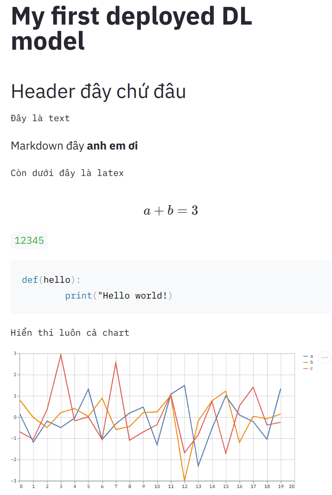

Streamlit là một open-source Python lib, nó giúp ta dễ dàng tạo một web app cho MachineLearning và Data Science. Đối với một người có rất ít kiến thức về HTML, CSS, JavaScript thì đây có lẽ là công cụ rất phù hợp với mình để demo các sản phẩm AI. Chúng ta có thể test cục bộ được, sau đó muốn deploy lên internet có thể dùng Heroku, Streamlit hay Ngrok đều được cả. Trên trang của streamlit có câu slogan:
> **The fastest way to build and share data apps**

Trong bài này chúng ta sẽ đi tìm hiểu sơ bộ trước về streamlit, bài sau chúng ta sẽ thử deploy model.
##### Cài đặt
```python
pip install streamlit
```
Sau khi cài đặt xong có thể chạy ngay câu lệnh sau, nó đưa chúng ta tới tab với đường link [http://localhost:8501/](http://localhost:8501/)
```python
streamlit hello
```
Ở đây chúng ta có thể xem một số demo của streamlit có sẵn.

Sau khi cài xong bạn có thể chạy ứng dụng với cú pháp sau:
```python 
streamlit run app.py
```
Ở đây `app.py` là file bạn muốn chạy.
Trước đây để làm trang web phần giao diện sẽ được thực hiện thông qua HTML, CSS, để deploy model có thể dùng Flask, Django hay FastAPI. Tuy nhiên với Streamlit mọi thứ đơn giản hơn rất nhiều, thuần Python, giúp chúng ta không phải học thêm nhiều thứ mà vẫn có thể deploy được sản phẩm.

Ngay ở trong trang chủ của streamlit có rất nhiều demo về các lĩnh vực, chúng ta có thể tham khảo tại đó.

##### Một số tính năng qua ví dụ
Thử xem ví dụ dưới đây
```python
import streamlit as st
import pandas as pd
import numpy as np

# app title
st.title("My first deployed DL model")
st.header("Header đây chứ đâu")
st.text("Đây là text")
st.markdown('Markdown đây **anh em ơi**')
st.text("Còn dưới đây là latex")
st.latex(r''' a + b = 3''')
# Viết một cái gì đó
st.write(12345)

# Hiển thị code luôn
code = '''def(hello):
        print("Hello world!)'''
st.code(code, language='python')

st.text("Hiển thi luôn cả chart")
hart_data = pd.DataFrame(np.random.randn(20, 3), columns=['a', 'b', 'c'])
st.line_chart(hart_data)
```


Ngoài việc hiển thị thông tin streamlit cũng cho chúng ta tương tác thông qua một số classes như:
* Sử dụng checkbox
```python
if st.checkbox('Show text'):
        st.write("This is a text")
```
* Sử dụng selectbox
```python
option = st.selectbox('Select one', ('The option 1', 'The option 2'))
```

Còn rất nhiều tính năng hay ho các bạn có thể xem thêm tại [trang chủ](https://streamlit.io/).

Trên đây mình đã giới thiệu sơ qua về streamlit một công cụ đang được cộng đồng AI rất thích. Streamlit giúp chúng ta demo nhanh chóng các dự án nhỏ không cần custom quá nhiều, bạn có thể dành thời gian tập trung cho các công việc khác quan trọng hơn. Nếu muốn hơn thế nữa hãy sử dự Flask hoặc Django kết hợp cùng HTML, CSS, Jasvasript để xây dựng web apps cho riêng mình.
##### Tài liệu tham khảo
1. https://streamlit.io/ 
