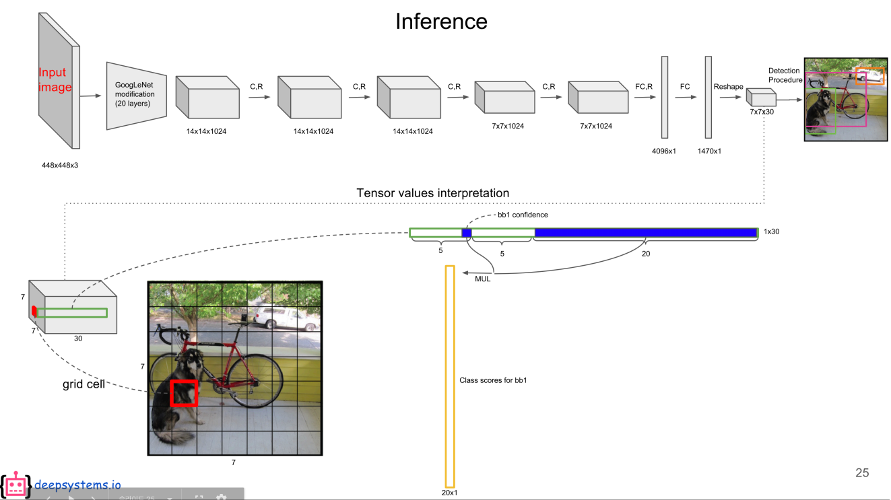
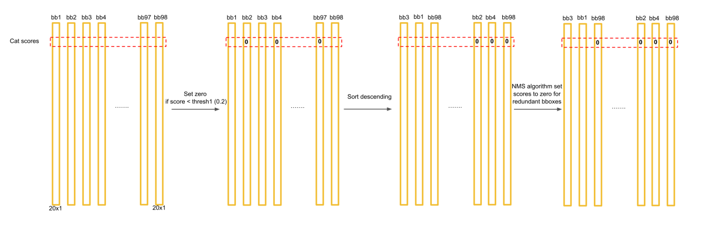
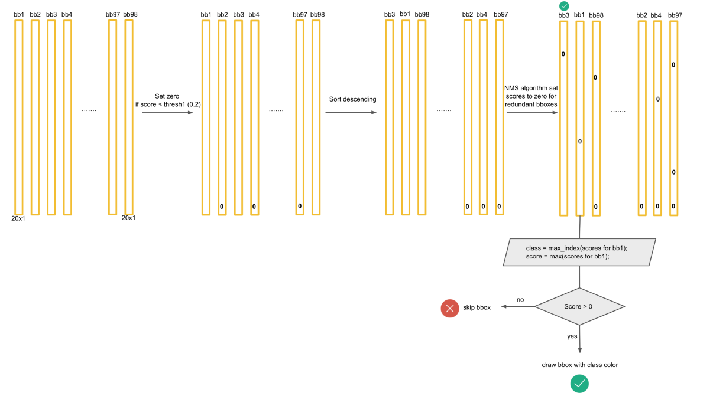

Trong bài này chúng ta sẽ cùng tìm hiểu các ý chính về YOLOv1. 
Không giống như các mô hình two-stages như R-CNN, Fast-RCNN, Faster-RCNN, YOLOv1 là mô hình one-stage để nhận diện vật thể. Bạn chỉ cần cho ảnh đi qua model duy nhất một lần là có kết quả, đó là lý do vì sao có tên YOLO - You Only Look One.
Để hiểu rõ một số phần liên quan các bạn có thể đọc từ bài báo gốc. Ở đây mình sẽ đi trực tiếp vào phần inference và training model.

1. Input image được chia thành $ S \times S $ grid cells ($S=7$). Nếu tâm của object thuộc grid cell nào thì cell đó chịu trách nhiệm phát hiện vật thể đó. Đối với mỗi grid cell sẽ dự đoán $B$ bounding boxes ($B=2$) và xác suất các classes với điều kiện tồn tại object trong cell đó $Pr(class_i | object)$. Ban đầu sử dụng bộ dữ liệu PASCAL VOC có số classes $C = 20$.

2. Đối với mỗi bounding box lại dự đoán 5 giá trị:
* **4 tọa độ** của của bounding box **$(x, y, w, h)$**. 
    * **$(x, y)$** là tọa độ tâm của bounding box so với grid cell của nó (còn gọi là offsets). **$x, y$** sẽ nhận giá trị từ 0 đến 1.
    * **$(w, h)$** là width và height của bounding box so với width và height của toàn bộ ảnh (không phải so với grid cell).
* **1 confidence score** thể hiện khả năng cell có chứa object, nó chính là $Pr(object) \cdot IOU_{pred}^{truth}$. Ở đây thêm $IOU_{pred}^{truth}$ có nghĩa rằng vừa tính khả năng cell chứa object vừa tính tới khả năng bounding box khớp với grounth truth như thế nào.

Như vậy tổng cộng chúng ta sẽ có $S \times S \times (5B + C)$ giá trị đầu ra ($7 \times 7 \times (2\times 5 + 20)=1470$). Đây chính là tensor shape của layer cuối cùng model. Hình bên dưới thể hiện đầu ra của model.

Cùng phân tích hình trên trong quá trình inference. 

Đầu ra của model chúng ra nhận được $ Pr(object) \cdot IOU_{pred}^{truth} $ cho mỗi bounding box, đối với mỗi grid cell chúng ta nhận được $ Pr(class_i|object) $ (dùng chung cho tất cả bounding box). Do đó kết quả nhận được cuối cùng cho một bounding box sẽ là:

$$ Pr(class_i | object) \cdot Pr(object) \cdot IOU_{pred}^{truth} = Pr(class_i) \cdot IOU_{pred}^{truth}$$

Công thức trên cho ta giá trị vừa tính xác suất có mặt $class_i$ trong bounding box vừa tính đến độ khớp của bounding box đó với grounth truth. **Nên nhớ công thức này chỉ sử dụng để xuất ra kết quả, không được sử dụng ở quá trình training**.

### Network architecture
Kiến trúc của YOLOv1 dựa trên GoogleNet, thay vì dùng inception block nó sẽ sử dụng các Conv layers $1 \times 1$ và $3 \times 3$.

**Model YOLOv1 bao gồm 24 Conv layers và 2 FC layers.** Phiên bản Fast YOLO (YOLO-tiny) chỉ sử dụng 9 Conv layers và ít filters hơn trong các layer đó.

### Trainging

* **Location loss**

$$ \mathcal{L}_\text{loc} = \lambda_\text{coord} \sum_{i=0}^{S^2} \sum_{j=0}^B \mathbb{1}_{ij}^\text{obj} [(x_i - \hat{x}_i)^2 + (y_i - \hat{y}_i)^2 +] +\lambda_\text{coord} \sum_{i=0}^{S^2} \sum_{j=0}^B \mathbb{1}_{ij}^\text{obj} [(\sqrt{w_i} - \sqrt{\hat{w}_i})^2 + (\sqrt{h_i} - \sqrt{\hat{h}_i})^2] $$

$ 1^{obj}_{ij} = 1 $ nếu box thứ $ j $ của cell thứ $ i $ chứa object. 
Khi huấn luyện chúng ta đã biết grounth-truth box thuộc cell nào. Box thứ $ j $ được lấy là box có IOU cao nhất trong 2 box thuộc grid cell.

$ \lambda_\text{coord} = 5 $ ảnh hưởng của việc dự đoán sai vị trí và kích thước bounding box sẽ lớn hơn trong loss function.

Trong loss function $ \mathcal{L}_\text{loc} $ nhận thấy width và height dùng square root (căn bậc 2). Điều này để tính tớí việc chênh lệch giữa hai box lớn ít bị ảnh hưởng hơn so với chênh lệch giữa hai box nhỏ. Cùng lấy ví dụ để hiểu rõ hơn. Ví dụ chúng ta có $w_1 = 0.55, \hat{w_1} = 0.5$, $w_2 = 0.3, \hat{w_2} = 0.25$, nhận thấy $(w_1 -\hat{w_1}) = (w_2 -\hat{w_2}) $, tuy nhiên bounding boxes nhỏ hơn $w_2 = 0.3, \hat{w_2} = 0.25$ bị lệch nhiều hơn so với bounding boxes lớn $w_1 = 0.55, \hat{w_1} = 0.5$. Làm cách nào đó để trừng phạt bounding box nhỏ hơn, ở đây dùng square root. Thật vậy $\sqrt{0.3} - \sqrt{0.25} = 0.0477 > 0.0345 = \sqrt{0.55} - \sqrt{0.5}$.

* **Object loss**

$$ \mathcal{L}_\text{obj} = {\sum_{i=0}^{S^2} \sum_{j=0}^B \mathbb{1}_{ij}^\text{obj} (C_{ij} - \hat{C}_{ij})^2} +\lambda_\text{noobj}{\sum_{i=0}^{S^2} \sum_{j=0}^B \mathbb{1}_{ij}^\text{noobj} (C_{ij} - \hat{C}_{ij})^2} $$

Thành phần thứ nhất của object loss chính là phần loss cho **trường hợp cell $i$ có chứa objet: $C_{ij}$ luôn bằng 1 còn $ \hat C_{ij} =  Pr(object) \cdot IOU_{pred}^{truth} $ của bounding box $j$ thuộc cell $i$.**

Thành phần thứ hai của object loss chính là phần loss cho **trường hợp cell $i$ không chứa objet: $C_{i}$ luôn bằng 0 còn $ \hat C_{ij} =  Pr(object) \cdot IOU_{pred}^{truth} $ của bounding box $j$ thuộc cell $i$.**

$1^{noobj}_{ij} = 1$ nếu box thứ $j$ của cell thứ $i$ không chứa object.

Cùng nhìn vào object loss, do trong ảnh đa số các grid cell không chứa object nên nếu để $\lambda_\text{noobj} = 1$, việc này có thể ảnh hưởng đến độ chính xác của model. Vì vậy ở đây lấy $\lambda_\text{noobj} =0.5$.

* **Classification loss**

$$ \mathcal{L}_\text{cls}={\sum_{i=0}^{S^2} \mathbb{1}_i^\text{obj}  \sum_{c \in \mathcal{classes}} (p_i(c) - \hat{p}_i(c))^2}$$

$1^{obj}_{i} = 1$ nếu cell thứ $i$ chứa object (chỉ tính classification class khi biết trong cell có chứa object).

$p_i(c) = Pr(class_i | object)$ (được tính chung cho cả grid cell)

Như vậy tổng loss sẽ là
$$ \mathcal{L} = \mathcal{L}_\text{loc} + \mathcal{L}_\text{obj} +\mathcal{L}_\text{cls} $$

$ \mathcal{L}_\text{loc} $ - loss function cho dự đoán vị trí bounding box so với ground truth.
$ \mathcal{L}_\text{obj} $ - loss function cho dự đoán trong cell có object hay không.
$ \mathcal{L}_\text{cls} $ - loss function cho dự đoán phân phối xác suất có từng loại object.

**Quá trình training**
* Pretrain 20 Conv layers đầu + Avarage Pooling layer + FC layer trên tập dữ liệu ImageNet khoảng 1 tuần để đạt được top-5 accuracy khoảng 88%. Ảnh đầu vào có kích thước 224 x 244.
* Chuyển model để thực hiện detection. Để làm điều đó thì giữ lại 20 Conv layers bên trên thêm vào 4 Conv layers + 2 FC layers với khởi tạo ngẫu nhiên weights. Ảnh đầu vào được đổi thành 448 x 448 để thuận tiện cho việc minh họa. Sau đó phần sau được train trên bộ dữ liệu PASCAL VOC.
* Một số hyperparameters:
    * epochs = 135
    * batch_size = 64
    * momemtum = 0.9
    * decay = 0.0005
    * learning rate = $[10^{-2},\ 10^{-3},\ 10^{-3},\ 10^{-4}]$
    * dropout = 0.5
    * augmentation = [scaling, translation, exposure, satuaration]

**Non-Max Suppression**
Chú ý khi nhận diện có rất nhiều bounding boxes có thể phụ trách cho một vật thể. Để loại bỏ bớt các bounding boxes thừa chúng ta sẽ áp dụng Non-Max Supression. Tuy nhiên trước tiên chúng ta cần biến đổi ouput một chút.

Ở bên trên chúng ta cũng đã đề cập

$$ Pr(class_i | object) \cdot Pr(object) \cdot IOU_{pred}^{truth} = Pr(class_i) \cdot IOU_{pred}^{truth}$$

Tương ứng với mỗi bounding box chúng ta sẽ có 20 giá trị $Pr(class_i) \cdot IOU_{pred}^{truth}$ thể hiện score của từng class trong bounding box có tính tới khớp với ground truth box. Tổng cộng chúng ta có $98 x 20 = 1960 $ các giá trị như này cho 98 bounding boxes. Thực chất việc đưa về tensor $7 \times 7 \times 30 = 1470$ giúp chúng ta giảm số tham số trong mô hình.

Chúng ta sẽ có tổng cộng 98 bounding boxes. Quá trình NMS có thể được tóm tắt như hình dưới đây

Để đơn giản gọi là $Pr(class_i) \cdot IOU_{pred}^{truth}$ là **class confidence**
* Đối với class **X** đầu tiên cho tất cả bounding boxes, nếu class confidence **X** của box nào nhỏ hơn **threshold** thì set class confidence của box đó = 0
* Sắp xếp boxes theo chiều giảm của class confidence **X**
* Áp dụng NMS bắt đầu từ box bên trái có class confidence **X** lớn nhất, các box sau có IOU so với box đầu đó lớn hơn **IOU threshold** thì set class confidence của box đó = 0. 
* Làm xong với box bên trái có class confidence **X** max rồi sẽ làm tiếp đến box còn lại (có class confidence **X** còn khác 0)
* Cứ làm như vậy đến khi bên tay phải không còn box nào có class confidence **X** khác 0. Như vậy xong cho một class.
* Lặp lại các bước trên lần lượt cho các class còn lại.

Sau khi thực hiện xong các bước trên sẽ đến bước vẽ các bounding box. Đối với mỗi bounding sẽ chọn ra class có confidence lớn nhất. Giá trị của class confidence này phải lớn hơn 0. Khi đó bounding box là hợp lệ có chứa thông tin class, class confidence và các thông số hình học, từ đây là vẽ được rồi. 

### Kết luận
Như vậy chúng ta đã cùng tìm hiểu các ý chính trong YOLOv1. YOLOv1 có nhược điểm là chỉ preidict được duy nhất một vật thể trong grid cell. Độ chính xác chưa được tốt như các state-of-the-art thời bấy giờ.

### Tài liệu tham khảo
1. https://towardsdatascience.com/yolov1-you-only-look-once-object-detection-e1f3ffec8a89
2. https://lilianweng.github.io/lil-log/2018/12/27/object-detection-part-4.html
3. https://www.git2get.com/av/89501128.html
4. https://deepsystems.ai/

