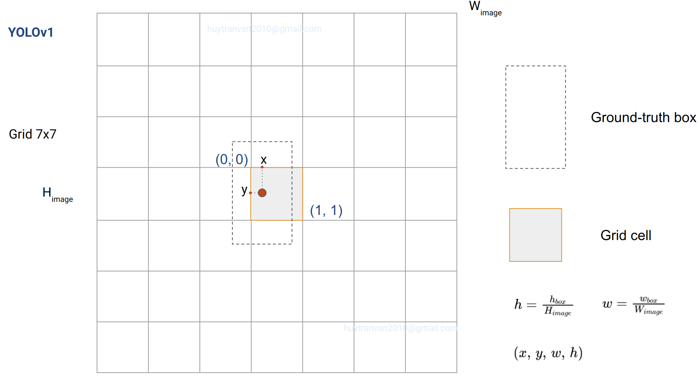
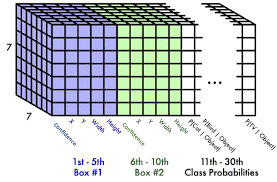
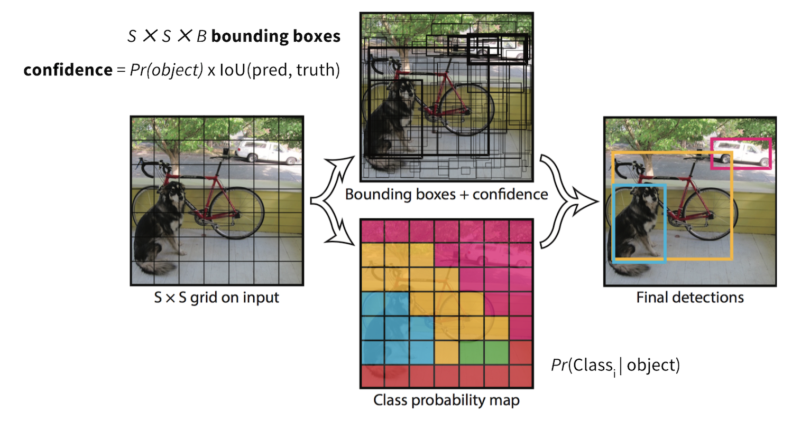
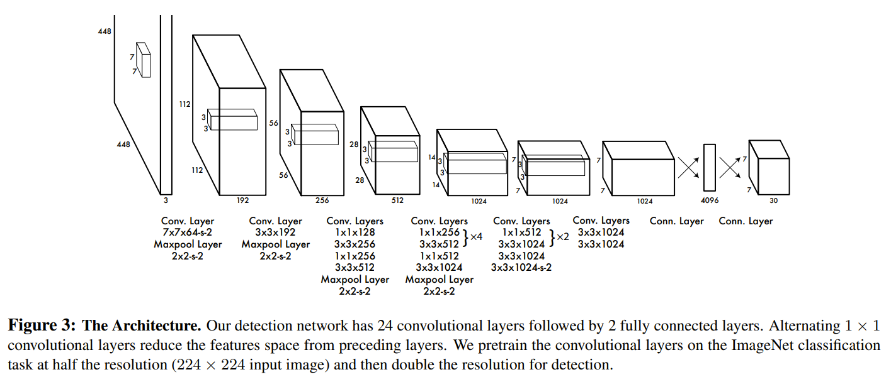
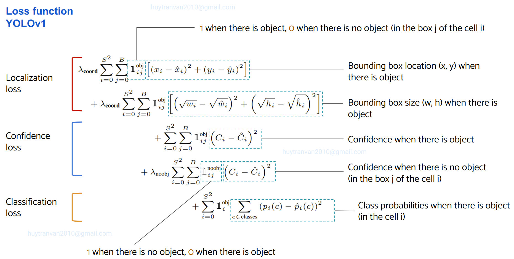
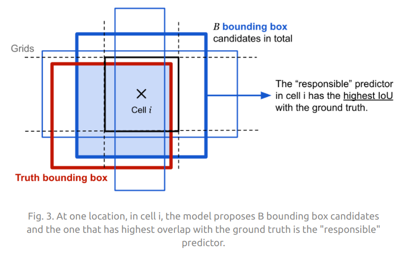
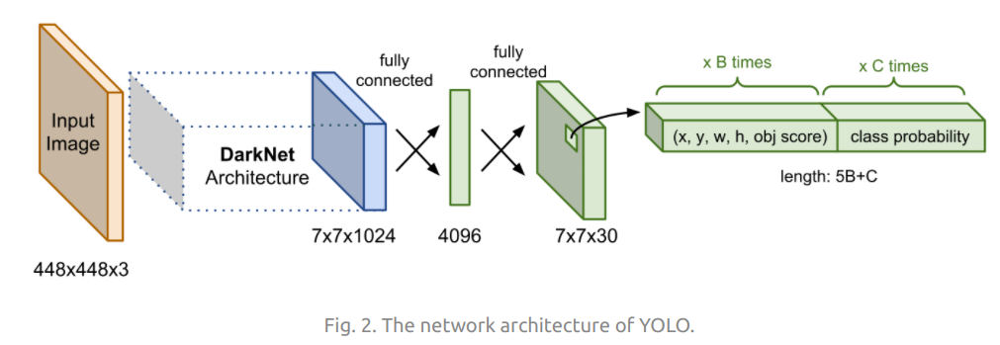
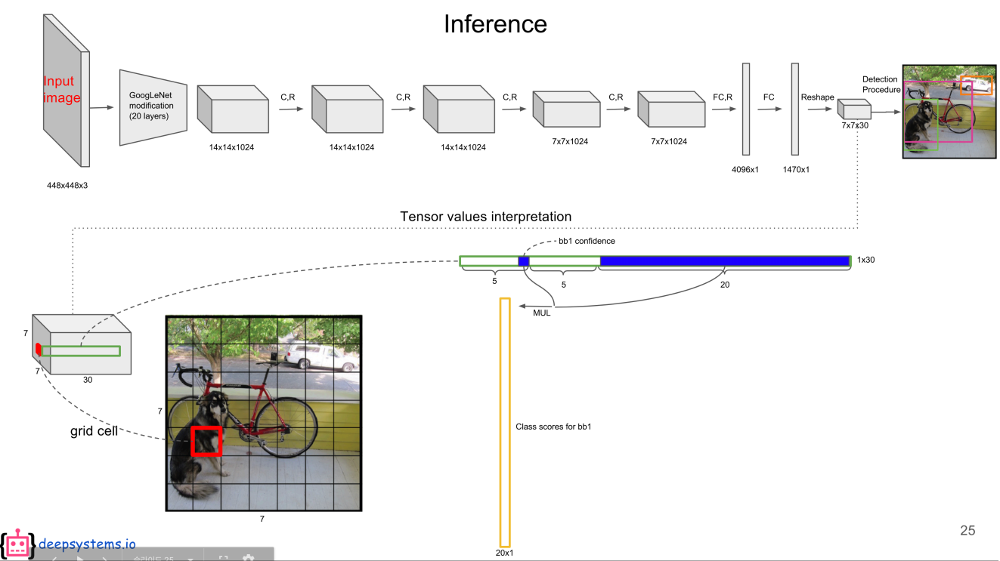
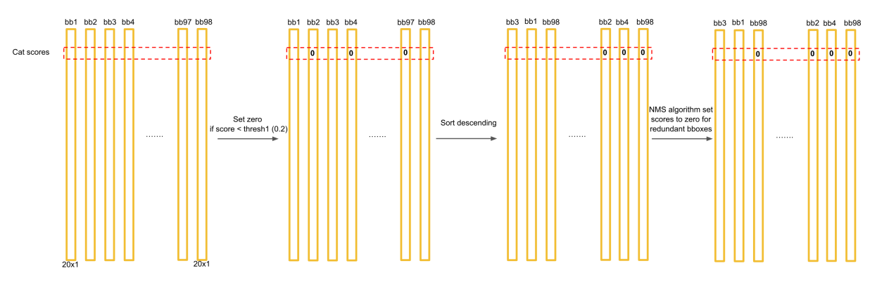
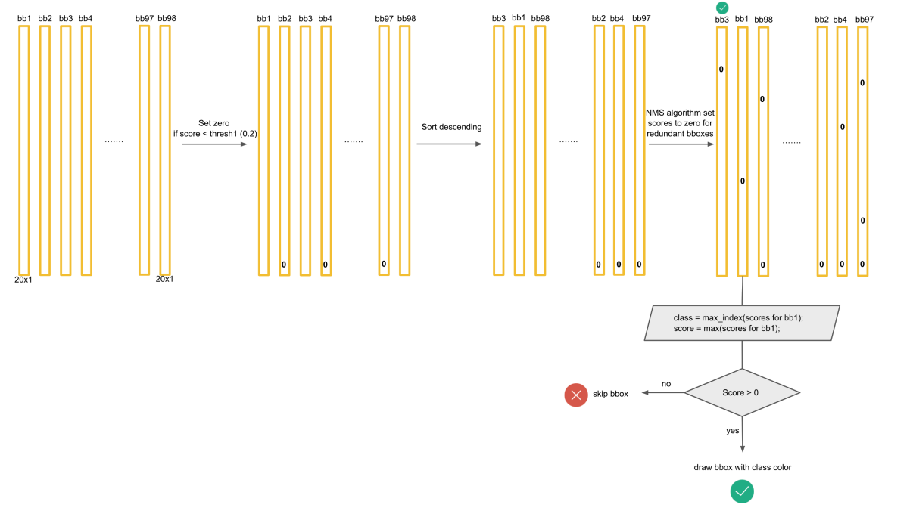

Trong bài này chúng ta sẽ cùng tìm hiểu các ý chính về YOLOv1. 
Không giống như các mô hình two-stages như R-CNN, Fast-RCNN, Faster-RCNN, YOLOv1 là mô hình one-stage để nhận diện vật thể. Bạn chỉ cần cho ảnh đi qua model duy nhất một lần là có kết quả, đó là lý do vì sao có tên YOLO - You Only Look One.
Để hiểu rõ một số phần liên quan các bạn có thể đọc từ [bài báo](https://arxiv.org/pdf/1506.02640.pdf). Ở đây mình sẽ đi trực tiếp vào phần inference và training model.

1. Input image được chia thành $ S \times S $ grid cells ($S=7$). Nếu tâm của object thuộc grid cell nào thì cell đó chịu trách nhiệm phát hiện vật thể đó. Nếu có nhiều tâm của các object nằm trong cùng một cell thì cũng chỉ gán nhãn duy nhất một nhãn cho cell đó. Đây cũng chính là nhược điểm của YOLOv1. Chúng ta có thể tăng kích thước grid lên để phát hiện được nhiều object hơn.

2. Mỗi grid cell sẽ chịu trách nhiệm dự đoán:
- $B=2$ bounding boxes
- $C$ **conditional class probabilities** $ Pr(class_i \| object) $ (hay xác suất có điều kiện xuất hiện các classes trong cell đó). Ban đầu sử dụng bộ dữ liệu PASCAL VOC có số classes $ C = 20 $. Grid cell ở đây được coi là prior box, dự đoán bounding boxes sẽ dựa trên những grid cell này.

3. Đối với mỗi predicted bounding box dự đoán 5 giá trị:
- **4 tọa độ** của của bounding box **$(x, y, w, h)$**. 
    - **$(x, y)$** là tọa độ tâm của bounding box so với grid cell của nó (chính xác là offsets của tâm box so tâm của grid cell, có chia cho width hoặc height của grid cell). **$x, y$** sẽ nhận giá trị từ 0 đến 1 ban đầu, lúc dự đoán thì không có constraints.
    - **$(w, h)$** là width và height của bounding box so với width và height của toàn bộ ảnh (không phải so với grid cell). Do đó $w, h$ cũng nhận các giá trị trong khoảng $(0, 1)$.

<!-- https://youtu.be/gKreZOUi-O0?t=734 
Trong khóa học DeepLearning.ai thì nói w, h cũng so với kích thước grid cell chứ ko phải cả image.
Có nhiều quy ước về bounding boxes, cần để ý cho phù hợp -->

- **1 box confidence score** thể hiện khả năng box có chứa object, nó chính là $Pr(object) \cdot IOU_{pred}^{truth}$. Ở đây thêm $IOU_{pred}^{truth}$ có nghĩa rằng vừa tính khả năng box chứa object vừa tính đến bounding box khớp với grounth truth như thế nào. Nếu không có object trong cell thì confidence score bằng 0, ngược lại chúng ta muốn confidence score bằng với IoU giữa predicted box và ground truth box.

Hình bên dưới sẽ thể hiện rất rõ cách bố trí output. Trong hình "Confidence" của mỗi box sẽ tương ứng với $Pr(object) \cdot IOU_{pred}^{truth}$.

Như vậy tổng cộng chúng ta sẽ có $S \times S \times (5B + C)$ giá trị đầu ra ($7 \times 7 \times (2\times 5 + 20)=1470$). Đây chính là tensor shape của layer cuối cùng model. Hình bên dưới thể hiện đầu ra của model. Dưới đây là video từ khóa học của [DeepLearning.ai](https://youtu.be/gKreZOUi-O0?t=331). Tuy không hoàn toàn giống như bài báo gốc nhưng nó cho ta intuition rất tốt.

**Chú ý**: Đầu output tensor của YOLOv1 của shape là `7x7x30`. Đó chính là lý do bên trên chúng ta nói input image được chia thành grid cell `7x7`. Mỗi vị trí trên output tương ứng với một cell trên input image. Bạn có thể xem [video này](https://www.youtube.com/watch?v=XdsmlBGOK-k&list=PLkDaE6sCZn6Gl29AoE31iwdVwSG-KnDzF&index=26).

Cùng phân tích kết quả của quá trình **inference**.

Đầu ra của model chúng ra nhận được $Pr(object)\cdot IOU_{pred}^{truth}$ cho mỗi bounding box, đối với mỗi grid cell chúng ta nhận được $Pr(class_i \mid object)$ (dùng chung cho tất cả bounding box và không phụ thuộc vào số boxes của grid cell). 

Do đó kết quả nhận được cuối cùng cho một bounding box sẽ là:

$$ \text{class confidence score} = \text{box confidence score} \times \text{conditional class probabilities}$$

$$ \text{class confidence score} = \left[ Pr(object) \cdot IOU_{pred}^{truth} \right] \cdot Pr(class_i | object)= Pr(class_i) \cdot IOU_{pred}^{truth}$$

Công thức trên cho chúng ta **confidence score cho class cụ thể trong một box**. Nó vừa tính xác suất có mặt $class_i$ trong bounding box vừa tính đến độ khớp của bounding box đó với grounth truth. **Nên nhớ công thức này chỉ sử dụng để xuất ra kết quả, không được sử dụng ở quá trình training**. Bên dưới sẽ viết lại các khái niệm

$$\text{box confidence score} = Pr(object) \cdot IOU_{pred}^{truth}$$

$$\text{conditional class probabilities} = Pr(class_i | object)$$

$$\text{class confidence score} = Pr(class_i) \cdot IOU_{pred}^{truth}$$

$Pr(object)$ là xác suất box chứa object.
IoU - IoU giữa predicted box và ground-truth box
$Pr(class_i | object)$ - xác suất object thuộc class $i$ khi cho trước có object
$Pr(class_i)$ - xác suất object thuộc class $i$

## Network architecture

Kiến trúc của YOLOv1 dựa trên GoogleNet, thay vì dùng inception block nó sẽ sử dụng các Conv layers $1 \times 1$ được theo sau bởi $3 \times 3$ Conv layer.

**Model YOLOv1 bao gồm 24 Conv layers và 2 FC layers.** Phiên bản Fast YOLO (YOLO-tiny) chỉ sử dụng 9 Conv layers và ít filters hơn trong các layer đó.

## Training

Trong quá trình training sẽ đi optimize loss function sau:

Loss function của YOLOv1 có 3 thành phần chính.
- **Localization loss**

$$ \mathcal{L}_\text{loc} = \lambda_\text{coord} \sum_{i=0}^{S^2} \sum_{j=0}^B \mathbb{1}_{ij}^\text{obj} [(x_i - \hat{x}_i)^2 + (y_i - \hat{y}_i)^2 ] +\lambda_\text{coord} \sum_{i=0}^{S^2} \sum_{j=0}^B \mathbb{1}_{ij}^\text{obj} [(\sqrt{w_i} - \sqrt{\hat{w}_i})^2 + (\sqrt{h_i} - \sqrt{\hat{h}_i})^2] $$

$ 1^{obj}_{i} = 1$ thể hiện object xuất hiện trong cell $i$ (nếu không xuất hiện thì bằng 0).

$ 1^{obj}\_{ij} = 1 $ nếu box thứ $ j $ của cell thứ $ i $ chứa object. $ 1^{obj}\_{ij} = 0 $ nếu box thứ $ j $ của cell thứ $ i $ không chứa object. Ở đây grid cell $i$ phải chứa object trước đã, chứa object rồi thì mới khớp được với prediected box.

Khi huấn luyện chúng ta đã biết grounth-truth box thuộc cell nào. Khi dự đoán đưa ra nhiều predicted boxes cho mỗi grid cell. Chúng ta chỉ muốn duy nhất một predicted box chịu trách nhiệm cho object của grid cell. **Do đó box thứ $ j $ được coi chứa object trong grid cell $i$ là predicted box có IoU cao nhất trong 2 boxes thuộc grid cell đó.** Trong hoàn cảnh này tất nhiên đang đề cập đến grid cell $i$ có object.

**Chú ý**: Phần localization loss này chỉ cho grid cell chứa object và cho predicted box của grid đó có IoU cao nhất.

Trong loss function $ \mathcal{L}_\text{loc} $ nhận thấy width và height dùng square root (căn bậc 2). Điều này để tính đến việc chênh lệch giữa hai box lớn ít bị ảnh hưởng hơn so với chênh lệch giữa hai box nhỏ. Cùng lấy ví dụ để hiểu rõ hơn. Ví dụ chúng ta có $w_1 = 0.55, \hat{w_1} = 0.5$, $w_2 = 0.3, \hat{w_2} = 0.25$, nhận thấy $(w_1 -\hat{w_1}) = (w_2 -\hat{w_2}) $, tuy nhiên bounding boxes nhỏ hơn $w_2 = 0.3, \hat{w_2} = 0.25$ bị lệch nhiều hơn so với bounding boxes lớn $w_1 = 0.55, \hat{w_1} = 0.5$. Làm cách nào đó để trừng phạt bounding box nhỏ hơn, ở đây dùng square root. Thật vậy $\sqrt{0.3} - \sqrt{0.25} = 0.0477 > 0.0345 = \sqrt{0.55} - \sqrt{0.5}$. 

> Để dễ hiểu hơn nữa mình sẽ lấy thêm ví dụ cho trường hợp **kích thước thật**. Tạm thời chỉ quan tâm đến width. Một box lớn có $w_1 = 10$, dự đoán được $\hat{w_1} = 5$. Một box nhỏ có $w_2 = 6$, dự đoán được $\hat{w_2} = 3$. Nếu chỉ dùng thông thường chúng ta sẽ có $\left(w_1 - \hat{w_1} \right)^2 > \left(w_2 - \hat{w_2} \right)^2$, tuy nhiên thực chất về việc dự đoán sai khác là như nhau (lệch một nửa). Do đó ở đây tác giả đã sử dụng square root để giảm sự khác biệt này.

- **Confidence loss (hay object loss)**

$$ \mathcal{L}_\text{obj} = {\sum_{i=0}^{S^2} \sum_{j=0}^B \mathbb{1}_{ij}^\text{obj} (C_{ij} - \hat{C}_{ij})^2} +\lambda_\text{noobj}{\sum_{i=0}^{S^2} \sum_{j=0}^B \mathbb{1}_{ij}^\text{noobj} (C_{ij} - \hat{C}_{ij})^2} $$

**Chú ý**: trong bài báo dùng $C_i$, tuy nhiên theo mình hiểu đây là objectness score gắn với từng box nên phải là $C_{ij}$.

Thành phần thứ nhất của object loss chính là phần loss cho **trường hợp cell $i$ có chứa objet**, lúc này $C_{i}$ luôn bằng 1 và tất nhiên $C_{ij} = 1$, còn $ \hat C_{ij} =  Pr(object) \cdot IOU_{pred}^{truth} $ cho bounding box $j$ thuộc cell $i$, đây là giá trị dự đoán.

<!-- Chỗ này còn phân vân: tp thứ nhất cho TH cell có object và box j của cell i đó chịu trách nhiện predict object. C_ij = 1-->

<!-- Thành phần thứ hai cho TH cell có object và box j của cell i đó không chịu trachs nhiệm predict. Đồng nghĩa với việc chúng ta không quan tâm đến các grid cell mà không có object ban đầu. C_ij = 0-->

Thành phần thứ hai của object loss chính là phần loss cho **trường hợp cell $i$ không chứa objet**, lúc này $C_{i}$ luôn bằng 0, dĩ nhiên $C_{ij=0}$, còn $ \hat C_{ij} =  Pr(object) \cdot IOU_{pred}^{truth} $ cho bounding box $j$ thuộc cell $i$, đây là giá trị dự đoán.

$1^{noobj}\_{ij} = 1$ nếu box thứ $j$ của cell thứ $i$ không chứa object. $1^{noobj}\_{ij} = 0$ nếu box thứ $j$ của cell thứ $i$ có chứa object. *Ở đây cứ grid cell và box của nó không match với nhau thì cho vào nhóm này, bao gồm cả những grid cell không chứa object và grid cell chứa object nhưng không khớp với box do có IoU nhỏ hơn box còn lại*. Và những trường hợp không khớp như này chúng ta chỉ đi minimize objectness score, không quan tâm đến coordinates và class probabilities (không chứa object rồi nên cũng chẳng quan).

**Chú ý**: Trong ảnh đa số các grid cell không chứa object nên nếu để weights của localization loss và confidence loss cho vị trí không có object như nhau thì kết quả sẽ không tốt. Model lúc này có xu hướng tập trung dự đoán các box không chứa object để giảm loss nhiều nhất có thể. Do đó ở đây sẽ thiết lập weights khác nhau $\lambda_\text{noobj} =0.5$, $ \lambda_\text{coord} = 5 $ để tăng performance của model.

- **Classification loss**

Loss function chỉ phạt classification error nếu object có trong grid cell. Grid cell không có object sẽ không có classification loss.

$$ \mathcal{L}_\text{cls}={\sum_{i=0}^{S^2} \mathbb{1}_i^\text{obj}  \sum_{c \in \mathcal{classes}} (p_i(c) - \hat{p}_i(c))^2}$$

trong đó $1^{obj}_{i}=1$ nếu grid cell thứ $i$ chứa object. 

$p_i(c)=Pr(class_i \mid object)$ được tính chung cho cả grid cell không phụ thuộc vào số bounding boxes của grid cell. Phần loss này chung cho grid cell có chứa object. Nếu class nào xuất hiện trong grid cell đó thì ta có $p(c) = 1$, các classes còn lại bằng 0.

Tóm lại loss function cho model YOLOv1 được viết như sau:

$$ \mathcal{L} = \mathcal{L}_\text{loc} + \mathcal{L}_\text{obj} +\mathcal{L}_\text{cls} $$

$ \mathcal{L}_\text{loc} $ - loss function cho dự đoán vị trí bounding box so với ground truth.

$ \mathcal{L}_\text{obj} $ - loss function cho dự đoán trong cell có object hay không.

$ \mathcal{L}_\text{cls} $ - loss function cho dự đoán phân phối xác suất cho từng class.

**Quá trình training**
-  Pretrain 20 Conv layers đầu + Avarage Pooling layer + FC layer trên tập dữ liệu ImageNet khoảng 1 tuần để đạt được top-5 accuracy khoảng 88%. Ảnh đầu vào có kích thước 224 x 244.
- Chuyển model để thực hiện detection. Để làm điều đó thì giữ lại 20 Conv layers bên trên thêm vào 4 Conv layers + 2 FC layers với khởi tạo ngẫu nhiên weights. Ảnh đầu vào được đổi thành 448 x 448 chi tiết hơn để tăng performance cho model. Sự thay đổi kích thước ảnh đầu vào chấp nhận được do chúng ta chỉ lấy 20 Conv layers đầu mà không lấy FC phía sau (nếu lấy sẽ bị ràng buộc về kích thước). Tiếp theo phần sau được train trên bộ dữ liệu PASCAL VOC.
- Một số hyperparameters:
    - epochs = 135
    - batch_size = 64
    - momemtum = 0.9
    - decay = 0.0005
    - learning rate = $[10^{-2},\ 10^{-3},\ 10^{-3},\ 10^{-4}]$
    * dropout = 0.5
    * augmentation = [scaling, translation, exposure, satuaration]

**Non-Max Suppression**

Chú ý khi nhận diện có rất nhiều bounding boxes có thể phụ trách cho một vật thể. Để loại bỏ bớt các bounding boxes thừa chúng ta sẽ áp dụng Non-Max Supression. Tuy nhiên trước tiên chúng ta cần biến đổi ouput một chút.

Ở bên trên chúng ta cũng đã đề cập

$$ Pr(class_i | object) \cdot Pr(object) \cdot IOU_{pred}^{truth} = Pr(class_i) \cdot IOU_{pred}^{truth}$$

Tương ứng với mỗi bounding box chúng ta sẽ có 20 giá trị $Pr(class_i) \cdot IOU_{pred}^{truth}$ thể hiện score của từng class trong bounding box có tính đến sự khớp với ground truth box. Tổng cộng chúng ta có $98 \times 20 = 1960 $ các giá trị như này cho 98 bounding boxes do mỗi có $7 \times 7$ grid cell, mỗi cell có 2 boxes. Thực chất việc đưa về tensor $7 \times 7 \times 30 = 1470$ giúp chúng ta giảm số tham số trong mô hình thay vì phải dùng FC layer với 1960 units. Sau FC layer với 1470 units chúng ta reshape lại về tensor `7x7x30` như hình bên dưới.

Sau đó chúng ta cần biến đổi một chút để có được class score cho mỗi bounding box như đã trình bày ở phần trên. Chúng ta có tổng cộng 98 predicted bounding boxes. Quá trình NMS có thể được tóm tắt như hình dưới đây

Để đơn giản gọi là $Pr(class_i) \cdot IOU_{pred}^{truth}$ là **class confidence** - kết quả sau khi thực hiện phép nhân. Xét cho tất cả bounding boxes:
- Đối với class $c_1$ đầu tiên, nếu class confidence $c_1$ của box nào nhỏ hơn **threshold score** thì set class confidence của box đó = 0
- Sắp xếp boxes theo chiều giảm của class confidence $c_1$
- Áp dụng [NMS](https://youtu.be/VAo84c1hQX8?list=PLkDaE6sCZn6Gl29AoE31iwdVwSG-KnDzF&t=159) bắt đầu từ box bên trái có class confidence $c_1$ lớn nhất, các box phía bên phải có [IOU](https://youtu.be/ANIzQ5G-XPE?list=PLkDaE6sCZn6Gl29AoE31iwdVwSG-KnDzF&t=102) so với box đầu lớn hơn **IOU threshold** thì set class confidence của box đó = 0. 
- Làm xong với box bên trái có class confidence $c_1$ max rồi sẽ làm tiếp đến box còn lại (có class confidence $c_1$ còn khác 0)
- [Cứ làm như vậy](https://youtu.be/VAo84c1hQX8?list=PLkDaE6sCZn6Gl29AoE31iwdVwSG-KnDzF&t=393) đến khi bên tay phải không còn box nào có class confidence $c_1$ khác 0. Như vậy xong cho một class. Lúc này class confidence của class đó trong các boxes được chọn sẽ lớn hơn 0, và bằng 0 trong các boxes không được chọn
* Lặp lại các bước trên lần lượt cho các class còn lại.

Sau khi thực hiện xong các bước trên sẽ đến bước vẽ các bounding box. Nên nhớ sau khi xử lý trong một bounding box có thể có nhiều class confidences khác 0. Đối với mỗi bounding box sẽ chọn ra class có confidence lớn nhất. Giá trị của class confidence này phải lớn hơn 0. Khi đó bounding box là hợp lệ có chứa thông tin class, class confidence và các thông số hình học, từ đây là vẽ được rồi. 

 

**Chú ý**: các giá trị dự đoán $(x, y, w, h)$ cần được suy ngược trở lại để nhận được giá trị tuyệt đối, nên nhớ
- $(x, y)$ được xác định theo grid cell
- $(w, h)$ được so sánh với kích thước của original image

## Kết luận
Như vậy chúng ta đã cùng tìm hiểu các ý chính trong YOLOv1. YOLOv1 có một số nhược điểm:
- Dự đoán tối đa 49 objects 
- Mỗi cell chỉ predict được duy nhất một vật thể với score cao nhất (do nó chỉ đưa ra class conditional probability chung cho grid cell), nếu vật thể gần nhau rất khó để phát hiện được. 
- Độ chính xác chưa được tốt như các state-of-the-art thời bấy giờ tuy nhiên bù lại YOLOv1 có tốc độ rất nhanh
- Không có constraints với tọa độ predicted bounding box, điều này khiến nó có thể nằm ở bất kì vị trí nào trong ảnh. Nhược điểm này sẽ được giải quyết trong YOLOv2.

## Tài liệu tham khảo
1. https://towardsdatascience.com/yolov1-you-only-look-once-object-detection-e1f3ffec8a89
2. https://lilianweng.github.io/lil-log/2018/12/27/object-detection-part-4.html
3. https://www.git2get.com/av/89501128.html
4. https://deepsystems.ai/
5. https://www.harrysprojects.com/articles/yolov1.html

<!-- Nên đọc bài này rất kĩ https://www.harrysprojects.com/articles/yolov1.html -->

<!-- Mỗi lần update weights, IoU của 2 boxes trong grid cell thay đổi dẫn đến thay đổi box được chọn chịu trách
nhiệm cho dự đoán thì sao?-->

<!-- Label ban đầu. Đối với grid cell có 20 class probability. Class nào thuộc grid cell đó thì đánh 1, còn lại là 0, nghĩa là đã biết p_i(c). x_i, y_i, w_i, h_i cũng xác định được dựa vào vị trí của ground truth (so với image và grid cell). Còn một giá trị đó là C_i-->

<!-- Mình đang phân vân nếu grid cell có object thì 
C_ij có luốn bằng 1 không, tại vì có một box chịu trách nhiệm cho dự đoán object và một box thì không. Tốt nhất nên xem code implement của nó.-->

