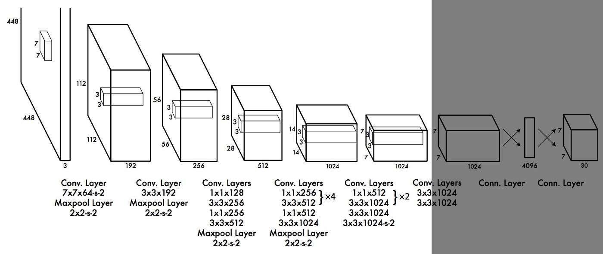
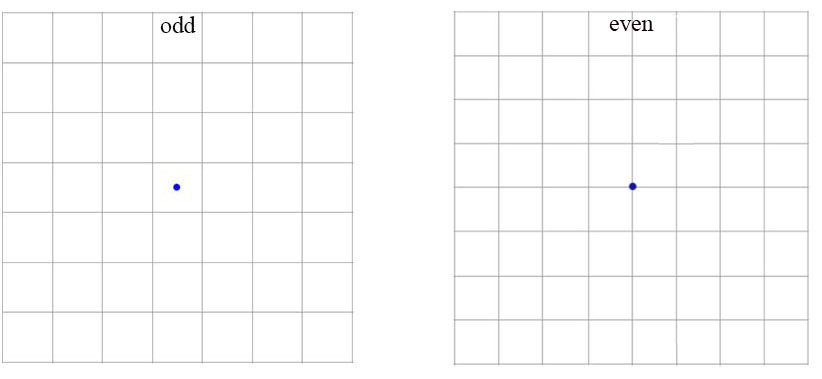
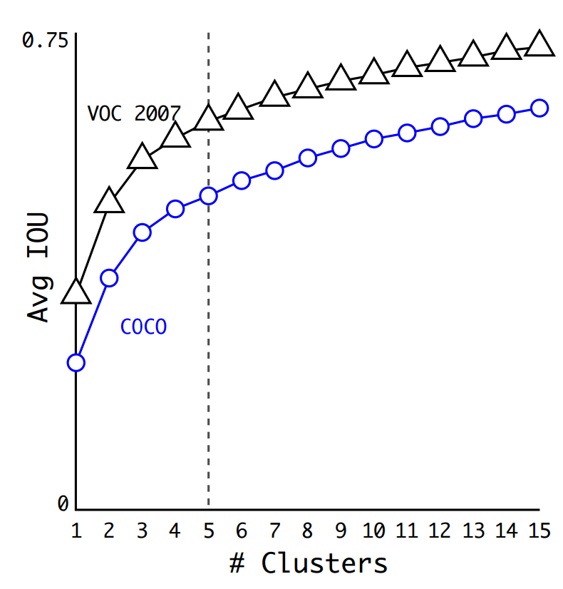
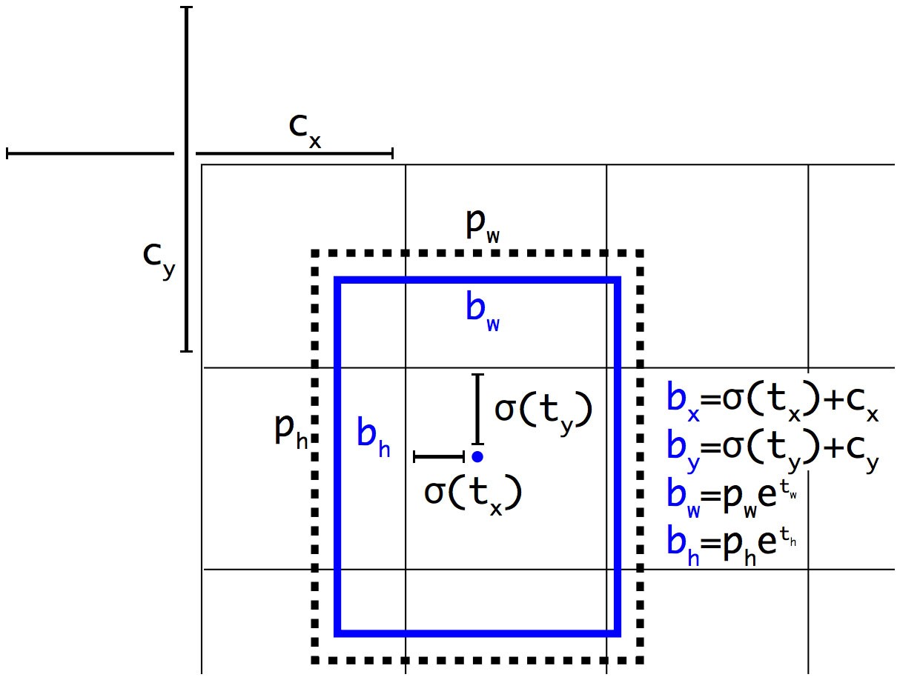
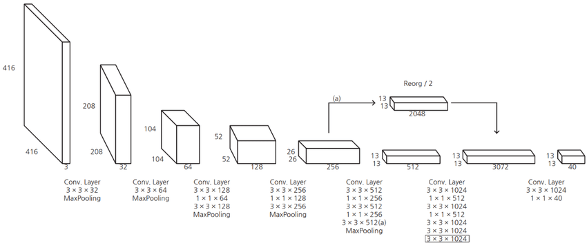
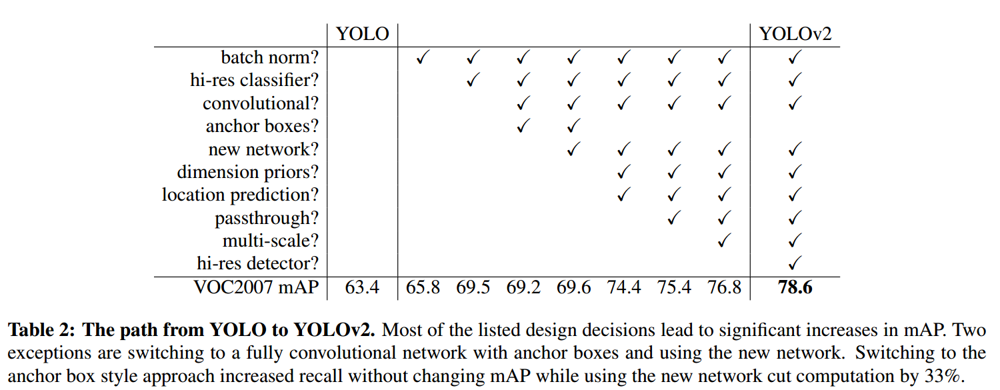

YOLOv2 [Redmon & Farhadi, 2016](https://arxiv.org/abs/1612.08242&target=_blank) được Joseph Redmon và Ali Farhadi công bố vào cuối năm 2016. YOLO9000 được xây dựng trên top của YOLOv2, nó được train kết hợp bởi COCO detection dataset và ImageNet classification dataset. Cải tiến chính của phiên bản này tốt hơn, nhanh hơn, tiên tiến hơn để bắt kịp faster R-CNN (phương pháp sử dụng Region Proposal Network), xử lý được những vấn đề gặp phải của YOLOv1.

Nhắc lại một số nhược điểm của YOLOv1:
- Dự đoán tối đa 49 objects
- Mỗi cell chỉ predict được duy nhất một vật thể với score cao nhất, nếu vật thể gần nhau rất khó để phát hiện được.
- Độ chính xác chưa được tốt như các state-of-the-art thời bấy giờ
- YOLOv1 có localization error cao so với Fast R-CNN, nó cũng có recall thấp (tỉ lệ dự đoán được object thấp)on

Ở 67 FPS, YOLOv2 đạt được 76.8% mAP trên VOC 2007. Ở 40 FPS, YOLOv2 đạt 78.6% mAP, vượt trội so với các state-of-the-art methods như Faster R-CNN dựa trên ResNet hay SSD trong khi vẫn chạy nhanh hơn.

# 1. YOLOv2

Để tăng performance trong Computer Vision thường xoay quanh việc tăng kích thước mạng NN. Thay vì tăng kích thước mạng, YOLOv2 đơn giản hóa mạng NN và áp dụng các ý tưởng để cải thiện performance. Dưới đây là những cải tiến chính của YOLOv2 với YOLOv1, giúp khác phục những nhược điểm của YOLOv1.

## 1.1. Batch Normalization 

Batch Normalization được thêm vào sau các lớp Conv layers trong YOLOv2. Nó giảm sự thay đổi giá trị của units trong hidden layer, do đó sẽ cải thiện được tính ổn định của neural network. Việc thêm Batch Normalization giúp mAP tăng thêm 2%. Việc dùng Batch Normalization này đã giúp model thực hiện regularization, chúng ta có thể loại bỏ Dropout khỏi model mà không bị overfitting.

## 1.2. Higher Resolution Classifier

Trong YOLOv1, ban đầu chúng ta train base network cho classification task với kích thước ảnh đầu vào là `224x224`. Sau đó khi thực hiện training cho detection, kích thước ảnh đầu vào được thay đổi thành `448x448`. 

Khác với YOLOv1, base network của YOLOv2 được train cho classification task với kích thước ảnh ban đầu là `448x448` trên ImageNet với 10 epochs. Sau đó thực hiện fine tune network cho detection task. Điều này giúp mAP tăng lên 4%.

## 1.3. Convolutional with anchor boxes

Đây là thay đổi đáng chú ý nhất của YOLOv2 so với YOLOv1. Các anchor boxes này chịu trách nhiệm cho việc dự đoán các bounding boxes. Anchor boxes được thiết kế cho bộ dataset có sẵn dựa trên phân nhóm clustering (K-means clustering). Điều này xuất phát từ việc các vật thể có một số boundng boxes tương đồng ví dụ như ô tô, xe đẹp có bounding box dạng hình chữ nhật nằm ngang, người có bounding box dạng hình chữ nhật đứng... Khái niệm anchor boxes này đã có trên [Faster R-CNN](https://huytranvan2010.github.io/Faster-RCNN/), hoạt động khá hiệu quả, sẽ đi dự đoán bounding boxes dựa trên các anchor boxes này. Anchor boxes sẽ giúp model phát hiện được nhiều vật thể trong cùng một grid cell, điều này đã khắc phục nhược điểm của YOLOv1 chỉ phát hiện được 1 object trong 1 grid cell.

Dưới đây là một số thay đổi khi sử dụng convolutional với anchor boxes:
- Loại bỏ FC layers chịu trách nhiệm cho dự đoán bounding boxes, loại bỏ một lớp Maxpooling ở cuối để tăng kích thước feature map.

- Thay đổi input size từ `448x448` xuống `416x416`. Điều này giúp tạo feature map có kích thước `13x13` - là số lẻ. Thông thường center của picture thường bị chiếm bởi object có kích thước lớn. Với số lẻ grid cells, chúng ta sẽ chỉ rõ vị trí của object. Tránh trường hợp feature map chẵn, vị trí trong hình thuộc về cả 4 grid cells.

- Chuyển class prediction từ cell level sang bounding box level. Mỗi dự đoán của bounding box bao gồm 4 parameters, 1 box confidence score (objectness) và 20 class probabilities. Xem thêm [Deep Learning Specialization](https://youtu.be/GSwYGkTfOKk?list=PLkDaE6sCZn6Gl29AoE31iwdVwSG-KnDzF&t=675) để có cảm giác tốt hơn. **Giả sử mỗi grid cell có 5 anchor boxes (5 prior boxes) thì sẽ dự đoán 5 bounding boxes và lúc này có tổng số 125 parameters cho mỗi grid cell.** Dĩ nhiên ứng với mỗi anchor box chúng ta sẽ có [label](https://youtu.be/RTlwl2bv0Tg?list=PLkDaE6sCZn6Gl29AoE31iwdVwSG-KnDzF&t=132).

Thay vì dự đoán vị trí của bounding boxes với FC layers trong [YOLOv1](https://huytranvan2010.github.io/YOLOv1-Core-Ideas/), YOLOv2 sử dụng Conv layers để dự đoán vị trí của anchor boxes như trong [Faster R-CNN](https://huytranvan2010.github.io/Faster-RCNN/). YOLOv2 downsampling ảnh ban đầu xuống feature map có kích thước `13x13`. YOLOv1 dự đoán 98 bounding boxes, còn YOLOv2 với anchor boxes nó dự đoán hơn 1000 boxes. Thay đổi này làm giảm mAP một chút từ 69.6% map xuống 69.2% mAP, nhưng recall tăng từ 81% lên 88% - đồng nghĩa với việc tăng cơ hội phát hiện được tất cả groundth-truth boxes. 

**Chú ý**: Tương tự như YOLOv1, khi downsampling xuống feature map `13x13`, điều này đồng nghĩa với việc chúng ta chia input image thành grid cell `13x13` và mỗi cell này tương ứng với một vị trí trong feature map.

## 1.4. Dimension clusters

Thay vì chọn các anchor boxes bằng tay thì chúng ta chạy thuật tonas K-Means clustering trên các ground-truth bounding boxes của tập train. Do đang làm việc với box có 2 kích thước width và height nên khi chạy K-Means, Euclidean distance sẽ không được sử dụng, thay vào đó sử dụng distance sau:

$$  d(\text{box}, \text{centroid}) = 1 - \text{IoU}(\text{box}, \text{centroid})$$

Việc lựa chọn metric này giúp chúng ta có IoU trung bình cao hơn (IoU giữa groudn truth box và centroid của nó). Tác giả đã lựa chọn $K=5$, việc lựa chọn này có tradeoff giữa model complexity và recall.

*Phụ thuộc IoU trung bình vào số clusters*

Việc lựa chọn $K$ lớn hơn có thể cho IoU trung bình cao hơn, tuy nhiên lúc này số paramters cũng lớn hơn rất nhiều.

## 1.5. Direct location prediction

YOLOv1 không hạn chế trong việc dự đoán vị trí của bounding box. Khi các trọng số được khởi tạo ngẫu nhiên, bounding box có thể được dự đoán ở bất kỳ đâu trong ảnh. Điều này khiến mô hình không ổn định trong giai đoạn đầu của quá trình huấn luyện. Vị trí của bounding box có thể ở rất xa so với vị trí của grid cell, ví dụ grid cell góc trên bên trái chứa object xong đi dự đoán của tâm của object lại ở grid cell gần dưới cùng.

YOLOv2 sử dụng hàm sigmoid để hạn chế giá trị trong khoảng 0 đến 1, từ đó có thể hạn chế các dự đoán bounding box ở xung quanh grid cell, từ đó giúp mô hình ổn định hơn trong quá trình huấn luyện.

YOLOv2 sẽ dự đoán 5 bounding boxes cho mỗi grid cell (có 5 anchor boxes cho mỗi grid cell). Mỗi bounding box mô hình lại dự đoán $(t_x, t_y, t_w, t_h)$ và $t_o$.
- $(t_x, t_y, t_w, t_h)$ và $t_o$ - các dự đoán của YOLOv2
- $(c_x, c_y)$ - tọa độ góc trên bên trái của grid cell chứa anchor box tương ứng
- $(p_w, p_h)$ - width và height của anchor box
- $(c_x, c_y, p_w, p_h)$ được normalize theo width và height của image
- $(b_x, b_y, b_w, b_h)$ - là các thông số cho predicted box. Từ đây có thể xác định kích thước và vị trí tuyệt đối của nó trên ảnh.
- $\sigma(t_o)$ - box confidence score

$$ \begin{aligned}
b_x &= \sigma(t_x) + c_x\\
b_y &= \sigma(t_y) + c_y\\
b_w &= p_w e^{t_w}\\
b_h &= p_h e^{t_h}\\
\text{Pr}(\text{object}) &\cdot \text{IoU}(b, \text{object}) = \sigma(t_o)
\end{aligned} $$

**Chú ý**: 
- Cách biểu diễn parameters của YOLOv2 khác với cách biểu diễn trong Faster R-CNN. Với cách biểu diễn trong YOLOv2, chúng ta đang **ép tâm của predicted bounding box nằm trong grid cell ứng với anchor box**.
- Mình có tham khảo rất nhiều bài viết nhưng đa phần đều không nói chi tiết về các tham số bên trên, cách xác định khá mơ hồ. Cụ thể ở đây $(c_x, c_y)$ - **tọa độ góc trên bên trái** của grid cell chứa anchor box tương ứng. Tọa độ này được xác định sau khi đã chia grid cell, ví dụ như hình bên trên $c_x = 1, c_y = 1$. $p_w, p_h$ cũng vậy, cũng được normalize theo width và height sau khi đã chia grid cell. Khi tính được $b_x, b_y, b_w, b_h$ có thể suy ngược lại như sau $b_x = b_x * \frac{416}{13}$ do kích thước một cell hay một đơn vị ở đây tương ứng với $\frac{416}{13} = 32$ pixels.

Thực chất chúng ta có mối liên hệ giữa [(anchor box, grid cell) và ground-truth box](https://youtu.be/RTlwl2bv0Tg?list=PLkDaE6sCZn6Gl29AoE31iwdVwSG-KnDzF&t=258), bây giờ như ở trên chúng ta có mối liên hệ giữa (anchor box, grid cell) và predicted bounding box. Từ đây nhận thấy thông qua anchor box và grid cell chúng ta đang đi khớp predicted bounding box với ground-truth box. Cụ thể từ các công thức trên chúng ta có thể xác định labels cho $t_x, t_y, t_h, t_w$ của ground-truth ứng với anchor box và grid cell tương ứng, đơn giản chỉ cần tính ngược lại.

*Hình 1. YOLOv2 bounding box location prediction*

### 1.6. Fine-Grained Features

YOLOv1 gặp vấn đề khó khăn khi phát hiện các vật thể nhỏ (chia ảnh thành `7x7` grid cells). YOLOv2 chia ảnh thành `13x13` grid cells, do đó có thể phát hiện được những vật thể nhỏ hơn, đồng thời cũng hiệu quả đối với các vật thể lớn.

Faster R-CNN và SSD đưa ra dự đoán ở nhiều tầng khác nhau trong mạng để tận dụng các feature map ở các kích thước khác nhau. Thay vì làm như vậy, YOLOv2 kết hợp các feature ở các tầng khác nhau lại để đưa ra dự đoán, cụ thể YOLOv2 chuyển feature map `26x26x512` thành `13x13x2048` thông qua kỹ thuật [Reorg](https://leimao.github.io/blog/Reorg-Layer-Explained/), sau đó kết hợp với feature map `13x13x512` feature map để được `13x13x3072`. Feature map này được dùng để đưa ra dự đoán. Bên dưới là kiến trúc của YOLOv2.

Việc sử dụng fine-grained features giúp mAP của YOLOv2 được tăng thêm 1%.

### 1.7. Multi-Scale Training

YOLOv1 có điểm yếu khi phát hiện các đối tượng với các kích cỡ đầu vào khác nhau. Ví dụ YOLOv1 được huấn luyện với các ảnh có kích thước nhỏ của cùng loại vật thể, nó sẽ gặp vấn đề khi phát hiện vật thể tương tự trong ảnh có kích thước lớn hơn. Điều này được giải quyết với YOLOv2, nó được train với kích thước ảnh ngẫu nhiên trong khoảng `320x320`, `352x352` đến `608x608`. Điều này cho phép model học và dự đoán chính xác đối tượng với nhiều kích thước khác nhau. *Kích thước mới của ảnh đầu vào được lấy ngẫu nhiên cứ sau 10 batches.* Do Conv layers YOLOv2 giảm kích thước của ảnh đầu vào theo hệ số 32 (phụ thuộc vào các Conv layers trong mạng NN) nên kích thước mới cần là số chia hết cho 32.

Dưới đây là bản tổng hợp các thử nghiệm cho YOLOv2. Nhận thấy các ý tưởng đều tăng mAP ngoại trừ việc sử dụng fully convolutional layers và anchor boxes. Tuy nhiên nó cũng giúp tăng recal của model.

## 1.8. Darknet 19

YOLOv1 tận dụng GoogleNet architecture, network này nhanh hơn VGG16, nó chỉ cần 8.52 tỉ operations để thực hiện forward pass. Tuy nhiên accuracy của nó thấp hơn so với VGG16.

Để tăng tốc độ YOLOv2 mà vẫn đảm bảo độ chính xác, YOLOv2 đã sử dụng kiến trúc Darknet-19 với 19 Conv layers, 5 MaxPooling layers, một Conv layer `1x1` để giảm số channels và 1 average pooling kết hợp với softmax layer cho phân loại vật thể. Darknet được viết bằng ngôn ngữ C và CUDA. Darknet-19 cần 5.58 tỉ operations để xử lý image, nó đạt 72.9% top-1 accuracy và 91.2% top-5 accuracy trên ImageNet.

*Kiến trúc Darknet-19*

Với những cải tiến như vậy YOLOv2 chính xác hơn, nhanh hơn so với phiên bản YOLOv1.

# 2. YOLO9000

Bởi vì việc vẽ các bounding boxes trên ảnh cho object detection tốn kém hơn nhiều so với việc tag images cho phân loại, bài báo đã đề xuất một cách kết hợp tập small object detection dataset với ImagNet dataset để model có thể phát hiện được nhiều classes hơn. Trong suốt quá trình training nếu ảnh đầu vào đến từ classification dataset nó sẽ chỉ backpropagates the classification loss, nếu nhìn thấy ảnh được gán nhãn trong detection set thì có thể backpropagate full loss function.

Để có thể kết nối ImageNet labels (1000 classes, fine-grained) với COCO/PASCAL (< 100 classes, coarse-grained), YOLO9000 xây dựng hierarchical tree từ [WordNet](https://wordnet.princeton.edu/), các labels chung gần với các node gốc còn fine-grained class labels là các node lá (classes trong ImageNet).

*Hình 2. The WordTree hierarchy merges labels from COCO and ImageNet. Blue nodes are COCO labels and red nodes are ImageNet labels.*

Để dự đoán xác suất rơi vào một class, ta nhân các xác suất từ node gốc của đồ thị, đi theo các nhánh và dừng lại khi gặp class đó
> Pr("persian cat" | contain a "physical object") 
= Pr("persian cat" | "cat") 
  Pr("cat" | "animal") 
  Pr("animal" | "physical object") 
  Pr(contain a "physical object")    # confidence score.

# 3. Kết luận

Như vậy chúng ta đã tìm hiểu về ý tưởng chính của YOLOv2 và YOLO9000. Những thay đổi trong YOLOv2 đã giúp loại bỏ các nhược điểm của YOLOv1.

# 4. Tài liệu tham khảo

1. https://medium.com/@venkatakrishna.jonnalagadda/object-detection-yolo-v1-v2-v3-c3d5eca2312a
2. https://lilianweng.github.io/lil-log/2018/12/27/object-detection-part-4.html#ssd-single-shot-multibox-detector
3. https://jonathan-hui.medium.com/real-time-object-detection-with-yolo-yolov2-28b1b93e2088
4. https://www.harrysprojects.com/articles/yolov23.html
5. https://manalelaidouni.github.io/Understanding%20YOLO%20and%20YOLOv2.html

