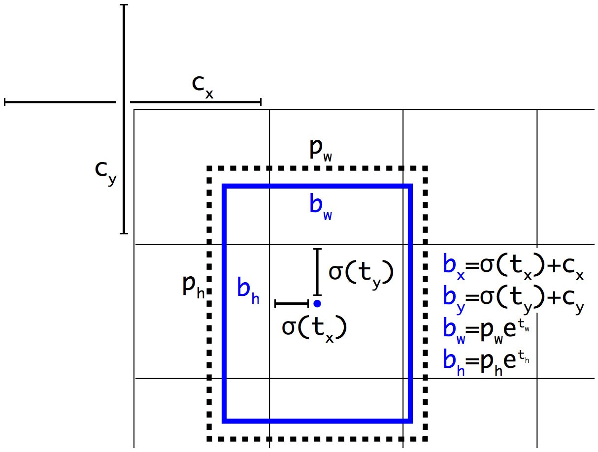

Chúng ta đã tìm hiểu về YOLOv1, YOLOv2/YOLO9000 rồi. Có vẻ như các phiên ản cải tiến của YOLO không ngừng ra đời. Trong bài này chủ đề của chúng ta là YOLOv3.

YOLOv3 có kiến trúc khá giống YOLOv2. Tác giả đã thêm các cải tiến mới trong các nghiên cứu object detection thời điểm đó vào YOLOv2 để tạo ra YOLOv3. Base network mới được dùng, lớn hơn Darknet-19 nhưng vẫn đảm bảo được tốc độ inference. 

## 1. Bounding box prediction

Trong dự đoán của mỗi box sẽ có các giá trị $t_x, t_y, t_w, t_h$ và objectness prediction - những giá trị này được sử dụng để tính loss. Nếu grid cell offset so với góc trên bên trái của ảnh $(c_x, c_y)$ và anchor box có width và height $p_w, p_h$ thì predictions (được tính toán lại, không phải output của model) sẽ là

$$
\begin{aligned}
b_x &= \sigma(t_x) + c_x\\
b_y &= \sigma(t_y) + c_y\\
b_w &= p_w e^{t_w}\\
b_h &= p_h e^{t_h}\\
\end{aligned}
$$

*Bounding box location prediction*

Mình xin nhắc lại $(c_x, c_y)$ - **tọa độ góc trên bên trái** của grid cell chứa anchor box tương ứng. Tọa độ này được xác định sau khi đã chia grid cell, ví dụ như hình bên trên $c_x = 1, c_y = 1$. $p_w, p_h$ cũng vậy, cũng được normalize theo width và height sau khi đã chia grid cell. Chi tiết hơn các bạn có thể xem lại ở [YOLOv2](https://huytranvan2010.github.io/YOLOv2-Core-Ideas/).

*Bounding boxes with dimension priors and location prediction.*

YOLOv3 dự đoán objectness score cho mỗi bounding box bằng logistic regression. Nếu bounding box prior (anchor) overlap với ground-truth box lớn hơn so với các anchor boxes khác thì objectness score bằng 1. Nếu anchor box không có IoU lớn nhất nhưng overlap với ground-truth box và IoU lớn hơn threshold 0.5 thì chúng ta bỏ qua dự đoán đó - không tính loss. Mỗi ground-truth box chỉ liên quan đến một anchor box. Nếu anchor box không được gán cho ground-truth box nào thì khi tính loss cho nó sẽ bỏ qua classification loss, localization loss và chỉ tính confidence loss cho object - liên quan đến việc có object hay không.

## 2. Class prediction

Mỗi box dự đoán các classes mà box đó có thể chứa bằng multilabel classification. Chúng ta không sử dụng softmax và thay vào đó sử dụng các logistic classifiers độc lập với nhau. Trong suốt quá trình training thì sử dụng binary cross-entropy loss cho class predictions. Thông thường chỉ sử dụng softmax khi mỗi box có duy nhất một class, tuy nhiên với nhiều dataset các objects có thể rất gần nhau và việc sử dụng này không hiệu quả.

## 3. Feature extractor
YOLOv3 sử dụng mạng neural network mới để trích xuất đặc trưng Darknet-53. Darknet-53 vẫn dựa trên sự thành công của `3x3`, `1x1` Conv layers giống như kiến trúc Darknet-19 cũ, tuy nhiên ở đây sử dụng thêm residual blocks. Model mới có 53 Conv layers nên gọi là **DarkNet-53**.

*Kiến trúc Darknet-53*

Darknet-53 mạnh mẽ hơn so với Darknet-19. Darknet-53 tốt hơn so với ResNet-101 và nhanh hơn 1.5 lần. Darknet-53 có performnace tương đương ResNet-152 nhưng nhanh hơn 2 lần.

Darknet-53 có BFLOP/s (billion floating point operations per second) lớn. Điều này có nghĩa rằng kiến trúc của Darknet-53 sử dụng tốt GPU, giúp nó có tốc độ nhanh hơn.

## 4. Multi-scale prediction

YOLOv3 đưa ra dự đoán cho **3 scales khác nhau**. YOLOv3 trích xuất features từ những scales này bằng cách sử dụng khái niệm tương tự Feature Pyramid Network. Từ base feature extractor sẽ thêm một số Conv layers.

Ở mỗi scale sẽ dự đoán 3 boxes cho mỗi vị trí (grid cell), do đó output tensor cho mỗi scale là `N x N x [3 x (4 + 1 + 80)]` với:
- 4 bounding box offsets
- 1 objectness prediction
- 80 class predictions

Cụ thể việc dự đoán cho 3 scales khác nhau là:
- Ở feature map cuối cùng
- Feature map ở trước đó 2 layers, feature map được được upsample 2x. YOLOv3 lấy feature map có resolution lớn hơn (ở trước nữa trong mạng NN) và kết hợp với upsampled feature thông qua concatenation. Sau đó áp dụng một số Conv layers và dự đoán output cuối cùng.
- Thực hiện thiết kế như scale thứ 2 cho scale thứ 3.

*Kiến trúc YOLOv3*

Chính việc dự đoán với các scales khác nhau mà YOLOv3 đã cải thiện khi dự đoán các object nhỏ.

YOLOv3 vẫn sử dụng K-Means để chọn ra trước 9 prior boxes (anchor boxes). Đối với COCO dataset, width và height của mỗi anchor box là (10×13), (16×30), (33×23), (30×61), (62×45), (59× 119), (116 × 90), (156 × 198), (373 × 326).

## 5. YOLOv3 performance

COCO AP metric của YOLOv3 ngang với SSD những YOLOv3 nhanh hơn 3 lần. Tuy nhiên AP của YOLOv3 vẫn kém RetinaNet.

Nhận thấy với $\text{IoU}=0.5$, AP của YOLOv3 cao hơn hẳn so với SSD, tuy nhiên khi sử dụng các $\text{IoU}$ lớn hơn thì AP của YOLOv3 tụt rất nhanh. Điều này có nghĩa YOLOv3 gặp khó khăn trong việc khớp chính xác các boxes.

Các phiên bản YOLO trước gặp khó khăn trong việc detect các objects nhỏ. Tuy nhiên YOLOv3 đã cải thiện điều này với $\text{AP}_S = 18.3%$

*So sánh tốc độ và mAP của các object detection model*

## 6. Kết luận

Như vậy chúng ta đã tìm hiểu 3 phiên bản khác nhau của YOLO. Cho đến nay YOLO đã phát triển đến phiên bản thứ 5 và một số biến thể khác như YOLO-X... Đến nay các mô hình YOLO rất thành công, nó được sử dụng rộng rãi trong các cuộc thi như trên Kaggle cũng như trong các ứng dụng trên edge devices. Trong phần tiếp theo có thể chúng ta đi sử dụng pre-trained model YOLO và thực hiện training lại trên custom dataset của chúng ta.

## 7. Tài liệu tham khảo

1. https://arxiv.org/abs/1804.02767
2. https://jonathan-hui.medium.com/real-time-object-detection-with-yolo-yolov2-28b1b93e2088
3. https://dev.to/afrozchakure/all-you-need-to-know-about-yolo-v3-you-only-look-once-e4m

<!-- C4W3L05 https://www.youtube.com/watch?v=gKreZOUi-O0
Nhắc lại một chút về sliding window, chúng ta trượt cửa sổ và đi classifiy cửa sổ đó. Nếu có object thì coi cửa sổ đó cũng là vị trí của
object hay bounding box luôn. Điều này có nhược điểm:
- Dự đoán không chính xác vị trí: Do thông thường window có hình vuông mà vật thể có thể có dạng hình chữ nhật
- Không đưa ra vị trí chính xác mà chỉ là vị trí của window 

Cần có algorithm khác OK hơn-->