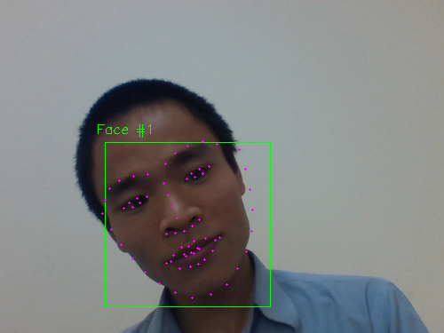

**Facial landmarks** được sử dụng để định vị và biểu diễn **salient regions** (các vùng nổi bật) của khuôn mặt như:
* Các mắt
* Lông mày (eyebrows)
* Mũi (nose)
* Miệng (mounth)
* Đường dưới của hàm (jawline)

Facial landmarks được ứng dụng rộng rãi trong face alignment, head pose estimation, face swapping (hoán đổi khuôn mặt), blink detection (phát hiện chớp mắt)...

Trong bài này sẽ sử dụng **dlib và OpenCV** để phát hiện **facial landmarks** (các điểm mốc trên khuôn mặt) trong ảnh và video từ webcam.

Thư viện **dlib** được viết bằng ngôn ngữ C++ do Davis King tạo ra vào năm 2012. **dlib** được sử dụng nhiều trong lĩnh vực Computer Vision, đặc biệt là trong phát hiện vật thể, nhận dạng khuôn mặt.

### Facial landmarks with dlib, OpenCV, and Python
Phát hiện facial landmarks là một bài toán con của **shape prediction problem**. Nhiệm vụ của chúng ta ở đây là phát hiện cấu trúc khuôn mặt trên ảnh bằng cách sử dụng **shape prediction methods**.

Quá trình chung phát hiện facial landmarks gồm 2 bước:
* **Bước 1 - Detect face**: Định vị vị trí khuôn mặt trong ảnh (detect face ROI). Một số methods như Haar cascades, [HOG + Linear SVM object detector](https://pyimagesearch.com/2014/11/10/histogram-oriented-gradients-object-detection/), pre-trained DL-bases model... Không phụ thuộc vào methods, cuối cùng chúng ta sẽ nhận **face bounding box** (các tọa độ).
* **Bước 2 - Detect the key facial structures** trên face ROI (tìm được ở bước 1). Có nhiều facial landmark detectors nhưng tất cả các methods đều cố gắng localize và label các facial regions:
    * Mouth (miệng)
    * Right eyebrow (lông mày phải)
    * Left eyebrow (lông mày trái)
    * Right eye (mắt phải)
    * Left eye (mắt trái)
    * Nose (mũi)
    * Jaw (quai hàm)

The facial landmark detector trong **dlib** library là implementation của bài báo [One Millisecond Face Alignment with an Ensemble of Regression Trees ](https://pdfs.semanticscholar.org/d78b/6a5b0dcaa81b1faea5fb0000045a62513567.pdf).

Phương pháp này được thực hiện bằng cách sử dụng:
* Training set là facial landmarks được đánh dấu trên ảnh 
* Xác suất trên khoảng cách giữa các cặp input pixels đầu vào

Cho các training data, tập hợp các regression trees được huấn luyện để đánh giá vị trí của facial landmarks trực tiếp từ pixel intensities.

### Tìm hiểu dlib's facial landmark detector
The pre-trained facial landmark detector trong dlib được sử dụng để ước lượng **68 (x, y) -coordinates** tương ứng với tọa độ các facial landmarks trên khuôn mặt.

Chỉ số của 68 tọa độ có thể được biểu diễn như hình dưới (tuy nhiên ở trong Python nó sẽ được đánh số từ 0 đến 67).


### Detecting facial landmarks with dlib, OpenCv and Python
Các bạn xem ở file `facial_landmarks.py` để theo dõi các bước bên dưới.
**Bước 1. Load ảnh và tiền xử lý**
Ở bước này mình có resize lại ảnh và chuyển về grayscale image (phục cho cho face detector bên dưới)
```python
gray = cv2.cvtColor(image, cv2.COLOR_BGR2RGB) 
```
**Bước 2. Phát hiện khuôn mặt - face detecion**
Để phát hiện khuôn mặt chúng ta sử dụng hàm `get_frontal_face_detector()` trong **dlib** để tạo face detector. Face detector này nhận vào grayscale image, đó chính là lý do chúng ta có bước tiền xử lý bên trên. Thực chất nó phục thuộc vào thuật toán phát hiện khuôn mặt, ở đây là HOG + Linear SVM, nếu dùng ảnh màu thì phải xác định HOG cho từng channel có thể ảnh hưởng đến tốc độ.
```python
detector = dlib.get_frontal_face_detector() 
rects = detector(gray, 1)
```
Detector nhận vào hai tham số:
* Grayscale image
* Tham số thứ hai là upsample image, mặc định để 1. Đây chính là số lần chúng ta upsample image trong quá trình detect faces giúp phát hiện các khuôn mặt có kích thước nhỏ. Tuy nhiên nếu tham số lớn quá sẽ khiến mô hình chạy chậm.

Câu lệnh số 2 trả về list các rectangle tương ứng với các khuôn mặt phát hiện được. Lưu ý trong dlib rectangle trả lại có dạng **(left, top, right, bottom)** tương đương với **(xmin, ymin, xmax, ymax)**. Ở đây có sử dụng hàm chuyển đổi rect này về dạng bounding box hay sử dụng trong OpenCV cho tiện **(xmin, ymin, w, h)**. Thư viện [imutils](https://github.com/jrosebr1/imutils) có tích hợp sẵn các hàm chuyển đổi này. Trong project này mình có để các hàm chuyển đổi trong file `hepler_function.py` cho các bạn tiện theo dõi.
 
**Bước 3. Xác định facial landmarks**
```python
predictor = dlib.shape_predictor(args["shape_predictor"])
shape = predictor(gray, rect)
```
Đầu tiên chúng ta cần tải pre-trained model cho các facial landmark. Ở câu lệnh số 2 truyền vào 2 tham số là ảnh ban đầu và rect (từng rectangle cho từng khuôn mặt). Kết quả trả về là **shape** có chứa thông tin của 68 facial landmarks. Tọa độ của mỗi facial landmark có thể được trích xuất thông qua câu lệnh sau:
```python
for i in range(68):
    x, y = shape.part(i).x, shape.part(i).y
```
Để đơn giản hơn chúng ta có thể chuyển đổi các tọa độ này về 2d-numpy array có chiều là (68, 2) - 68 là số điểm, 2 tương ứng hai tọa độ x, y cho mỗi điểm. Tương tự như trên thư viện [imutils](https://github.com/jrosebr1/imutils) có tích hợp sẵn các hàm chuyển đổi này. Trong project này mình có để các hàm chuyển đổi trong file `hepler_function.py` cho các bạn tiện theo dõi.

**Bước 4. Quẩy thôi**
Khi đã phát hiện được các facial landmarks thì bây giờ là thời gian để quẩy. Từ đây chúng ta có thể thực hiện một số bài toán như phát hiện facial landmark trực tiếp từ webcam, từ video, trích xuất các vùng đó, thay đổi khuôn mặt, phát hiện chớp mắt (chống ngủ gật khi lái xe), face alignment (căn chỉnh khuôn mặt)...

Đây là khuôn mặt của mình


Chúng ta có thể thay đổi một chút code để phát hiện facial landmarks real-time từ webcam (load webcam)... Các bạn xem thêm file `video_landmarks.py` để thấy rõ hơn. Source code các bạn tham khảo tại [github-huytranvan2010](https://github.com/huytranvan2010/Facial-landmarks-with-dlib-OpenCV)
### Kết luận
Như vậy chúng ta đã tìm hiểu về facial landmarks và cách phát hiện chúng với thư viện **dlib**. Mình xin tóm gọn nội dung như sau.
Phát hiện facial landmarks trong ảnh được thực hiện thông qua 2 bước:
* Xác định vị trí faces trong bức ảnh (thông qua một số method of face detection)
* Sử dụng shape predictor để có được tọa độ (x,y) của các facial landmarks

### Tài liệu tham khảo
1. https://www.pyimagesearch.com/2017/04/03/facial-landmarks-dlib-opencv-python/
2. https://github.com/Luca96/dlib-minified-models
3. https://livecodestream.dev/post/detecting-face-features-with-python/


