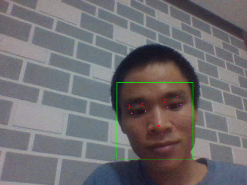

Hello các bạn!
Trong bài này chúng ta cùng tìm hiểu facial landmark detector mới trong thư viện dlib. Phiên bản gốc [facial landmark detector](https://github.com/huytranvan2010/Facial-landmarks-with-dlib-OpenCV) phát hiện được 68 điểm như đã tìm hiểu. Phiên bản mới này nhẹ hơn (đến 10 lần 9.2 MB so với 99.7 MB của phiên bản 68 điểm), nhanh hơn phiên bản cũ, nó chỉ phát hiện 5 facial landmarks:
* 2 điểm cho mắt trái
* 2 điểm cho mắt phải
* 1 điểm cho mũi

Phiên bản mới 5 facial landmarks này hay được ứng cho **face alignment** - sắp xếp khuôn mặt (xoay) để khuôn mặt thẳng đứng 2 mắt ngang nhau. Face alignment có thể được ứng dụng trong bước tiền xử lý ảnh khuôn mặt trước khi đưa vào mạng để nhận **face encoding** (ví dụ trong model FaceNet để nhận diện khuôn mặt) nhằm tăng độ chính xác của mô hình.

Ok, đi vào chủ đề chính nào. Cùng xem dlib có thể giúp chúng ta phát hiện 5 facial landmarks với phiên bản nhẹ hơn như thế nào. Cách làm cũng giống với phiên bản gốc 68 điểm. Trong bài này mình làm với video từ webcam, các bạn có thể modify một chút để làm với ảnh. Kết quả chạy mượt hơn so với phiên bản cũ nhỉ.

Đây là phần implementation cho 5 facial landmarks:
```python
video = cv2.VideoCapture(0)

# khởi tạo dlib's face detector (HOG-based)
detector = dlib.get_frontal_face_detector()   # dựa trên HOG + Linear SVM tìm face, xem thêm bài face recognition

# Tạo the facial landmerk predictor
predictor = dlib.shape_predictor(args["shape_predictor"])

while True:
    ret, frame = video.read()

    # Vẫn phải detect được khuôn mặt trước khi tìm facial landmarks
    # load ảnh, resize, convert to gray (cần cho HOG)
    frame = imutils.resize(frame, width=500)    # giữ nguyên aspect ratio, để size lớn quá lag
    gray = cv2.cvtColor(frame, cv2.COLOR_BGR2GRAY)   # dùng cho HOG detector bên dưới

    # detect faces in the grayscale image
    # nhận 2 tham số ảnh (có thể ảnh màu), 2-nd parameter - số image pyramids tạo ra trước khi detect faces (upsample)
    # nó giúp phóng ảnh lên để có thể phát hiện khuôn mặt nhỏ hơn, dùng thì chạy lâu hơn
    rects = detector(gray, 1)   # trả về list các rectangle chứa khuôn mặt (left, top, right, bottom) <=> (xmin, ymin, xmax, ymax)

    # duyệt qua các detections
    for (i, rect) in enumerate(rects):
        # chuyển dlib's rectangle (left, top, right, botttom) về bounding box hay dùng trong OpenCV (xmin, ymin, w, h)
        (x, y, w, h) = face_utils.rect_to_bb(rect)
        # vẽ hình chữ nhật around the face
        cv2.rectangle(frame, (x, y), (x+w, y+h), (0, 255, 0), 1)

        # xác định facial landmarks for the face region sau đó convert các facial landmarks (x,y)
        # về numpy array, mỗi hàng là một cặp tọa độ
        shape = predictor(gray, rect)   # nhận 2 tham số là ảnh đầu vào và vùng phát hiện khuôn mặt, shape.part(i) là cặp tọa độ thứ i

        # chuyển về dạng numpy các coordinates
        shape = face_utils.shape_to_np(shape)   # numpy array (5, 2) do có 5 điểm

        # duyệt qua các coordinates of facial landmarks (x, y) và vẽ chúng lên ảnh
        for (i, (x, y)) in enumerate(shape):
            cv2.circle(frame, (x, y), 1, (255, 0, 255), -1)
            cv2.putText(frame, str(i + 1), (x - 10, y - 10), cv2.FONT_HERSHEY_SIMPLEX, 0.35, (0, 0, 255), 1)

        # hiển thị ảnh đầu ta với face detections + facial landmarks
        cv2.imshow("Output", frame)

    if cv2.waitKey(1) & 0xFF == ord("q"):     # nhấn "q" để thoát
        break
```
Các bạn có thể xem thêm tại [github-huytranvan2010](https://github.com/huytranvan2010/Facial-Landmarks-with-dlib-LIGHT-VERSION). Dưới đây là hình ảnh mình cắt ra từ video.

 

Hy vọng qua bài này các bạn đã nắm thêm một công cụ mới hữu ích.

Mình có đính kèm đây link đên thư viện [dlib](https://github.com/davisking/dlib-models), bạn nào có hứng thú có thể tham khảo thêm.


