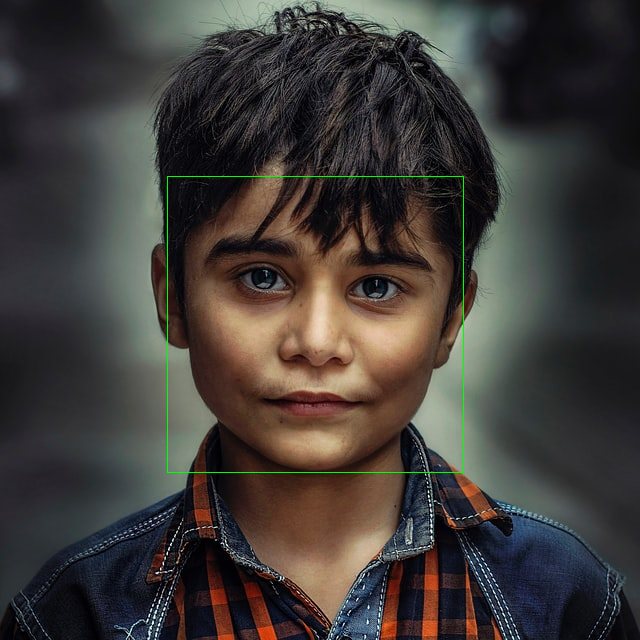
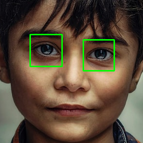
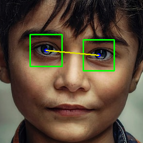
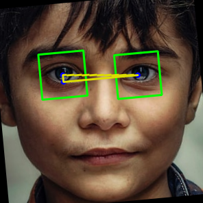

### Nội dung
Face alignment là quá trình sắp xếp khuôn mặt sao cho nó thẳng đứng trong ảnh. Face alignment thường được thực hiện như bước tiền xử lý cho các thuật toán nhận diện khuôn mặt. Để thực hiện việc này cần trải qua 2 bước:
* Xác định cấu trúc hình học của khuôn mặt trong ảnh
* Thực hiện face alignment thông qua các pháp biến đổi như translation (dịch chuyển), scale, rotation.

Có một số phương pháp để thực hiện face alignment như sử dụng pre-trained 3D model sau đó chuyển ảnh đầu vào sao cho các landmarks trên khuôn mặt ban đầu khớp với landmarks trên 3D model... Trong bài này chúng ta sẽ thực hiện face alignment dựa trên vị trí của hai mắt.

Dưới đây là các bước thực hiện face alignment:
* Phát hiện khuôn mặt và mắt trong ảnh 
* Xác định tâm của hai mắt, vẽ đường nối hai tâm
* Vẽ đường nằm ngang giữa hai mắt, tính góc xoay ảnh
* Xoay ảnh
* Scale ảnh

Chúng ta cùng đi vào các bước cụ thể.

**Bước 1 - Phát hiện khuôn mặt và mắt trong ảnh**
Có rất nhiều phương pháp để phát hiện khuôn mặt như Haar cascades, Single Shot Multibox Detector (SSD) trong OpenCV dưới dạng pre-trained model, Dlib có HOG và CNN (hay còn gọi là Max-Margin Object Detection MMOD). Ngoài ra còn phải kể đến MTCNN (multi-task Cascaded Convolutional Networks) và RetinaFace là những mô hình rất tiên tiến để phát hiện khuôn mặt. Để đơn giản trong này này chúng ta sẽ sử dụng **Haar Cascades**.

Đầu tiên sẽ tạo `face_cascade` và `eye_cascade` để phát hiện khuôn mặt và mắt:
```python
face_cascade = cv2.CascadeClassifier(args["face"])
eye_cascade = cv2.CascadeClassifier(args["eye"])
```
Ảnh đưa vào cascade cần được chuyển về dạng grayscale.
```python
image = cv2.imread(args["image"])
gray = cv2.cvtColor(image, cv2.COLOR_BGR2GRAY)
```
Sau đó chúng ta sẽ thực hiện phát hiện khuôn mặt, 

```python
rects_face = face_cascade.detectMultiScale(gray, scaleFactor=1.1, minNeighbors=4, minSize=(30, 30))
for (x, y, w, h) in rects_face:
    cv2.rectangle(image, (x, y), (x+w, y+h), (0, 255, 0), 1)
```


Sau khi phát hiện được khuôn mặt thì trích xuất vùng của khuôn mặt dùng để phát hiện hai mắt.

```python
rects_eye = eye_cascade.detectMultiScale(face_ROI_gray, scaleFactor=1.1, minNeighbors=4)
cv2.rectangle(face_ROI_color, (ex, ey), (ex+ew, ey+eh), (0, 255, 0), 2)
```


**Bước 2 - Xác định tâm của hai mắt, vẽ đường nối hai tâm**

Đầu tiên sẽ xác định mắt nào là mắt trái, mắt nào là mắt phải (đứng từ phía người dùng) dựa trên tọa độ x của hai bounding box quanh mắt
```python
if eye_1[0] < eye_2[0]:     # tọa độ x nhỏ hơn là mắt bên trái (từ phía người quan sát)
    left_eye = eye_1
    right_eye = eye_2
else:
    left_eye = eye_2
    right_eye = eye_1
```
Sau đó chúng ta đi xác định tâm của hai mắt (coi là tâm của 2 bounding boxes), dễ dàng vẽ được đoạn thẳng nối hai tâm.


```python
center_left_eye = (int(left_eye[0] + left_eye[2] / 2), int(left_eye[1] + left_eye[3] / 2))
center_right_eye = (int(right_eye[0] + right_eye[2] / 2), int(right_eye[1] + right_eye[3] / 2))

cv2.line(face_ROI_color, center_left_eye, center_right_eye, (0, 220, 220), 2)
```


**Bước 3 - Vẽ đường nằm ngang giữa hai mắt, tính góc xoay ảnh**
> Quy ước: Đường nằm ngang là đường đi qua tâm của mắt nằm bên dưới (có tọa độ y lớn hơn)

Xác định tâm mắt bên nào nằm dưới dựa vào tọa độ y, đồng thời vẽ điểm A để phục vụ cho việc tính góc xoay. Ở đây cần chú ý cả chiều xoay:
* Nếu mắt trái (nhìn từ phía người dùng) thấp hơn mắt phải, chúng ta sẽ phải xoay ảnh theo chiều kim đồng hồ
* nếu mắt phải (nhìn từ phía người dùng) thấp hơn mắt trái, chúng ta phải xoay ảnh theo chiều ngược kim đồng hồ
```python
if y_left_eye > y_right_eye:    # mắt trái thấp hơn mắt phải
    point_A = (x_right_eye, y_left_eye)
    # Ảnh phải xoay theo chiều kim đồng hộ clockwise direction
    direction = -1
else: 
    point_A = (x_left_eye, y_right_eye)
    # Ảnh cần xoay ngược chiều kim đồng hồ counter clockwise direction
    direction = 1
```


Góc cần xoay được xác định dựa vào khoảng cách giữa các điểm. Góc phải được chuyển về `degree`, nếu quay ngược chiều kim đồng hồ thì góc dương, cùng chiều kim đồng hồ thì góc âm.


Ảnh này vẽ cho trường hợp mắt trái nằm bên dưới góc phải. Trường hợp góc phải nằm bên dưới góc trái tương tự.

```python
dist_A_righteye = np.linalg.norm(np.array(point_A) - np.array(center_right_eye))
dist_A_lefteye = np.linalg.norm(np.array(point_A) - np.array(center_left_eye))
if direction == -1:     # quay theo chiều kim đồng hồ clockwise direction
    angle = np.arctan(dist_A_righteye / dist_A_lefteye)
    angle = - angle     # quay theo chiều kim đồng hồ nên góc < 0
else:   # quay theo chiều ngược kim đồng hồ counter clockwise direction
    angle = np.arctan(dist_A_lefteye / dist_A_righteye)

# chuyển về degree
angle = (angle * 180.) / np.pi 
```

**Bước 4 - Xoay ảnh**

```python
(h, w) = face_ROI_color.shape[:2]
center = (w // 2, h // 2)
M = cv2.getRotationMatrix2D(center, angle, 1.0)
rotated_face_ROI = cv2.warpAffine(face_ROI_color, M, (w, h))    # có thể dùng thư viện imutils cho nhanh
```

Ảnh sau khi đã được xoay căn chỉnh



Chi tiết implementation các bạn có thể xem tại [github-huytranvan2010](https://github.com/huytranvan2010/Face-Alignment-Algorithm). Nếu thấy hay hãy để lại cho mình 1 sao nhé.

### Kết luận
Như vậy chúng ta đã cùng tìm hiểu cách thực hiện face alignment dựa trên vị trí của hai mắt. Ở đây mình giới thiệu một cách tổng quát nhất, các bạn có thể tùy biến một số bước. Ví dụ ở bước xác định vị trí khuôn mặt có thể dùng **facial landmarks**, ở bước phát hiện khuôn mặt có thể dùng phương pháp khác. Trong bài sau mình sẽ giới thiệu một số packages thực hiện việc này. Điều quan trọng là chúng ta cần hiểu được cách thức nó hoạt động. 

### Tài liệu tham khảo
1. http://datahacker.rs/010-how-to-align-faces-with-opencv-in-python/
2. https://sefiks.com/2020/02/23/face-alignment-for-face-recognition-in-python-within-opencv/ 


