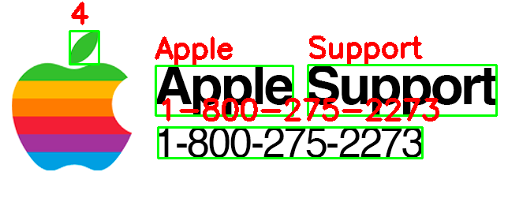

Trong bài trước chúng ta đã tìm hiểu sơ bộ về [Tesseract](https://huytranvan2010.github.io/Tesseract-OCR-Guide/). Trong bài này cùng tìm hiểu cách thực hiện text localization và text detection với Tesseract. Thực chất nội dung này có thể bị trùng lặp với bài trước. Tuy nhiên ở đây chúng ta sẽ đi sâu hơn một chút.

Đây là phần implementation [github-huytranvan2010](https://github.com/huytranvan2010/Text-Localization-and-Detection-with-Tesseract)
```python
import pytesseract
from pytesseract import Output
import cv2
import argparse

parser = argparse.ArgumentParser()
parser.add_argument("-i", "--image", required=True, help="path to the input image")
parser.add_argument("-c", "--min_confidence", type=float, default=0., help="min confidence value to filter the weak text detection")
args = vars(parser.parse_args())

image = cv2.imread(args["image"])
rgb = cv2.cvtColor(image, cv2.COLOR_BGR2RGB)    # chuyển về RGB trước khi đưa vào Tesseract

# lấy boxes quanh các từ 
results = pytesseract.image_to_data(image, output_type=Output.DICT)     # ở đây để output_type=Output.DICT để trả về dạng dictionary

# in ra để biết các keys trong dict là gì
# print(results)

# số bounding boxes trả về
n_boxes = len(results['level'])

# duyệt qua các bounding boxes đó
for i in range(n_boxes):
    # lấy x, y, w, h cho từng bounding box
    x = results['left'][i]
    y = results['top'][i]
    w = results['width'][i]
    h = results['height'][i]

    text = results['text'][i]
    conf = int(results['conf'][i])  # chuyển về int nha, nó đang ở string

    # Lọc các text có confidence thấp
    if conf < args["min_confidence"]:
        continue
    
    # In ra confidence và text
    print("Confidence: {}".format(conf))
    print("Text: {}".format(text))
    print("")

    # loại bỏ các kí tự ko phải ASCII để có thể in ra trên ảnh, dùng list comprehension, .strip() loại bỏ dấu trắng đầu cuối
    text = "".join([c if ord(c) < 128 else "" for c in text]).strip()
	
    cv2.putText(image, text, (x, y - 10), cv2.FONT_HERSHEY_SIMPLEX, 1.2, (0, 0, 255), 3)
    cv2.rectangle(image, (x, y), (x + w, y + h), (0, 255, 0), 2)

cv2.imshow('Output', image)
cv2.waitKey(0)
```
Bên trên có
```python
results = pytesseract.image_to_data(image, output_type=Output.DICT) 
```
`results` này là dictionary, các bạn có thể in ra để xem các keys và values trong đó. Điều này sẽ giúp các bạn hiểu hơn về các lấy các giá trị.

Khi test có thể thay đổi `min_confidence` để có kết quả tốt nhất. Ví dụ khi test với `image2` nhận diện lá táo thành số 4.
```python
Confidence: 34
Text: 4

Confidence: 96
Text: Apple

Confidence: 96
Text: Support

Confidence: 96
Text: 1-800-275-2273
```


Có thể tăng confidence lên để giải quyết việc này, ví dụ `min_confidence=50`.

Thực chất Tesseract đã bao gồm tất quả các bước trong OCR nên việc phát hiện và định vị text là điều đương nhiên. Như vậy chúng ta đã tìm hiểu các định vị text thông qua Tesseract. Hy vọng bài viết này giúp ích cho các bạn. 
