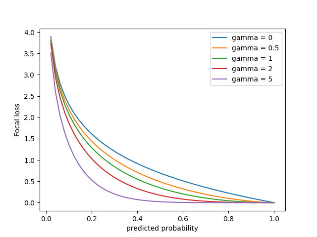

Trong bài này chúng ta sẽ tìm hiểu về one-stage detector có tên là RetinaNet. Đầu tiên cùng tìm hiểu về **Focal Loss**, chính loss function này làm nên sự khác biệt của RetinaNet. Các bài toán object detection trước đó luôn gặp phải một vấn đề về class imbalance (ám chỉ sự chênh lệch giữa foreground và background là quá lớn).

Nhớ lại cross entropy (CE) cho bài toán phân loại đối với phân phối xác suất thực tế $\mathbf{p}$ và phân bố xác suất dự đoán $\mathbf{q}$:

$$CE(\mathbf{p}, \mathbf{q}) \triangleq \mathbf{H}(\mathbf{p}, \mathbf{q}) = -\sum_{i=1}^{C}p_i\log({q_i})$$

trong đó $\sum_{i=1}^{C} p_i = \sum_{i=1}^{C} q_i = 1$ và $C$ là số classes. $\mathbf{H}(\mathbf{p}, \mathbf{q})$ là kí hiệu cross entropy. 

Các nhãn bằng 0 tương ứng với $p_i = 0$ có đóng góp vào loss function bằng 0. Trong số các nhãn có duy nhất 1 nhãn $p_i=1$ (tương ứng với class $i$), do đó cross entropy có thể được viết thành:

$$CE(\mathbf{q}) = -log({q_i})$$

Đóng góp vào loss function của các class là như nhau $-log({q_i})$.

Đồ thị trên được vẽ cho bài toán binary classification trong đó $p_t = q_i$.

Cùng xem hình trên với $\gamma = 0$ chính là trường hợp cross entropy bình thường. Với well-classified class loss nhận được rất nhỏ. Tuy nhiên nên nhớ lại đây là loss cho một examples. Trong bài toán object detection số lượng background của chúng ta tạo ra lớn hơn rất nhiều số lượng foreground (chênh lệch nhau đến hàng nghìn lần), vì vậy loss tổng hợp cho tất cả background examples sẽ lớn hơn loss cho tất cả foreground examples. 

Xem thêm ví dụ dưới đây

*Đồ thị $-log(q_i)$*

Chúng ta có 100000 easy examples (0.1 loss cho mỗi example) và 100 hard examples (2.3 loss cho mỗi example). Khi đó tập hợp lại ta được
- Loss cho tất cả easy examples = 100000×0.1 = 10000
- Loss cho tất cả hard examples = 100×2.3 = 230
- 10000 / 230 = 43. Loss từ easy examples lớn hơn rất nhiều loss từ hard examples. 

Cross entropy loss không phải là sự lựa chọn tốt cho trường hợp rất mất cân bằng dữ liệu. Nếu dùng cross entropy thông thường này thì  
- Ngay cả khi mô hình dự đoán sai foreground (predicted probability of foreground thấp, gần gốc tọa độ) thì loss do việc dự đoán foreground sai này vẫn nhỏ so với tổng loss, mô hình thậm chí không cần cải thiện thêm vẫn được (tất nhiên nếu dự đoán đúng foreground thì loss vẫn giảm). Điều này là không chấp nhận được. **Mô hình ít quan tâm đến dự đoán đúng foreground vì loss do dự đoán sai foreground không ảnh hưởng nhiều đến loss chung**. Phải nhấn mạnh rằng nếu dự đoán đúng foreground (predicted probability of foreground cao, gần điểm 1) loss có giảm nhưng không đáng kể so với tổng loss.
- Hay khi mô hình dự đoán đúng các easy examples - predicted probability of background, gần điểm 1 trên trục hoành thì tổng loss cho việc dự đoán đúng background vẫn lớn. Thử tưởng tượng nếu dự đoán sai các easy examples (đồ thị gần gốc tọa độ) thì loss sẽ cực kỳ lớn. **Mô hình đang tập trung dự đoán đúng background để giảm loss**.

Chính vì những điều trên chúng ta cần một loss function hiệu quả hơn giúp **điều chỉnh loss lớn hơn khi dự đoán sai foreground (object)**. Điều này giúp chúng ta hạn chế dự đoán sai đối với foreground vì khi dự đoán sai loss sẽ tăng lên đáng kể.

## Balanced cross entropy 

Phương pháp thông thường để giải quyết vấn đề class imbalance là đưa vào trọng số $\alpha_i$ cho mỗi class vào thành phần loss của nó trong cross entropy. Trong thực tế $\alpha_i$ thường được lấy bằng nghịch đảo tần suất của class $i$ (hay nghịch đảo số lần xuất hiện của class $i$ trong tập dữ liệu).

$$\alpha_i = \frac{1}{f_i+\epsilon}$$

trong đó $f_i$ - tần suất class $i$, $\epsilon$ - hằng số dương rất nhỏ để tránh phép chia cho 0. 

Ta có công thức cho balanced cross entropy:

$$BCE(\mathbf{q}) = -\alpha_i\log(q_i)$$

Việc đưa thêm trọng số của các class vào cross entropy giúp chúng ta giải quyết phần nào class imbalance (class ít hơn sẽ có hệ số đóng góp lớn hơn vào loss function). Tuy nhiên nó chưa thực sự thay đổi được gradient của loss function. Trong khi mô hình được huấn luyện trên mẫu mất cân bằng trầm trọng có giá trị gradient chịu ảnh hưởng phần lớn bởi class chiếm đa số. Do đó chúng ta cần một sự điều chỉnh triệt để hơn giúp gia tăng ảnh hưởng của nhóm thiểu số lên gradient. Đó là lý do **Focal loss** ra đời.

## Focal loss

$$FP(\mathbf{q}) = -\alpha_i (1-q_i)^{\gamma} \log(q_i)$$

trong đó 
- $\gamma$ - tunable focusing parameter $\gamma \geq 0$, thường chọn $\gamma \in [0,1]$. Trong bài báo tác giả tìm được $\gamma = 2$ tốt nhất cho thử nghiệm của họ. $\gamma$ giúp ta thay đổi dễ dàng trọng số đóng góp của class đa số (background). $\gamma = 0$ chúng ta có balanced cross entropy.  

$(1-q_i)^{\gamma}$ - modulating factor giúp giảm đóng góp vào loss của class chiếm đa số. 

Cùng đánh giá chi tiết hơn vấn đề này:
- Đối với class dễ dự đoán (class chiếm đa số) xác suất $q_i$ của class cao, do đó $(1-q_i)^\gamma$ sẽ nhỏ. Ví dụ $q_i=0.9$, $\gamma = 2$ khi đó $(1-q_i)^\gamma = 1/100$. Điều này đồng nghĩa với việc đóng góp vào loss của class đa số đã giảm đi 100 lần.
- Đối với class dễ dự đoán sai (class thiểu số) giá trị $q_i$ thường sẽ nhỏ, ví dụ $p_i=0.1$ khi đó $(1-q_i)^\gamma = 1/0.81=1.23$. Đóng góp vào loss của class thiểu số cũng giảm 1.23 lần nhưng tổng thể trọng số đóng góp của class thiểu số lại tăng lên (bên trên đóng góp của class đa số giảm 100 lần).

## Đạo hàm của Focal Loss
Ở đây có predicted probability $q_i$ là biến cần tìm, ta sẽ lấy đạo hàm của focal loss $FL(q_i)$ theo nó:

$$ \frac{\partial FL(\mathbf{q})}{\partial q_i} = \frac{-\alpha_i \partial [ (1-q_i)^{\gamma} \log(q_i)]}{\partial q_i} $$

$$ \frac{\partial FL(\mathbf{q})}{\partial q_i} = -\alpha_i[-\gamma(1-q_i)^{\gamma-1}\log(q_i)+\frac{(1-q_i)^\gamma}{q_i}] $$

$$ \frac{\partial FL(\mathbf{q})}{\partial q_i} = \alpha_i(1-q_i)^\gamma [\frac{\gamma\log(q_i)}{1-q_i}-\frac{1}{q_i}]  $$

$$ \frac{\partial FL(\mathbf{q})}{\partial q_i} \triangleq \alpha_i(1-q_i)^\gamma g(x)
 $$

với $g(x) = \frac{\gamma\log(q_i)}{1-q_i}-\frac{1}{q_i}$

Đối với hàm $log(x)$ với $x \in [0,1]$ chúng ta có:

$$ log(x) \geq \beta (\frac {1}{x} - 1) ~,\forall \beta \leq -1$$

Hàm $log$ là logarithm cơ số $e$ không phải cơ số 10. Chứng minh bất đẳng thức trên thông qua đạo hàm của $f(x)=log(x) - \beta (\frac {1}{x} - 1) ~,\forall \beta \leq -1$

$$f'(x) = \frac{1}{x}+\frac{\beta}{x^2}=\frac{x+\beta}{x^2} \leq \frac{1+\beta}{x^2} \leq 0$$

Khi đó $f(x)$ nghịch biến trên $(0, 1]$ mà $f(1)=0$ do đó ta có:

$$ log(x) \geq \beta (\frac {1}{x} - 1) ~,\forall \beta \leq -1$$

Tương tự như vậy ta có thể chứng minh được bất đẳng thức:

$$ log(x) \leq \beta (\frac {1}{x} - 1) ~,\forall \beta \geq 0$$

Như vậy nếu chọn $\beta_1 \leq -1$ và $\beta_2 \geq 0$ bất kỳ ta có:

$$g(x) = \frac{\gamma\log(q_i)}{1-q_i} - \frac{1}{q_i} \geq \frac{\gamma\beta_1(\frac{1}{q_i}-1)}{1-q_i}-\frac{1}{q_i} = \frac{\gamma\beta_1-1}{q_i} = C_1$$

$$g(x) = \frac{\gamma\log(q_i)}{1-q_i}-\frac{1}{q_i} \leq \frac{\gamma\beta_2(\frac{1}{q_i}-1)}{1-q_i}-\frac{1}{q_i} = \frac{\gamma\beta_2-1}{q_i} = C_2$$

Điều này chứng tỏ hàm số $g(x)$ bị chặn nên giá trị của **Focal loss** sẽ chịu ảnh hưởng lớn từ $(1-q_i)^\gamma$.
- Class đa số (dễ dự đoán) $q_i$ lớn:  $(1-q_i)^\gamma$ nhỏ nên sự ảnh hưởng lên gradient của các class đa số không đáng kể
- Class thiểu số (khó dự đoán) $q_i$ nhỏ: $(1-q_i)^\gamma$ lớn gần bằng 1, ảnh hưởng lên gradient sẽ lớn. Như vậy khi dự đoán sai class thiểu số, gradient sẽ thay đổi lớn để giảm focal loss.

*Đồ thị Focal loss $FP(\mathbf{q}) = -\alpha_i (1-q_i)^{\gamma} \log(q_i)$, với $\alpha_i = 1$*

Trường hợp $\gamma = 0$ tương ứng với cross entropy bình thường (màu xanh lam). Khi $\gamma$ càng lớn focal loss có xu hướng trũng xuống.

Trục hoành là xác suất dự đoán được của class $i$ bất kỳ (đa số hay thiểu số đều được).
- Đối với class đa số (dễ dự đoán) xác suất $q_i$ sẽ gần với điểm 1
- Đối với class thiểu số (khó dự đoán) xác suất $q_i$ thấp nên sẽ gần gốc tọa độ hơn.

Nhận thấy khi $\gamma$ tăng, đồ thị focal loss càng trũng xuống, tốc độ giảm loss của class thiểu số chậm hơn so với class đa số. Điều này đồng nghĩa với việc tỉ số loss giữa class thiểu số (khó dự đoán) và class đa số (dễ dự đoán) ngày càng lớn. Do đó mô hình sẽ trừng phạt nặng khi class thiểu số bị dự đoán sai, đây chính là mục đích của focal loss.

## RetinaNet
RetinaNet là sự kết hợp giữa các networks bao gồm backbone và subnets. Backbone của RetinaNet chính là [Feature Pyramid Network](https://huytranvan2010.github.io/Feature-Pyramid-Network/) dùng để trích xuất các feature map. Các mạng subnet dùng để thực hiện classification và box regression. RetinaNet dùng focal loss như đã giới thiệu bên trên. 

**Feature Pyramid Network (FPN)**

FPN cung cấp multi-scale feature pyramid dựa trên bottom-up, top-down pathways và lateral (skip) connection. 

*RetinaNet architecture*

Trong RetinaNet, FPN chỉ lấy các megered feature maps từ level P3 đến P7. $P_l$ ám chỉ feature map có spatial resolution bằng $1/2^l$ so với input image ban đầu.

**Subnets**
Ở đây class subnet và box subnet có chung cấu trúc, chỉ khác số channels ở layers cuối cùng.

>Chú ý: class subnet và box subnet sử dụng *riêng* các parameters.

Megered feature maps có số channels $C=256$:
- Class subnet: đi qua 4 Conv layers `3x3` với số filters là $C$, sau đó lại đi qua Conv layers `3x3` với số filters là $K \times A$. Trong đó $K$ - số classes, $A$ - số anchors tại một vị trí.
- Box subnet: đi qua 4 Conv layers `3x3` với số filters là $C$, sau đó lại đi qua Conv layers `3x3` với số filters là $4A$. $A$ thường được chọn bằng 9. 

## Tài liệu tham khảo
1. https://arxiv.org/abs/1708.02002
2. https://towardsdatascience.com/review-retinanet-focal-loss-object-detection-38fba6afabe4
3. https://towardsdatascience.com/retinanet-the-beauty-of-focal-loss-e9ab132f2981
4. https://phamdinhkhanh.github.io/2020/08/23/FocalLoss.html 
5. https://medium.com/swlh/focal-loss-what-why-and-how-df6735f26616
6. https://maxhalford.github.io/blog/lightgbm-focal-loss/
7. https://keras.io/examples/vision/retinanet/
8. https://medium.com/@14prakash/the-intuition-behind-retinanet-eb636755607d
9. https://deep-learning-study-note.readthedocs.io/en/latest/Part%202%20(Modern%20Practical%20Deep%20Networks)/12%20Applications/Computer%20Vision%20External/Focal%20Loss%20for%20Dense%20Object%20Detection.html
10. https://leimao.github.io/cv/ 

