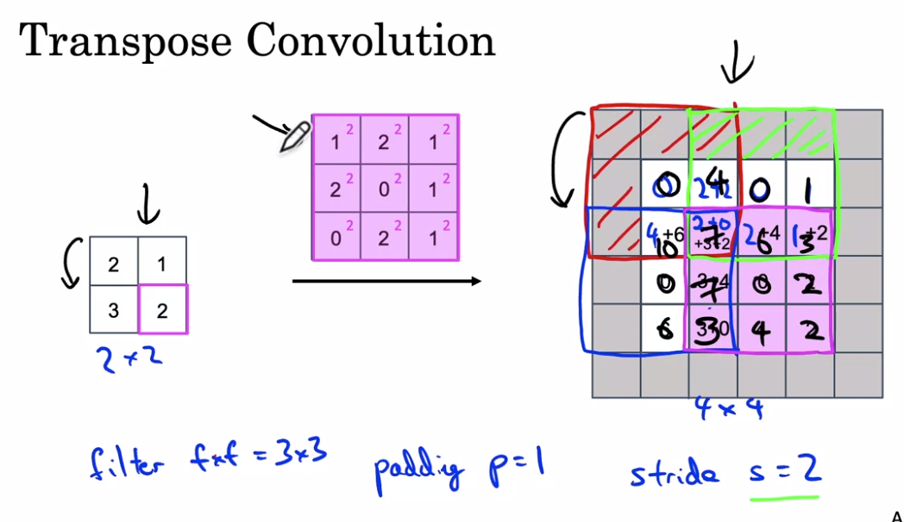

Như chúng ta đã biết convolution operation giúp giảm spatial dimensions khi chúng ta đi sâu vào mạng NN và nó tạo ra các biểu diễn trừu tượng cho ảnh ban đầu. Những features có được từ mạng CNN rất hữu ích trong các bài toán phân loại. Tuy nhiên đối với các bài toán segmentation hay object localization, spatial dimensions của object trong ảnh gốc là cần thiết để dự đoán bounding box hoặc để segment chúng.

Để giải quyết vấn đề này có nhiều phương pháp được sử dụng như fully convolutional neural network với padding = 'same', ở đây chúng ta có thể bảo toàn input dimensions. Tuy nhiên điều này làm tăng computation cost do chúng ta phải thực hiện convolution operation trên original input dimensions trên toàn bộ mạng NN (từ đầu đến cuối).


*Fully convolutional neural network*

Một cách tiếp cận khác cho image segmentation là chia mạng NN thành 2 phần: Downsampling network và Upsampling network. Trong Downsampling network một kiến trúc CNN đơn giản được sử dụng, nó làm giảm spatial dimension của input + số channels tăng lên. Trong Upsampling network đầu ra từ Downsampling network được upsample sao cho spatial dimension của nó bằng với spatial dimension của input của mạng NN. Loại kiến trúc này được gọi là Encoder-Decoder network.


## Upsampling technique

Các kỹ thuật hay được sử dụng để upsampling trong Encoder-Decoder Networks là:
1. **Nearest Neighbors**: chúng ta lấy các giá trị input pixel và copy chúng thành K-Nearest Neighbors, K phụ thuộc vào output mong muốn.


2. **Bi-Linear Interpolation**: chúng ta lấy 4 giá trị pixel gần nhất và thực hiện lấy trung bình có trọng số dựa trên khoảng cách của 4 cells gần nhất để làm mượt output.


3. **Bed of Nails**: chúng ta copy giá trị pixel tạo vị trí tương ứng với output và làm đầy các vị trí còn lại với giá trị 0.


Sử dụng UpSampling2D trong Keras, đây là cách upsample khá đơn giản. Có vài sự lựa chọn là `nearest` và `bilinear`.
```python
import tensorflow as tf
import numpy as np

x = np.arange(12)
x = x.reshape(3, 4)

# mở rộng chiều batch size và # channels
x = x[np.newaxis, ..., np.newaxis]

# 1 pixel trong x sẽ tạo tương ứng với 4 pixels trong y
# y = tf.keras.layers.UpSampling2D(size=(2,2), interpolation='nearest')(x)
y = tf.keras.layers.UpSampling2D(size=(2,2), interpolation='bilinear')(x)

print(y)
# Để dễ hình dung sẽ lấy ra kết quả như này cho đơn giản
print(y[0, :, :, 0])
```
4. **Max-Unpooling**

Max Pooling trong mạng CNN lấy giá trị lớn nhất trong tất cả các giá trị tùy vào kích thước của pool size. Khi thực hiện quá trình ngược lại Max-Unpooling chúng ta chỉ biết giá trị mà max mà không biết vị trí của nó. Một cách đơn giản giải quyết vấn đề này là lưu vị trí của giá trị max trong Max Pooling layer ở bước encoding, giá trị này sẽ được sử dụng trong Max-Unpooling ở bước decoding để đặt đúng vị trí của giá trị max, các vị trí còn lại sẽ điền giá trị 0.


Những kỹ thuật bên trên đều được xác định trước và không phụ thuộc vào dữ liệu, chúng không học từ dữ liệu. Còn một cách khác để tăng spatial dimensions là sử dụng transposed convolution.

## Transposed Convolution
Transposed convolution cũng là một cách để tăng spatial dimensions của feature map có sử dụng các tham số học được (learneable parameters).

Tạm thời bỏ qua số channels chúng ta sẽ bắt đầu với basic transposed convolution với `stride=1` và `padding=0`:
- Ban đầu có encoded feature map `2x2` (input), chúng ta cần upsample nó lên `3x3` feature map (output)


- Chúng ta lấy kernel có kích thước `2x2` với `stride=1` và `padding=0`.


*kernel với kích thước 2x2*

- Chúng ta lấy pixel trên cùng bên trái của input nhân với kernel (nhân với từng phần tử)


- Tương tự như vậy chúng ta làm cho tất cả các phần tử còn lại của input như hình bên dưới (`stride=1` nên mỗi lần kết quả dịch chuyển 1 pixel)


- Cuối cùng một số giá trị trong feature maps bị overlap (có cùng vị trí). Để giải quyết vấn đề này đơn giản chúng ta sẽ cộng tất cả chúng lại với nhau như hình bên dưới (ví dụ giá trị ở vị trí giữa là 0 + 2 + 2 + 0 = 4)


*Transposed convolution operation*

- Cuối cùng chúng ta có upsampled feature map `3x3`.

Trong trường hợp tổng quát chúng ta có `stride=s` và `padding=p`. 
- Với `stride=s` sau mỗi lần tính tích của từng phần tử với kernel, kết quả lại di chuyển một đoạn `s`. Chú ý rằng kernel luôn di chuyển 1 chuyển pixel trên input layer. Do đó stride càng lớn thì output càng lớn nếu không có padding. 


- Với trường hợp tổng quát `padding=p` . Một số tài liệu chỉ cách thực hiện tính toán như với `padding=0`, sau đó loại bỏ `p` hàng, cột ở 4 phía trái, phải, trên, dưới là **KHÔNG ĐÚNG**. Mình sẽ lấy một ví dụ để chỉ ra điều này: Với input `2x2`, kernel `3x3`, `stride=2`, `padding=1` output `4x4`, nếu làm như hướng dẫn **SAI** bên trên chúng ta sẽ nhận được output có kích thước `3x3` chứ không phải `4x4`. Các bạn có thể lấy giấy để thử. 

Một cách đơn giản là chúng ta sẽ thêm `padding=p` vào output như hình bên dưới (được tô xám). Sau đó thực hiện tính toán như bình thường như trên vào đặt kết quả vào output vừa được sửa đổi. Những giá trị nằm trên padding sẽ bị loại bỏ.



Chúng ta đi tìm hiểu thêm một cách nữa để thực hiện transposed convolution. Ở đây transposed convolution cũng được xác định bởi padding và stride. Padding $p$ và stride $s$ là những giá trị được giả định (xác định trước) để khi thực hiện convolution operation trên output với padding và stride đó chúng ta sẽ nhận lại được đầu ra có spatial dimension giống với input.

Việc thực hiện transposed convolution có thể được giải thích qua 4 bước sau:
- **Bước 1**: Tính các tham số mới $z = s- 1$ và $p' = k - p -1$, $s' = 1$
- **Bước 2**: Giữa các hàng và các cột của input chúng ta sẽ chèn $z$ hàng 0, $z$ cột 0. Ví dụ nếu $z=1$ Kích thước của input mới là $(2i-1) \times (2i-1)$ trong đó $i$ là kích thước input ban đầu.
- **Bước 3**: Thêm pad vào tensor vừa nhận được ở trên với $\text{padding}=p'$
- **Bước 4**: Thực hiện standard convolution trên tensor được tạo thành ở bước 3 với $\text{stride}=s'=1$


Những hình động dưới đây giải thích cách hoạt động của convolution với stride và padding khác nhau (bước 4).

 

 

Cho kích thước của input là $i$, kernel là $k$, padding là $p$ và stride là $s$. Kích thước của output feature map $o$ sẽ là:

$$o = (i-1) \times s + k - 2p$$

Công thức này có thể được suy ra từ công thức tính kích thước của output trong standard convolution. Ở đây không có phép tính lấy phần nguyên do không thực hiện phép chia.

Cùng xem ví dụ dưới đây


*Transposed convolution $s=2$, $p=1$*

Ở ví dụ này chúng ta muốn chuyển input `3x3` về output `5x5` với kernel `3x3`. Lúc này chúng ta chọn $s=2$, $p=1$ (bởi vì với input `5x5` và kernel `3x3`, $s=2$, $p=1$ chúng ta sẽ nhận được output là `3x3`). Do đó chúng ta có các giá trị $z=s-1=1$ (giữa 2 hàng chúng ta chèn 1 hàng 0, giữa hai cột chúng ta chèn một cột 0), $p'=k-p-1=3-1-1=1$, $s'=1$. Lúc này chúng ta chèn cột 0, hàng 0 vào giữa các hàng. Padding $p'=1$ nên chúng ta chèn thêm hàng 0, cột 0 vào 4 phía trái, phải, trên dưới. Sau đó sẽ thực hiện standard convolution với kernel `3x3` trên tensor mới với $\text{stride} = s'= 1$ chúng ta sẽ được output với kích thước `5x5`.


Dưới đây là bảng tổng kết cho standard convolution và transposed convolution.


*Chú ý: standard convolution output size cần có phép tính lấy phần nguyên*

Trong tensorflow chúng ta có thể thực hiện transposed convolution như sau:

```python
import tensorflow as tf
import numpy as np

x = np.random.rand(1, 3, 3, 3)

y = tf.keras.layers.Conv2DTranspose(filters=6, kernel_size=(3,3), strides=(2,2), padding='valid')(x)

print(y)
print("Output shape: ", y.shape)
print("Expected output shape: (1, 7, 7, 6)")
```

## Kết luận
Như vậy chúng ta đã tìm hiểu một số kỹ thuật được sử dụng để tăng spatial simension. Những kỹ thuật này được dùng nhiều trong mạng Encoder-Decoder Network đang rất thịnh hành. Hy vọng các bạn sẽ tìm thấy điều hữu ích từ bài viết này.

## Tài liệu tham khảo
1. https://towardsdatascience.com/understand-transposed-convolutions-and-build-your-own-transposed-convolution-layer-from-scratch-4f5d97b2967
2. https://towardsdatascience.com/transposed-convolution-demystified-84ca81b4baba
3. https://towardsdatascience.com/what-is-transposed-convolutional-layer-40e5e6e31c11
4. https://github.com/vdumoulin/conv_arithmetic
5. https://www.coursera.org/learn/convolutional-neural-networks/home/week/3
6. https://www.tensorflow.org/api_docs/python/tf/keras/layers/Conv2DTranspose


