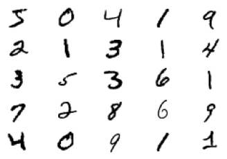
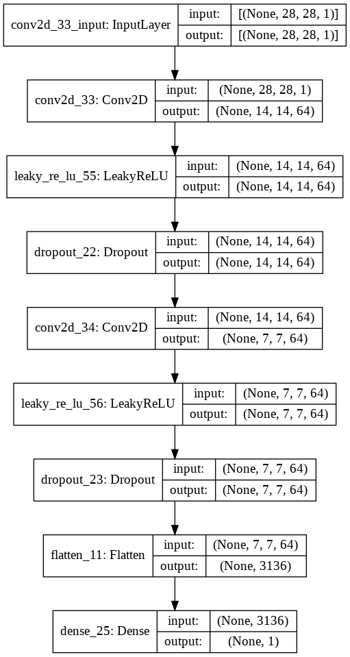
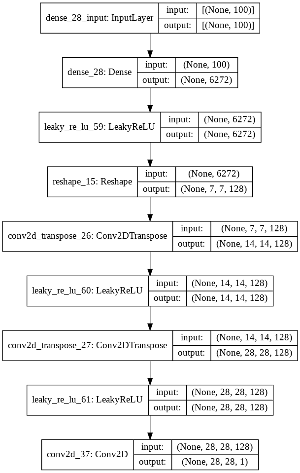
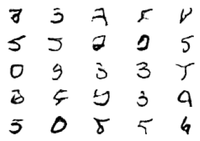

Trong bài này chúng ta đi xây dựng model GAN với bộ dữ liệu MNIST (bộ dữ liệu các chữ số viết tay). Chúng ta sẽ đi từng bước một, chia thành các phần nhỏ để dễ hiểu hơn.

## Chuẩn bị dữ liệu
```python
from tensorflow.keras.datasets import mnist

# load images
(x_train, y_train), (x_test, y_test) = mnist.load_data()
# check shapes
print('Shape for train:', x_train.shape, y_train.shape)
print('Shape for test:', x_test.shape, y_test.shape)
```
Đầu ra nhận được
```python
Shape for train: (60000, 28, 28) (60000,)
Shape for test: (10000, 28, 28) (10000,)
```
Sau khi load dữ liệu chúng ta sẽ đi biểu diễn các ảnh. Ảnh ban đầu với black background (giá trị pixel = 0) và các chữ số màu trắng hoặc gần trắng (giá trị pixels gần 255). Khi hiển thị sẽ thấy đa phần màu đen và các chữ số trắng nằm giữa hơi khó nhìn. Do đó chúng ta set `camp='gray_r` để dễ nhìn hơn.
```python
import matplotlib.pyplot as plt

for i in range(25):
    plt.subplot(5, 5, i+1)
    plt.axis('off')
    plt.imshow(x_train[i], cmap='gray_r')

plt.show()
```


Chúng ta sẽ sử dụng các ảnh trong training dataset để train GAN. Cụ thể generator model sẽ học cách tạo ra các chữ số mới, discriminator cố gắng phân biệt giữa ảnh thật từ training dataset và ảnh được tạo ra từ generator model.

## Standalone discriminator model

Discriminator model sẽ lấy ảnh từ MNIST dataset làm input và đưa ra prediction ảnh đó là real hay fake. Đây là bài toán binary classification.

Discriminator có 2 Conv layers với 64 filters cho mỗi layer, kernel size = 3, stride = 2. Discriminator model không dùng Pooling layers, output layer có 1 unit với sigmoid activation function để dự đoán đầu ra. Model được train để minimize binary cross entropy loss function. 

**Một số best practice cho disciminator**:
- Sử dụng LeakyReLU: $\text{max}(\alpha x, x)$
- sử dụng Dropout
- sử dụng optimizer Adam với learning rate 0.0003 và momentum 0.5.

Bên dưới chúng ta đi tạo hàm *define_discriminator()* để  định nghĩa discriminator model.

```python
def define_discriminator(input_shape=(28, 28, 1)):  # Conv2D mong chờ input có 3 dimensions không tính batch size
    model = Sequential()
    model.add(Conv2D(64, (3, 3), strides=(2, 2), padding='same', input_shape=input_shape))
    model.add(LeakyReLU(alpha=0.2))
    model.add(Dropout(0.4))
    model.add(Conv2D(64, (3, 3), strides=(2, 2),  padding='same'))
    model.add(LeakyReLU(alpha=0.2))
    model.add(Dropout(0.4))
    model.add(Flatten())
    model.add(Dense(1, activation='sigmoid'))
    #compile model
    opt = Adam(learning_rate=0.0002, beta_1=0.5)
    model.compile(loss='binary_crossentropy', optimizer=opt, metrics=['acc'])

    return model
```
Kiến trúc của discriminator model 


>Chú ý: ở đây dùng Conv layer với `padding='same'` và `strides=2` (kernel_size có thể thay đổi) giúp chúng ta giảm kích thước đi một nửa. Nó có tác dụng như Pooling layer.


## Standalone generator model

Generator model có nhiệm vụ sinh ra ảnh chữ số mới từ noise (hay từ các điểm trong latent space).

Các điểm trong *latent space* là các vector có độ bài bất kỳ (dimensions hay chọn là 100). Chúng ta hoàn toàn có thể sử dụng các giá trị khác để thử nghiệm. 
- **Input** - point trong latent space (vector 100 dimensions, các giá trị lấy từ phân bố Gaussian - hay dùng)
- **Output** - 2 dimensional grayscale image of `28x28` pixels với pixels values trong [0, 1] (tùy thuộc vào mình rescale ảnh và ảnh hưởng đến activation function cần chọn)

```python
def define_generator(latent_dim):
    model = Sequential()
    n_nodes = 128 * 7 * 7
    model.add(Dense(n_nodes, input_dim = latent_dim))
    model.add(LeakyReLU(alpha=0.2))
    model.add(Reshape((7, 7, 128)))

    # upsample to 14x14
    model.add(Conv2DTranspose(128, (4,4), strides=(2, 2), padding='same'))
    model.add(LeakyReLU(alpha=0.2))

    # upsample to 28x28
    model.add(Conv2DTranspose(128, (4,4), strides=(2, 2), padding='same'))
    model.add(LeakyReLU(alpha=0.2))
    
    model.add(Conv2D(1, (7,7), activation='sigmoid', padding='same'))   # dùng 1 filter để đưa về 28x28x1 cho phù hợp với ảnh MNIST
    return model
```

Kiến trúc của generator model 


## GAN model

Chúng ta sẽ xây dựng composite GAN model bằng cách kết hợp generator model và discriminator model. Sau đó chúng ta sẽ train generator thông qua GAN model. Weights của generator được update dựa trên performance của discriminator đối với các ảnh fake được tạo ra từ generator. Có một điều cần chú ý khi chúng ta train generator thông qua GAN model chúng ta cần gán nhãn cho fake generated sample là 1. Điều này giúp generator có thể tạo ra được ảnh fake giống thật nhất.

```python
def define_gan(g_model, d_model):
    d_model.trainable = False   
    # connect 2 model lại
    model = Sequential()
    # add generator
    model.add(g_model)
    # add discriminator
    model.add(d_model)
    # compile model
    opt = Adam(learning_rate=0.0002, beta_1=0.5)
    model.compile(loss='binary_crossentropy', optimizer=opt)
    return model
```

Ngoài ra chúng ta cần tạo một số hàm để xử lý như sau
```python
def load_real_samples():
    # load mnist dataset
    (x_train, _), (_, _) = mnist.load_data()
    # mở rộng chiều về cuối
    X = np.expand_dims(x_train, axis=-1)
    # chuyển từ int về float32
    X = X.astype('float32')
    # scale về [0, 1]
    X = X / 255.
    return X

# Chọn n_samples real samples, labels = 1 
def generate_real_samples(dataset, n_samples):
    # chọn instances bất kì
    idx = np.random.randint(0, dataset.shape[0], n_samples)     # trả về list, ko lấy cận trên
    # lấy các ảnh được chọn
    X = dataset[idx]
    # tạo nhãn cho các ảnh đó, label = 1
    y = np.ones((n_samples, 1))     # tương ứng với số ảnh được lấy
    # trả về ảnh và label
    return X, y     

# Tạo latent points làm input cho generator model
def generate_latent_points(latent_dim, n_samples):
    # tạo các điểm
    x_input = np.random.randn(latent_dim * n_samples)
    # reshape thành batch of inputs
    x_input = x_input.reshape(n_samples, latent_dim)
    return x_input

# Sử dụng generator model để tạo fake samples, label = 0, để đưa vào discriminator
def generate_fake_samples(g_model, latent_dim, n_samples):
    # tạo points trong latent space
    x_input = generate_latent_points(latent_dim, n_samples)
    # cho x_input đi qua generator model để tạo output bằng predict
    X = g_model.predict(x_input)
    # tạo labels cho fake examples, labels = 0
    y = np.zeros((n_samples, 1))
    return X, y
```

## Train model

```python
# train the generator and discriminator
def train(g_model, d_model, gan_model, dataset, latent_space, n_epochs=100, n_batch=256):
    batch_per_epoch = dataset.shape[0] // n_batch
    half_batch = n_batch // 2

    # duyệt qua epochs
    for i in range(n_epochs):
        # duyệt qua các batches
        for j in range(batch_per_epoch):
            # UPDATE CHO discriminator
            # lấy ngẫu nhiên real samples từ MNIST dataset
            X_real, y_real = generate_real_samples(dataset, half_batch)
            # tạo fake examples để train discriminator
            X_fake, y_fake = generate_fake_samples(g_model, latent_dim, half_batch)     # lấy từ generator nhé
            # tạo training set cho discriminator
            X, y = np.vstack((X_real, X_fake)), np.vstack((y_real, y_fake))
            # update discriminator model weights
            d_loss, _ = d_model.train_on_batch(X, y)    # trả về loss + metric do bên trên định nghĩa

            # UPDATE CHO generator
            # chuẩn bị points in the latent space như input của generator
            X_gan = generate_latent_points(latent_dim, n_batch)     # lấy 256 luôn
            # tạo inverted labels for fake samples , label 1
            y_gan = np.ones((n_batch, 1))
            # update the generator thông qua performance của discriminator
            g_loss = gan_model.train_on_batch(X_gan, y_gan)     # nếu không muốn return loss thì chỉ cần model.train_ob_batch(...)

            # summarize loss on this batch
            print(">{}: {}/{} d_loss={:.2f} g_loss={:.2f}".format(i+1, j+1, batch_per_epoch, d_loss, g_loss))
        
        # evaluate the model performance
        if (i+1)%10 == 0:
            summarize_performance(i, g_model, d_model, dataset, latent_dim)    

# size of the laten space
latent_dim = 100
# create the discriminator
d_model = define_discriminator()    # NHỚ discriminator có compile model nhé
# create the generator
g_model = define_generator(latent_dim)
# create the gan
gan_model = define_gan(g_model, d_model)
# load image data
dataset = load_real_samples()
# train model
train(g_model, d_model, gan_model, dataset, latent_dim)
```

## Sinh ảnh từ generator

Khi có final generator model chúng ta có thể sử dụng nó riêng biệt để phục vụ cho ứng dụng của chúng ta. Chúng ta có thể load model và dùng nó để tạo ra images. Quá trình tạo image cũng cần point trong latent space như input.

Bên dưới là code để sinh ảnh từ trained generator model.
```python
# create and save a plot of generated images (reversed grayscale)
def save_plot(examples, n):
    # plot images
    for i in range(n * n):
        plt.subplot(n, n, 1 + i)
        plt.axis('off')
        plt.imshow(examples[i, :, :, 0], cmap='gray_r')
    plt.show()

# load model
model = load_model('generated_model_0100.h5')
# tạo points trong latent space
latent_points = generate_latent_points(100, 25)
X = model.predict(latent_points)
# plot the result
save_plot(X, 5)
```
Một số ảnh nhận được khi dùng model lưu lại sau 100 epochs.



Như vậy chúng ta đã cùng nhay xây dựng GAN model cho MNIST dataset. Dưới đây là một số gợi ý để thử nghiệm:
- Scale image về [-1, 1] => thay đổi activation funcion sang `tanh`
- Thay đổi kích thước vector trong latent sapce
- Sử dụng Batch Normalizarion
- Label smoothing: thay vì gán nhán real sample là 1 thì thử cho bằng 0.9 xem thế nào
- Thay đổi kiến trúc model.


