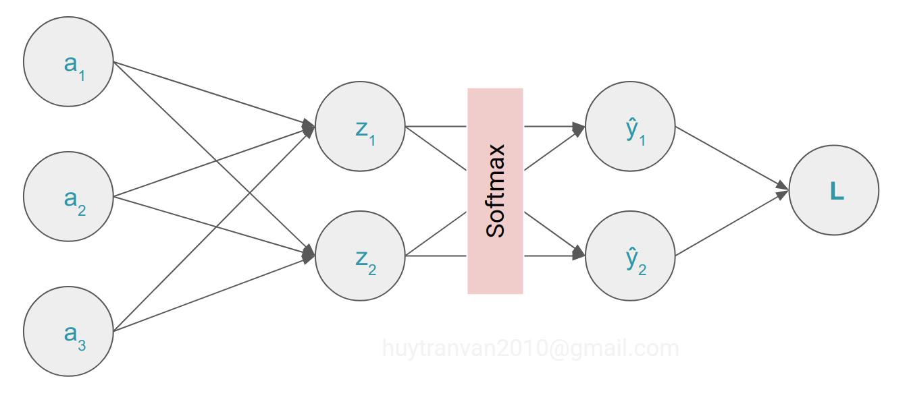
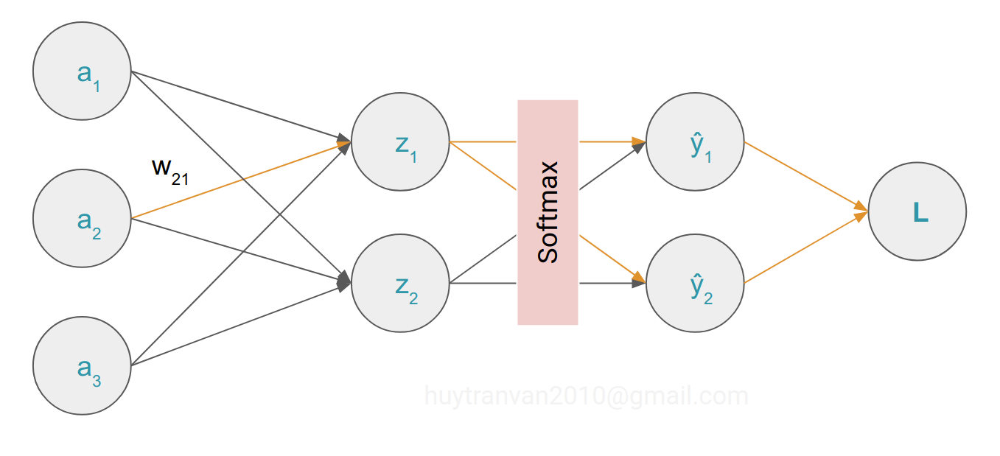

Trong bài trước chúng ta đã tìm hiểu về hàm [softmax](https://huytranvan2010.github.io/Derivative-softmax/). Trong này chúng ta sẽ đi phân tích thuật toán backpropagation với hàm softmax và crossentropy- thuật toán được ứng dụng trong mạng Neural Network rất thành công.

## Chain rule

Trước này chúng ta đã biết cách tính đạo hàm cho hàm đơn giản như:

$$\frac{\mathrm{d} x^2}{\mathrm{d} x} = 2x  ~~~~~~ \frac{\mathrm{d} e^x}{\mathrm{d} x} = e^x$$

Đối với các hàm phức hợp:

$$z_1 = z_1(x_1, x_2) ~~~~~~ z_2 = z_2(x_1, x_2) ~~~~~~ p = p(z_1, z_2)$$

trong đó $z_1, z_2$ khả vi. Khi đó **chain rule** có thể được hiểu như sau:

$$ \frac{\partial p}{\partial x} = \frac{\partial p}{\partial z_1} \frac{\partial z_1}{\partial x} +  \frac{\partial p}{\partial z_2} \frac{\partial z_2}{\partial x}$$

**Tổng quát**: nếu có hai hàm $f(x)$ và $g(x) $ khả vi
- $h(x) = (f \circ g)(x)$ cũng khả vi:

$$h'(x) = f'(g(x)) ~g'(x)$$

- $y = f(u)$ và $u = g(x)$ khi đó:

$$\frac{dy}{dx} = \frac{dy}{du} ~ \frac{du}{dx}$$

Ví dụ $h(x) = f(x) ~ g(x)$ ta có:

$$ \frac{\partial h}{\partial x} = \frac{\partial h}{\partial f} \frac{\partial f}{\partial x} +  \frac{\partial h}{\partial g} \frac{\partial g}{\partial x}$$

## Cross entropy

Trong bài toán multiclass classification chúng ta có giá trị thực tế $y_i$, giá trị dự đoán $\hat{y}_i$ (đầu ra hàm softmax). Khi đó cross entropy loss được xác định như sau.

$$ L = - \sum_i y_i log(\hat{y}_i) $$

$$\hat{y}(\mathbf{z})_i = \frac{e^{z_i}}{\sum_{k=1}^{n} e^{z_k}}$$

Đi xác định đạo hàm của loss theo các predicted nodes (units).

$$ 
\begin{align}
\frac{\partial L}{\partial z_i} &= - \sum_k y_k \frac{\partial log(\hat{y}_k)}{\partial z_i} \\
&= - \sum_k y_k \frac{\partial log(\hat{y}_k)}{\partial \hat{y}_k} \times \frac{\partial \hat{y}_k}{ \partial z_i} \\
&= - \sum_k y_k \frac{1}{\hat{y}_k} \times \frac{\partial \hat{y}_k}{\partial z_i} \\
\end{align}
$$

Nhớ lại bài trước, đạo hàm của softmax theo từng thành phần

$$ \frac{\partial \hat{y}_k}{\partial z_i} =  \hat{y}_k(\delta_{ki} - \hat{y}_i) $$

với 

$$ \delta_{ki} = \begin{cases} 
1 & if & k=i \\ 
0 & if & k \neq i 
\end{cases} $$

Do đó (3) tương đương với:

$$ 
\begin{align*}
\frac{\partial L}{\partial z_i} &= - \sum_k y_k \frac{1}{\hat{y}_k} \times \hat{y}_k(\delta_{ki} - \hat{y}_i) \\
&= - y_i \frac{1}{\hat{y}_i} \times \hat{y}_i(1 - \hat{y}_i)- \sum_{k \neq i} y_k \frac{1}{\hat{y}_k} \times \hat{y}_k(- \hat{y}_i)  \\
&= - y_i (1-\hat{y}_i) + \sum_{k \neq i} y_k \hat{y}_i \\
&= - y_i + y_i \hat{y}_i + \sum_{k \neq i} y_k \hat{y}_i \\
&= - y_i + \hat{y}_i (y_i + \sum_{k \neq i} y_k)
\end{align*}
$$

Do tổng các phần tử của softmax bằng 1 hay $\sum_k y_k = y_i + \sum_{k \neq i} y_k = 1$ nên chúng ta có:

$$ \frac{\partial L}{\partial z_i} = \hat{y}_i -y_i ~~~~ (4)$$ 

Kí hiệu $w_{pq}$ là weight kết nối units thứ $p$ của layer trước với unit thứ $q$ của output layer, $a_p$ là giá trị đầu ra của unit thứ p của layer trước, chúng ta có:

$$z_k=\sum_iw_{ik}a_i+b_k \implies \frac{\partial z_k}{\partial w_{pq}}=\sum_i a_i\frac{\partial w_{ik}}{\partial w_{pq}}=\sum_i a_i\delta_{ip}\delta_{kq}=\delta_{kq} a_p ~~~~ (5)$$

Có biểu thức cuối do $i$ theo chạy theo số units của layer trước và $\delta_{ip} = 1 $ khi $i=p$.

Chốt lại từ (4) và (5) chúng ta có:

$$ \frac{\partial L}{\partial w_{pq}} = \sum_k\frac{\partial L}{\partial z_k}\frac{\partial z_k}{\partial w_{pq}} = \sum_k(\hat{y}_k - y_k)\delta_{kq} a_p = a_p(\hat{y}_q - y_q)$$ 

hay 

$$ \frac{\partial L}{\partial w_{ij}} = a_i(\hat{y}_j - y_j) $$

Như vậy chúng ta đã làm từng bước tính đạo hàm của loss so với weights cho output layer. Một cách tổng quát hơn.

$$ \frac{\partial L}{\partial w_{pq}}=\sum_i \frac{\partial L}{\partial \hat{y}_i}\frac{\partial \hat{y}_i}{\partial w_{pq}} $$

$$\frac{\partial \hat{y}_i}{\partial w_{pq}} = \sum_k \frac{\partial \hat{y}_i}{\partial z_k}\frac{\partial z_k}{\partial w_{pq}}$$

Kết hợp lại sẽ có:

$$\frac{\partial L}{\partial w_{pq}}=\sum_i \left[ \frac{\partial L}{\partial \hat{y}_i}\left(\sum_k \frac{\partial \hat{y}_i}{\partial z_k}\frac{\partial z_k}{\partial w_{pq}}\right) \right]$$

trong đó $i, k$ đều chạy trong số units của output layer.

Đi vào một ví dụ cụ thể xem thế nào.

$$ L=-y_1\log \hat{y}_1 - y_2\log \hat{y}_2 $$

$$ \hat{y}_1 = \frac{e^{z_1}}{e^{z_1} + e^{z_2}} $$

$$ \hat{y}_2 = \frac{e^{z_2}}{e^{z_1} + e^{z_2}} $$

$$ z_1 = w_{11}a_1 + w_{21}a_2 + w_{31}a_3 + b_1 $$

$$ z_2 = w_{12}a_1 + w_{22}a_2 + w_{32}a_3 + b_2 $$

Chúng ta sẽ đi tính đạo hàm của loss theo $w_{21}$ và $b_1$. Chúng ta đánh dấu đường đi (liên quan) cho dễ hiểu.

$$ \frac{\partial L}{\partial \hat{y}_1} = -\frac{y_1}{\hat{y}_1} ~~~~~~ \frac{\partial L}{\partial \hat{y}_2} = -\frac{y_2}{\hat{y}_2} $$

$$ \frac{\partial \hat{y}_1}{\partial z_1} = \hat{y}_1(1 - \hat{y}_1) ~~~~~~ \frac{\partial \hat{y}_2}{\partial z_1} = -\hat{y}_1 \hat{y}_2 $$

$$ \frac{\partial z_1}{\partial w_{21}} = a_2 ~~~~~~ \frac{\partial z_1}{\partial b_1} = 1 $$

Cuối cùng áp dụng chain rule cho $w_{21}$ ta có:

$$ 
\begin{align*}
\frac{\partial L}{\partial w_{21}} &= \frac{\partial L}{\partial \hat{y}_1}\frac{\partial \hat{y}_1}{\partial z_1}\frac{\partial z_1}{\partial w_{21}} + \frac{\partial L}{\partial \hat{y}_2}\frac{\partial \hat{y}_2}{\partial z_1}\frac{\partial z_1}{\partial w_{21}}\\
&= \frac{-y_1}{\hat{y}_1}[\hat{y}_1(1 - \hat{y}_1)] a_2 + \frac{-y_2}{\hat{y}_2}(-\hat{y}_2 \hat{y}_1) a_2\\
&= a_2(- y_1 + y_1 \hat{y}_1 + y_2 \hat{y}_1 )\\
&= a_2(\hat{y}_1(y_1 + y_2) - y_1)\\
&= a_2(\hat{y}_1 - y_1)
\end{align*}
$$

Đối với $b_1$ ta có:

$$ 
\begin{align*}
\frac{\partial L}{\partial b_1} &= \frac{\partial L}{\partial \hat{y}_1}\frac{\partial \hat{y}_1}{\partial z_1}\frac{\partial z_1}{\partial b_1} + \frac{\partial L}{\partial \hat{y}_2}\frac{\partial \hat{y}_2}{\partial z_1}\frac{\partial z_1}{\partial b_1}\\
&= \frac{-y_1}{\hat{y}_1}[\hat{y}_1(1 - \hat{y}_1)] + \frac{-y_2}{\hat{y}_2}(-\hat{y}_2 \hat{y}_1) \\
&= - y_1 + y_1 \hat{y}_1 + y_2 \hat{y}_1 \\
&= \hat{y}_1(y_1 + y_2) - y_1 \\
&= \hat{y}_1 - y_1
\end{align*}
$$

Như vậy chúng ta đã cùng tìm hiểu backpropagation algorithm cho hệ số của output layer. Hy vọng các bạn tìm thấy điều gì hữu ích từ bài viết.

## Tài liệu tham khảo 
1. https://peterroelants.github.io/posts/neural-network-implementation-part02/
2. https://stats.stackexchange.com/questions/235528/backpropagation-with-softmax-cross-entropy 
3. https://en.wikipedia.org/wiki/Chain_rule#Higher_dimensions
4. https://eli.thegreenplace.net/2016/the-softmax-function-and-its-derivative/