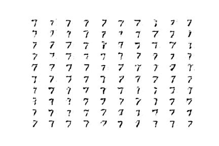

Trong các bài trước chúng ta đã tìm hiểu cách xây dựng mô hình GAN truyền thống. Ở đó chúng ta sử dụng binary cross entropy (BCE) làm cost function. Tuy nhiên việc sử dụng BCE có hai nhược điểm:
- Xảy ra **mode collapse** ("sụp đổ mô hình"). Hiểu đơn giản thì giả sử ban đầu chúng ta có 10 classes các chữ số viết tay từ 0 đến 9, tuy nhiên sau khi training GAN khi sinh dữ liệu chúng ta thường chỉ nhận được samples từ một class nào đó.
- **Vanishing gradient** - dẫn đến việc học rất chậm, điều này do discriminator có thể quá xuất sắc và nó không đưa ra được feedback tốt cho generator cách cải thiện như nào.

Để cải thiện mô hình GAN đòi hỏi sử dụng cost function mới (có liên quan đến độ đo sự khác biệt giữa hai phân phối real samples và generated samples). Martin Arjovsky và cộng sự đã đưa ra mô hình [Wasserstein GAN - WGAN](https://arxiv.org/abs/1701.07875), đưa vào cost function - Wasserstein.

Trong mô hình [GAN truyền thống](https://arxiv.org/abs/1406.2661), discriminator có nhiệm vụ dự đoán xác suất ảnh tạo ra là thật hay giả. Trong khi đó đối với WGAN vai trò của discriminator được thay thế vởi critic. Critic bây giờ sẽ chấm điểm cho ảnh dựa trên độ thật giả (giá trị không còn bị giới hạn trong khoảng 0, 1).

## Triển khai Wasserstein GAN

Dưới đây là thuật toán cho Wasserstein GAN được các tác giả đưa ra.


Sự khác biệt trong triển khai WGAN khác với GAN truyền thống như sau:
1. Output layer của critic sử dụng linear activation function (không sử dụng sigmoid function)

```python
model.add(Dense(1))
```

2. Sử dụng `label = -1` cho real images, `label = 1` cho fake images (GAN truyền thông sử dụng 1, 0 cho real và fake images). Đây chỉ là một cách giúp triển khai WGAN, đôi khi không cần gán nhãn vẫn có thể triển khai được, do trong discriminator có phân biệt rõ ảnh thật giả.

```python
# tạo class labels -1 cho real images
y = - np.ones((n_samples, 1))
# tạo class labels 1 cho fake images
y = np.ones((n_samples, 1))
```
3. Dùng Wasserstein loss để train critic và generator (không dùng BCE)

$$\mathbb{E}(c(x)) - \mathbb{E}(c(g(z)) ~~~~ (1)$$

> Chú ý: $\mathbb{E}$ thể hiện lấy kì vọng, khi triển khai đối với các examples thì chúng ta lấy trung bình. $\mathbb{E}(c(x))$ chính là điểm số critic đánh giá ảnh thật.

Critic sẽ đi maximize $\mathbb{E}(c(x)) - \mathbb{E}(c(g(z))$ do nó muốn phân bố của ảnh thật và ảnh giả khác nhau càng nhiều càng tốt. Generator lại muốn minimize biểu thức đó do muốn tạo ảnh giả gần với thật nhất. Tuy nhiên thông thường chúng ta hay đi xây dựng bài toán dựa trên gradient descent, do đó chúng ta sẽ đảo dấu của biểu thức (1) và đi tìm min cho nó $- \mathbb{E}(c(x)) + \mathbb{E}(c(g(z))$. Để đơn giản sẽ đi gán nhãn cho ảnh thật có `label = -1` và ảnh giả có `label = 1`. Lúc này ta đi tìm min cho:

$$y(x) \cdot \mathbb{E}(c(x)) + y(g(z) \cdot \mathbb{E}(c(g(z))$$

ở đây, $y(x)$ là label của example $x$. Xin nhấn mạnh lại việc gán nhãn như này chỉ là một cách triển khai WGAN, chúng ta hoàn toàn có thể làm cách khác.

```python
import tensorflow as tf
# wasserstein loss
def wasserstein_loss(y_true, y_pred):
	return tf.reduce_mean(y_true * y_pred)
```

Khi compile model chúng ta sẽ sử dụng tên loss function vừa xây dựng:

```python
# compile the model
model.compile(loss=wasserstein_loss, ...)
```

4. Giới hạn weights của critic trong khoảng cho phép sau mỗi lần cập nhật bằng weight clipping. *Đây là một cách thỏa mãn điều kiện [L-1 continuous](https://en.wikipedia.org/wiki/Lipschitz_continuity)*.

Chúng ta có thể thực hiện weight clipping bằng *Keras constraint*. Để thực hiện điều này sẽ đi tạo class mới kế thừa từ *Constranit* class và định nghĩa method `__call__()` thực hiện việc giới hạn các giá trị và `get_config()` để trả về các cấu hình.

```python
# clip model weights
class ClipConstraint(Constraint):
	# truyền vào giá trị cận trên
	def __init__(self, clip_value):
		self.clip_value = clip_value

	# clip model weights to hypercube
	def __call__(self, weights):
		return tf.clip_by_value(weights, -self.clip_value, self.clip_value)

	# get the config
	def get_config(self):
		return {'clip_value': self.clip_value}
```

Để sử dụng constraint chúng ta đi khởi tạo object và truyền nó cho *kernel_constraint* trong layer.

```python
...
# define the constraint
const = ClipConstraint(0.01)
...
# use the constraint in a layer
model.add(Conv2D(..., kernel_constraint=const))
```

5. Update critic nhiều lần hơn generator trong mỗi iteration, thường lấy 5 (GAN truyền thống hay để 1)

```python
...
# main gan training loop
for i in range(n_steps):

	# update the critic
	for _ in range(n_critic):
		# get randomly selected 'real' samples
		X_real, y_real = generate_real_samples(dataset, half_batch)
		# update critic model weights
		c_loss1 = c_model.train_on_batch(X_real, y_real)
		# generate 'fake' examples
		X_fake, y_fake = generate_fake_samples(g_model, latent_dim, half_batch)
		# update critic model weights
		c_loss2 = c_model.train_on_batch(X_fake, y_fake)

	# update generator

	# prepare points in latent space as input for the generator
	X_gan = generate_latent_points(latent_dim, n_batch)
	# create inverted labels for the fake samples
	y_gan = np.ones((n_batch, 1))
	# update the generator via the critic's error
	g_loss = gan_model.train_on_batch(X_gan, y_gan)
```

6. Sử dụng RMSProp với learning rate nhỏ (ví dụ 0.00005) và không có momentum (truyền thống hay dùng SGD với momentum)

```python
opt = RMSprop(lr=0.00005)
```

## Train Wasserstein GAN model

Trong phần này sẽ xây dựng WGAN để tạo ra một chữ số viết tay từ bộ dữ liệu MNIST. Sau đó có thể thử cho toàn bộ các chữ số của MNIST.

**Critic model**

Xây dựng critic model có sử dụng:
- LeakyReLU activation function với alpha = 0.2
- Batch Normalization
- Conv layer với `stride=2` để giảm kích thước thay cho Pooling layer.

```python
# định nghĩa critic model
def define_critic(in_shape=(28,28,1)):
	# khởi tạo weights
	init = RandomNormal(stddev=0.02)
	# weight constraint - weight clipping
	const = ClipConstraint(0.01)
	# định nghĩa model
	model = Sequential()
	# giảm kích thước xuống 14x14
	model.add(Conv2D(64, (4,4), strides=(2,2), padding='same', kernel_initializer=init, kernel_constraint=const, input_shape=in_shape))
	model.add(BatchNormalization())
	model.add(LeakyReLU(alpha=0.2))
	# giảm kích thước xuống 7x7
	model.add(Conv2D(64, (4,4), strides=(2,2), padding='same', kernel_initializer=init, kernel_constraint=const))
	model.add(BatchNormalization())
	model.add(LeakyReLU(alpha=0.2))
	# linear activation
	model.add(Flatten())
	model.add(Dense(1))
	# compile model
	opt = RMSprop(lr=0.00005)
	model.compile(loss=wasserstein_loss, optimizer=opt)
	return model
```

**Generator model**

Khi xây dựng generator model chúng ta không thực hiện compile vì việc train generator sẽ thông qua critic.

```python
# định nghĩa generator model
def define_generator(latent_dim):
	# khởi tạo weights
	init = RandomNormal(stddev=0.02)
	# define model
	model = Sequential()
	# foundation for 7x7 image
	n_nodes = 128 * 7 * 7
	model.add(Dense(n_nodes, kernel_initializer=init, input_dim=latent_dim))
	model.add(LeakyReLU(alpha=0.2))
	model.add(Reshape((7, 7, 128)))
	# tăng kích thước lên 14x14
	model.add(Conv2DTranspose(128, (4,4), strides=(2,2), padding='same', kernel_initializer=init))
	model.add(BatchNormalization())
	model.add(LeakyReLU(alpha=0.2))
	# tăng kích thước lên 28x28
	model.add(Conv2DTranspose(128, (4,4), strides=(2,2), padding='same', kernel_initializer=init))
	model.add(BatchNormalization())
	model.add(LeakyReLU(alpha=0.2))
	# output 28x28x1, dùng tanh chuyển về (-1, 1)
	model.add(Conv2D(1, (7,7), activation='tanh', padding='same', kernel_initializer=init))
	return model
```

**GAN model**

```python
# define the combined generator and critic model, for updating the generator
def define_gan(generator, critic):
	# make weights in the critic not trainable
	for layer in critic.layers:
		if not isinstance(layer, BatchNormalization):
			layer.trainable = False
	# connect them
	model = Sequential()
	# add generator
	model.add(generator)
	# add the critic
	model.add(critic)
	# compile model
	opt = RMSprop(lr=0.00005)
	model.compile(loss=wasserstein_loss, optimizer=opt)
	return model
```

Đây là ảnh được tạo ra sau khi training với 10 epochs.



Source code mọi người có thể tham khảo [tại đây](https://github.com/huytranvan2010/WGAN).

## Tài liệu tham khảo
1. https://machinelearningmastery.com/how-to-code-a-wasserstein-generative-adversarial-network-wgan-from-scratch/
2. https://www.coursera.org/specializations/generative-adversarial-networks-gans
3. https://arxiv.org/abs/1701.07875
4. https://github.com/TanyaChutani/WGAN-TF2.x
