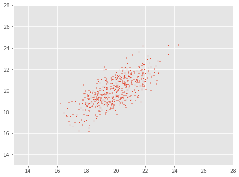
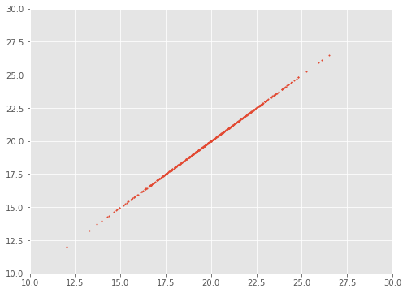

## Giới thiệu

Trong phần này chúng ta sẽ đi tìm hiểu về **covariance matrix** và sẽ giải thích nó dưới dạng hình vẽ để chúng ta có thể hình dung tốt hơn.

Chúng ta đã biết về **variance** và standard deviation.


Hình bên trên chúng ta biểu diên Gaussian distribution với mean $\mu$ và standar deviation $\sigma$. Trên hình cũng biểu diễn các khoảng giá trị mà trong đó có bao nhiêu phần trăm random variable có thể rơi vào. Cái này được xác định từ công thức tích phân tính xác suất. Dưới đây ghi lại công thức xác định variance cho random variable.

$$
\begin{align*}
 \sigma^2_x&=  \frac{1}{N-1} \sum_{i-1}^N \left(x_i - \mu\right)^2\\ 
 &= \mathbb{E}\left[ \left(x - \mathbb{E}(x)\right) \left(x - \mathbb{E}(x)\right)\right]\\ 
 &= \sigma(x,x)
\end{align*}~~~~~(1)
$$

trong đó $N$ là số lượng samples, $\mu$ là mean của random varibale $x$.

**Chú ý**: Công thức bên trên xác định variance cho sample, đối với population thì chúng ta sử dụng $\frac{1}{N}$ thay cho $\frac{1}{N-1}$.

Tuy nhiên variance chỉ xác được được spread of the data (sự mở rộng) theo một trục nào đó hay single random variable. Còn đối với 2D feature space hay dữ liệu trong không gian 2 chiều thì sao?

## Dữ liệu nhiều chiều 


Đối với dữ liệu này chúng ta có thể tính variance $\sigma(x, x)$ theo hướng $x$ và variance $\sigma(y,y)$ theo hướng $y$. Tuy nhiên sự phân bố data theo chiều ngang hay chiều dọc không giải thích được sự tương quan chéo. Nhìn trên hình có thể thấy khi $x$ tăng thì $y$ cũng tăng hay có sự tương quan dương (positive correlation). Sự tương quan này có thể được thể hiện thông qua **covariance** như sau:

$$\sigma(x,y) = \frac{1}{N-1}\sum_{i=1}^N \left(x_i - \bar{x}\right) \left(y_i - \bar{y}\right) = \mathbb{E}\left[ \left(x - \mathbb{E}(x)\right) \left(y - \mathbb{E}(y)\right)\right]~~~~~(2)$$

Mẫu số là $N-1$ thì đó là sample covariance, nếu sử dụng $N$ thì đó là population covariance.

Lúc này chúng ta có thể xây dựng được covariance matrix như sau:

$$\Sigma = 
\begin{bmatrix}
\sigma(x, x)& \sigma(x, y)\\
\sigma(y, x)& \sigma(y, y)
\end{bmatrix}~~~~~(3)$$

Nếu $x$ tương quan dương với $y$ thì $y$ cũng tương quan dương với $x$, ở đây chúng ta có $\sigma(x, y) = \sigma(y, x)$. Do đó covariance matrix là ma trận đối xứng với các variances trên đường chéo chính. Đối với data n chiều, chúng ta có covariance matrix $n \times n$

Chúng ta hoàn toàn có thể dựa vào công thức (2) để xác định covariance giữa các biến. Bài tiếp theo chúng ta sẽ đưa ra công thức tổng quát dưới dạng vector.

```python
import numpy as np 
import matplotlib.pyplot as plt 

def plot_data(means, cov_matrix, xlim=(13, 28), ylim=(13,28)):
    data = np.random.multivariate_normal(means, cov_matrix, size=500)
    # plot
    fig = plt.figure(figsize=(8,6))
    plt.scatter(data[:, 0], data[:, 1], s=2)
    plt.xlim(xlim)
    plt.ylim(ylim)

    plt.show()
```

```python
# tạo data POSITIVE CORRELATION
means = np.array([20, 20])
cov_matrix = np.array([
    [2, 1.5], 
    [1.5, 2]])
plot_data(means, cov_matrix)
```



*Data với các features x, y có tương quan dương với nhau*

```python
# tạo data NEGATIVE CORRELATION
means = np.array([20, 20])
cov_matrix = np.array([
    [1, -0.5], 
    [-0.5, 1]])
plot_data(means, cov_matrix)
```


*Data với các features x, y có tương quan âm với nhau*

**Chú ý:** correlation bị giới hạn trong đoạn [-1, 1] tuy nhiên covariance không bị giới hạn. Giá trị cao không đồng nghĩa chúng thay đổi cùng nhau nhiều. Giá trị này phụ thuộc vào khoảng giá trị mà các biến nhận được. Xem hai ví dụ bên dưới.

```python
means = np.array([200, 200])
cov_matrix = np.array([
    [20, 20], 
    [20, 20]])
plot_data(means, cov_matrix, xlim=(180, 220), ylim=(180, 220))
```


```python
means = np.array([20, 20])
cov_matrix = np.array([
    [5, 5], 
    [5, 5]])
plot_data(means, cov_matrix, xlim=(10, 30), ylim=(10, 30))
```



Nhận thấy ở đây covariance khác nhau nhưng $x$ và $y$ tăng với tốc độ như nhau.
## Ví dụ 

Chúng ta sẽ có một ví dụ để hiểu rõ hơn cách xác định covariance matrix dựa trên data chúng ta có.

Giả sử chúng ta có các dữ liệu, mỗi dữ liệu có 2 thành phần chiều cao và cân nặng của mỗi người được khảo sát. Dữ liệu được cho trong bảng dưới đây.

<!-- : trong bang ben nao thi can ve phia do-->

|STT  | Chiều cao (m)| Cân nặng (kg) |
|:---:| :----------: | :-----------: |
|1    | 1.6          | 50            |
|2    | 1.7          | 52            |
|3    | 1.75         | 55            |
|4    | 1.63         | 49            |

Chúng ta làm ví dụ đơn giản như này. Ở đây số examples $N=4$. Coi chiều cao là $x$, cân nặng là $y$. Ta có 

$$\bar{x}=\frac{1}{N} \sum_{i=1}^N x_i = \frac{1}{4} \left(1.6 + 1.7 +1.75 + 1.63 \right) = 1.67$$

$$\bar{y}=\frac{1}{N} \sum_{i=1}^N y_i = \frac{1}{4} \left(50 + 52 + 55 + 49 \right) = 51.5$$


$$
\sigma(x,x) = \sigma^2_x = \frac{1}{N-1} \sum_{i-1}^N \left(x_i - \bar{x}\right)^2 = \frac{1}{3} \left[ \left( 1.6 - 1.67 \right)^2 + \left( 1.7 - 1.67 \right)^2 + \left( 1.75 - 1.67 \right)^2 + \left( 1.63 - 1.67 \right)^2\right] = 0.0046
$$

$$
\sigma(y,y) = \sigma^2_x = \frac{1}{N-1} \sum_{i-1}^N \left(y_i - \bar{y}\right)^2 = \frac{1}{3} \left[ \left( 50 - 51.5 \right)^2 + \left( 52 - 51.5 \right)^2 + \left( 55 - 51.5 \right)^2 + \left( 49 - 51.5 \right)^2\right] = 7
$$

$$\sigma(x,y) = \frac{1}{N-1}\sum_{i=1}^N \left(x_i - \bar{x}\right) \left(y_i - \bar{y}\right) = \frac{1}{3} \left[ \left(1.6 - 1.67\right) \left(50 - 51.5\right) + \left(1.7 - 1.67\right) \left(52 - 51.5\right) + \left(1.75 - 1.67\right) \left(55 - 51.5\right) + \left(1.63 - 1.67\right) \left(49 - 51.5\right)\right] = 0.1667$$

Như vậy ta sẽ có covariance matrix cho bộ data trên như sau:

$$
\mathbf{C} = 
\begin{bmatrix}
\sigma(x, x)& \sigma(x, y)\\
\sigma(y, x)& \sigma(y, y)
\end{bmatrix} = 
\begin{bmatrix}
0.0046& 0.1667\\
0.1667& 7
\end{bmatrix}
$$

Chúng ta có thể kiểm tra lại kết quả với thư viện Numpy
```python
# Khởi tạo data
x = np.array([ 
    [1.6, 50],
    [1.7, 52],
    [1.75, 55],
    [1.63, 49]
])
cov = np.cov(x.T)
cov
```

Kết quả nhận được với Numpy
```python
array([[4.60000000e-03, 1.66666667e-01],
       [1.66666667e-01, 7.00000000e+00]])
```
Nhận thấy kết quả đã khớp nhau, như vậy cách chúng ta tính ở trên là đúng.

Phần 1 sẽ dừng ở đây. Phần tiếp theo mình sẽ nói về cách xác định covariance matrix dưới dạng vectorization và tìm hiểu về eigendecomposition cho covariance matrix.