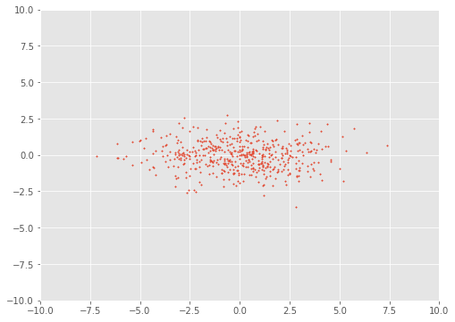
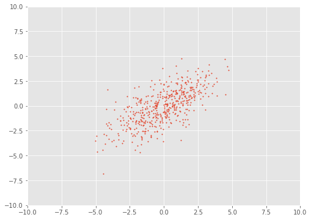
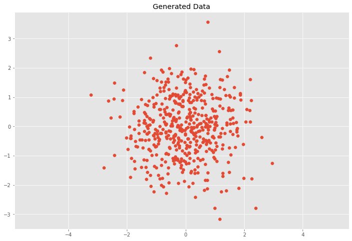
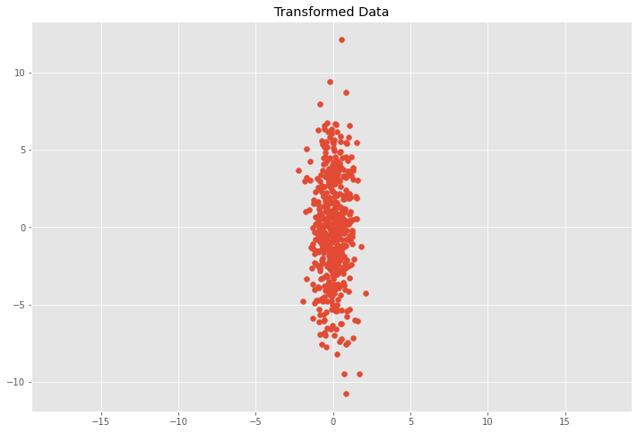
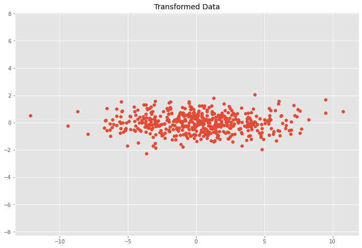

Trong [bài lần trước](https://huytranvan2010.github.io/Covariance-matrix/) chúng ta nhận thấy covariance matrix xác định độ mở rộng (spread of data) thông qua variance - các thành phần trên đường chéo và hướng (của data) thông qua covariance - các thành phần ngoài đường chéo. **Do đó nếu chúng ta muốn biểu diễn covariance matrix với vector và độ lớn của nó thì cách đơn giản là tìm vector chỉ theo hướng mở rộng nhất của data và độ lớn của nó bằng với variance theo hướng đó.**

Nếu chúng ta gọi vector này là $\mathbf{v}$, thì hình chiếu của data lên vector này sẽ là $\mathbf{v}^T \mathbf{X}$. Variance của projected data sẽ là $\mathbf{v}^T \Sigma \mathbf{v}$, gọi là variance do bây giờ mỗi example chuyển thành một điểm. Mình sẽ chứng minh lại công thức này bên dưới. $\Sigma$ là covariance matrix của data ban đầu.

**Chú ý**:
- $\mathbf{X}$ vẫn có shape là $d \times N$ - nghĩa là mỗi cột tương ứng một example
- $\mathbf{v}$ có shape là $d \times 1$. Lúc này hình chiếu của data lên vector $\mathbf{v}$ là $\mathbf{v}^T \mathbf{X}$ có shape là $1 \times N$ hay hình chiếu của mỗi example lên vector sẽ thành một điểm, lúc này ta sẽ có $N$ điểm tương ứng (vector hàng nhân vector cột được một điểm)

Mục đích của chúng ta là tìm vector $\mathbf{v}$ chỉ theo hướng mà data có variance lớn nhất, chúng ta cần chọn sau cho covariance matrix của projected data $\mathbf{v}^T \Sigma \mathbf{v}$ là lớn nhất có thể. Đi tìm cực đại của hàm có dạng $\mathbf{v}^T \Sigma \mathbf{v}$ với $\mathbf{v}$ là biến, $\mathbf{v}$ là vector đơn vị có thể được mô tả như [Rayleigh Quotient](https://en.wikipedia.org/wiki/Rayleigh_quotient). *Cực đại của Rayleigh Quotient đạt được khi $\mathbf{v}$ bằng với eigenvector lớn nhất của matrix $\Sigma$.* Phương pháp giảm chiều PCA sẽ dựa theo cách này. Các bạn có thể tìm hiểu thêm các bước thực hiện PCA để thấy nó liên quan đến covariance matrix và linear transformation như nào.

Điều này có nghĩa rằng eigenvector lớn nhất của covariance matrix luôn chỉ theo hướng mà data có variance lớn nhất, độ lớn của vector đó chính bằng **eigenvalue**. Eigenvector lớn thứ hai luôn trực giao với  eigenvector lớn nhất và chỉ theo hướng data có variance lớn thứ hai.

Như chúng ta đã biết linear transformation matrix $\mathbf{T}$ hoàn toàn được xác định bởi eigenvectors và eigenvalues. Áp dụng điều này lên covariance matrix ta có:

$$ \Sigma \mathbf{v} = \lambda \mathbf{v}$$

Trong đó $\mathbf{v}$ là eigenvector của $\Sigma$ và $\lambda$ là eigenvalue tương ứng.

Nếu covariance matrix của data là ma trận đường chéo hay covariances = 0, điều này có nghĩa rằng các variances bằng với eigenvalues.

```python
# tạo data UNCORRELATION
means = np.array([0, 0])
cov_matrix = np.array([
    [5, 0], 
    [0, 1]])
plot_data(means, cov_matrix, xlim=(-10, 10), ylim=(-10, 10))

eValues, eVectors = np.linalg.eig(cov_matrix)
print("eValues: ", eValues)
print("eVectors: ", eVectors)
```

```python
eValues:  [5. 1.]
eVectors:  [[1. 0.]
 [0. 1.]]
```



Nhận thấy các eigenvalues là 5 và 1 bằng với các variances, eigenvectors nhận được là $[1, 0]^T$ và $[0, 1]^T$. Tuy nhiên nếu covariance matrix không phải là ma trận đường chéo, lúc này sẽ phức tạp hơn. Eigenvetors không còn chỉ theo các trục $x$, $y$ như ví dụ trên.

```python
means = np.array([0, 0])
cov_matrix = np.array([ 
    [3, 2],
    [2, 3]
])
plot_data(means, cov_matrix, xlim=(-10, 10), ylim=(-10, 10))

eValues, eVectors = np.linalg.eig(cov_matrix)
print("eValues: ", eValues)
print("eVectors: ", eVectors)
```
```python
eValues:  [5. 1.]
eVectors:  [[ 0.70710678 -0.70710678]
 [ 0.70710678  0.70710678]]
```



Dễ nhận hai eigenvectors trong trường hợp này tạo với trục $x$ một góc 45 và 135 độ. Dễ nhận thấy hướng của eigenvector đầu tiên là hướng mà khi chiếu data lên đó có projected data có variance lớn nhất. Hướng của eigenvector thứ hai vuông góc với eigenvector thứ nhất.

## Covariance matrix as a Linear Transformation 

Trong các ánh xa từ không gian vector $V$ sang không gian vector $W$ có một lớp quan trọng là lớp ánh xạ tuyến tính - Linear transformation.

Cho $V$ và $W$ lần lượt là hai không gian vector $n$ và $m$ chiều. Mọi ánh xạ tuyến tính $T:V \rightarrow W$ có thể được biểu diễn qua ma trận $\mathbf{A} \in \mathbb{R}^{m \times n}$. $\mathbf{A}$ còn được gọi là **transformation matrix**.

$$
\mathbf{w} = \mathbf{A} \mathbf{v}
$$

$\mathbf{v}$ là vector cột $\in \mathbb{R}^{n \times 1}$, $\mathbf{w}$ là vector cột $\in \mathbb{R}^{m \times 1}$

Chúng ta sẽ xem linear transformation sẽ ảnh hưởng như thế nào đến data và covariance matrix. Ở đây sẽ xem xét trường hợp đặc biệt là biến đổi data với **scaling matrix**.

$$
\mathbf{S} = 
\begin{bmatrix}
s_x& 0\\
0& s_y
\end{bmatrix}
$$

Giả sử dữ liệu ban đầu của chúng ta $\mathbf{X}$ có covariance matrix là:

$$
\mathbf{C} = 
\begin{bmatrix}
\sigma^2_x& 0\\
0& \sigma^2_y
\end{bmatrix}
$$

Lúc này các thành phần $x$, $y$ mới bằng cách thành phần $x$, $y$ cũ nhân với $s_x$ và $s_y$ tương ứng. Lúc này chúng ta kỳ vọng covariance matrix $\mathbf{C}$ của data mới sẽ có dạng (dễ dàng chứng minh được từ đình nghĩa).

$$
\mathbf{C}_{new} = 
\begin{bmatrix}
\left(s_x \sigma_x \right)^2& 0\\
0& \left(s_y \sigma_y \right)^2
\end{bmatrix}
$$

Lúc này data mới $\mathbf{Y}$ sẽ là:

$$
\mathbf{Y} = 
\mathbf{S}\mathbf{X} 
$$

$\mathbf{X}$ và $\mathbf{Y}$ **đều có các cột là example** mới nhân kiểu này được.

Tổng quát chúng ta có $\mathbf{S} \in \mathbb{R}^{m \times d}$, ma trận data ban đầu $\mathbf{X} \in \mathbb{R}^{d \times N}$. Lúc này ma trận data mới là $\mathbf{Y} \in  \mathbb{R}^{m \times N}$. 

**Chú ý**:
- Đối với chuyển một example chúng ta vẫn để vector cột cho example đó
- Cách biểu diễn data matrix với example là một hàng hay cột tùy thuộc vào bài toán. Nói chung để phù hợp dễ biến đổi là tốt nhất.

Ở đây nhận thấy transformation matrix $\mathbf{S} = \sqrt{\mathbf{C}_{new}}$ cho trường hợp đặc biệt với $\sigma(x, y) = 0$, có nghĩa rằng các features của data không tương quan với nhau. Liệu điều này còn đúng cho trường hợp tổng quát không? Để tìm hiểu mối quan hệ của linear transformation matrix $\mathbf{T}$ và covariance matrix mới $\mathbf{C}_{new}$ chúng ta thử phân tích covariance matrix thành tích của rotation và scaling matrices.

Từ bài [Eigendecomposition](https://huytranvan2010.github.io/Eigendecomposition/) có thể biểu diễn covariance matrix thông qua các eigenvectors và eigenvalues của nó như sau:

$$
\Sigma = \mathbf{V} \mathbf{L} \mathbf{V}^{-1}
$$

trong đó $\mathbf{V}$ là ma trận với các cột là các eigenvectors của ma trận $\Sigma$ và $\mathbf{L}$ là ma trận đường chéo với các giá trị trên đường chéo là các eigenvalues tương ứng.

Phương trình trên còn được gọi là **eigendecomposition của covariance matrix**, nó có thể có được bằng cách sử dụng [Sigular Value Decomposition](https://en.wikipedia.org/wiki/Singular_value_decomposition). Trong khi eigenvectors biểu diễn hướng có variance lớn nhất của data thì eigenvalues biểu diễn độ lớn của variance. Nói cách khác, $\mathbf{R}$ biểu diễn rotation matrix, $\sqrt{\mathbf{L}}$ biểu diễn scaling matrix. Do đó covariance matrix có thể được phân tách như sau:

$$
\Sigma = \mathbf{R}\mathbf{S} \mathbf{S}\mathbf{R}^{-1}
$$

trong đó $\mathbf{R} = \mathbf{V}$ là rotation matrix và $\mathbf{S} = \sqrt{\mathbf{L}}$ là scaling matrix.

Nên nhớ transsformation matrix $\mathbf{T} = \mathbf{R}\mathbf{S}$. Do $\mathbf{S}$ là ma trận đường chéo nên $\mathbf{S} = \mathbf{S}^T$, $\mathbf{R}$ là orthogonal matrix nên $\mathbf{R}^{-1} = \mathbf{R}^T$. Do đó ta có $\mathbf{T}^T = \left(\mathbf{R} \mathbf{S} \right)^T = \mathbf{S}^T \mathbf{R}^T = \mathbf{S} \mathbf{R}^{-1}$. Vì vậy covariance matrix có thể được viết lại như sau:

$$\Sigma = \mathbf{R}\mathbf{S} \mathbf{S}^{-1} \mathbf{R} = \mathbf{T} \mathbf{T}^T$$

Nói cách khác khi áp dụng linear transformation với transformation matrix $\mathbf{T} = \mathbf{R} \mathbf{S}$ lên data ban đầu thì chúng ta nhận được data mới với covariance matrix $\mathbf{C}_{new} = \Sigma = \mathbf{T}\mathbf{T}^T = \mathbf{R}\mathbf{S}\mathbf{S}\mathbf{R}^{-1}$. Sẽ thử luôn một ví dụ nhé.

Đi tạo dữ liệu ban đầu

```python
import numpy as np
import matplotlib.pyplot as plt
%matplotlib inline

plt.style.use('ggplot')
plt.rcParams['figure.figsize'] = (12, 8)    # set figure size, cái này hay dùng khi hiển thị inline

# Normal distributed x and y vector with mean 0 and standard deviation 1
np.random.seed(123)
x = np.random.normal(0, 1, 500)     # x.shape(500,)
y = np.random.normal(0, 1, 500)
X = np.vstack((x, y))             # np.vstack((x, y)) có shape là (2, 500), chuyển vị thành (500, 2), mỗi hàng là một examples

plt.scatter(X[0, :], X[1, :])
plt.title('Generated Data')
plt.axis('equal');

""" Hàm xác định covariance matrix - example là cột """
def get_cov(X):
    X = X - X.mean(axis=1, keepdims=True) 
    C = 1 / (X.shape[1] - 1) * np.dot(X, X.T)
    return C 

get_cov(X)
"""
array([[1.00843284, 0.00962312],
       [0.00962312, 0.99873119]])
"""
```



Áp dụng scaling matrix lên dữ liệu ban đầu, tính covariance matrix mới và biểu diễn transformed data.

```python
# scaling matrix
sx, sy = 0.7, 3.4 
S = np.array([ 
    [sx, 0],
    [0, sy]
])

# apply scaling matrix to X
# S 2x2, X.T 2x500, Y 2x500
Y = np.dot(S, X)    # Y.shape (2, 500)
# Y lúc này có mỗi cột là một example nên không cần chuyển vị khi xác định covariance matrix

get_cov(Y)

plt.scatter(Y[0, :], Y[1, :])
plt.title('Transformed Data')
plt.axis('equal')
"""
array([[ 0.49413209,  0.02290303],
       [ 0.02290303, 11.54533254]])
"""
```
Tất nhiên do ở đây chúng ta chỉ lấy một số samples từ population nên không có được $\sigma(x,y) = 0$ và $\sigma(x, x) = \sigma(y, y) = 1$, do đó kết quả có thể bị lệch so với công thức bên trên



Rõ ràng dữ liệu của chúng ta, thành phần $x$ bị thu hẹp lại còn thành $y$ được nới rộng ra.

Bây giờ chúng ta vừa xoay vừa scale dữ liệu

```python
# Scaling matrix
sx, sy = 0.7, 3.4
S = np.array([[sx, 0], [0, sy]])

# Rotation matrix
theta = 0.5*np.pi
c, s = np.cos(theta), np.sin(theta)
R = np.array([[c, -s], [s, c]])

# Transformation matrix
T = np.dot(R, S)

# Apply transformation matrix to X
Y = np.dot(T, X)  # chú ý X chuyển về dạng mỗi example là  một cột
plt.scatter(Y[0, :], Y[1, :])
plt.title('Transformed Data')
plt.axis('equal');

# Calculate covariance matrix
# Y đã ở dạng mỗi một cột là một example rồi
get_cov(Y)
"""
array([[11.54533254, -0.02290303],
       [-0.02290303,  0.49413209]])
"""
```




```python
"""
Check lại công thức tính covariance matrix của projected data dựa trên
scaling matrix và rotation matrix (hai cái này tạo thành transformation matrix).
Thấy khớp nhau rồi.
"""
cov_new = np.dot(np.dot(R,S), np.dot(S, np.linalg.inv(R)))
cov_new

"""
array([[ 1.15600000e+01, -6.77842003e-16],
       [-6.77842003e-16,  4.90000000e-01]])
"""
```
Mọi thứ dường như đã ổn rồi. Như vậy chúng ta đã tìm hiểu về eigendecomposition cho covariance matrix và mối liên hệ giữa convariance matrix và linear transformation matrix. 

## Tài liệu tham khảo
1. https://www.cuemath.com/algebra/covariance-matrix/
2. https://datascienceplus.com/understanding-the-covariance-matrix/
3. https://www.visiondummy.com/2014/04/geometric-interpretation-covariance-matrix/
4. https://guzintamath.com/textsavvy/2019/02/02/eigenvalue-decomposition/
5. https://blueblazin.github.io/math/2016/08/18/eigenvalue-decomposition.html 
6. https://www.tvhoang.com/articles/2018/10/linear-transformation


<!--
https://blueblazin.github.io/math/2016/08/18/eigenvalue-decomposition.html
https://guzintamath.com/textsavvy/2019/02/02/eigenvalue-decomposition/
https://www.utdallas.edu/~Herve/Abdi-EVD2007-pretty.pdf
https://www.math.usm.edu/lambers/cos702/cos702_files/docs/PCA.pdf   Lý thuyết hay đầy đủ
https://blog.clairvoyantsoft.com/eigen-decomposition-and-pca-c50f4ca15501
-->